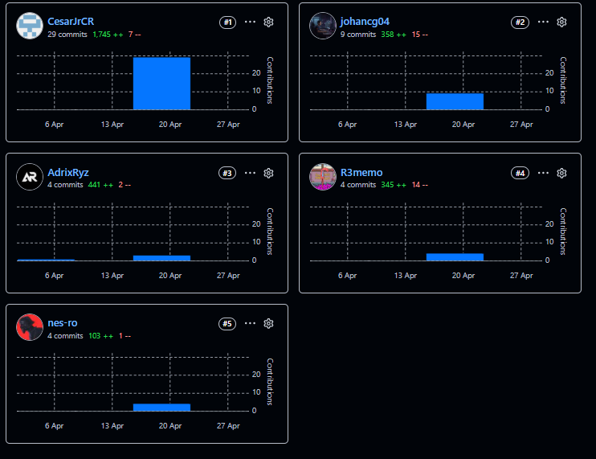
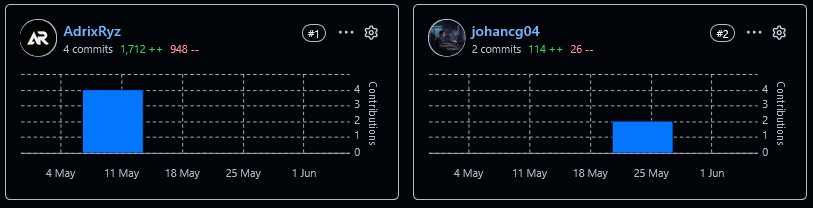
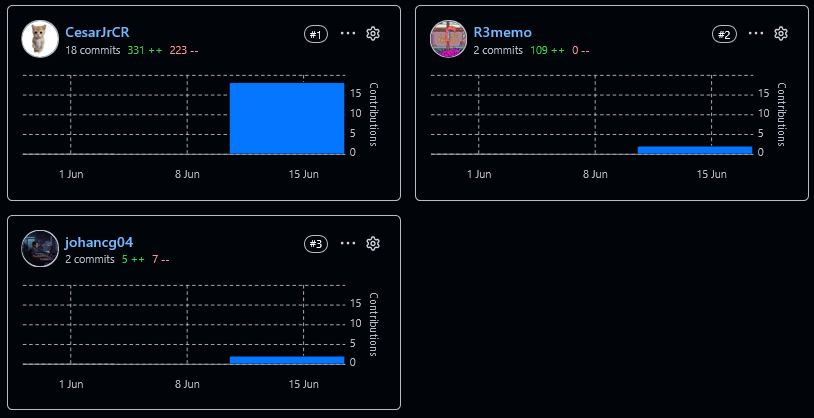
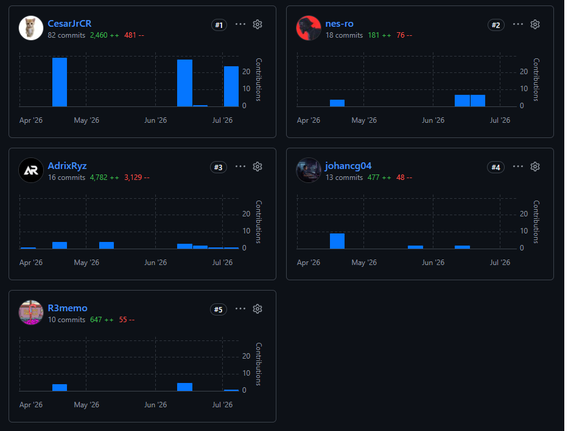

  

Universidad Peruana de Ciencias Aplicadas

Carrera de Ingeniería de Software

**1ASI0729**

**Desarrollo de Aplicaciones Open Source**

NRC

**12029**

**Informe del Trabajo Final**

Docente

**Mori Paiva, Hugo Allan**

Equipo

**Axiora**

Proyecto

**SpotGo**

**Integrantes**

| Código | Apellidos y Nombres |
| --- | --- |
| U20241E177 | Ruiz Mideyros, Adrian |
| U202317099 | Rojas Tello, Nestor Alonso |
| U20241E321 | Espinoza Lopez, Paul Alexandro |
| U20241D995 | Contreras Rojas, Cesar Jair |
| U202423752 | Contreras Granados, Johan Alexis |

**Período 202610**

**Julio 2026**

---

# Registro de versiones del informe

| Versión | Fecha | Autor | Descripción de modificación |
| --- | --- | --- | --- |
| 0.1.0 | 19/4/26 | @AdrixRyz | docs: añadir los puntos previos al capítulo 1 |
| 0.1.1 | 20/4/26 | @johancg04 | docs: añadir descripción del startup |
| 0.1.2 | 20/4/26 | @CesarJrCR | docs: añadir todos los puntos de solution profile |
| 0.1.3 | 20/4/26 | @nes-ro | docs: añadir segmentos objetivo |
| 0.1.4 | 21/4/26 | @R3memo | docs: añadir todos los puntos de competidores |
| 0.1.5 | 21/4/26 | @R3memo | docs: añadir todos los puntos de entrevistas |
| 0.1.6 | 22/4/26 | @R3memo | docs: añadir las imagenes del needfinding |
| 0.1.7 | 25/4/26 | @CesarJrCR | docs: añadir todos los puntos del capitulo 3 |
| 0.1.8 | 25/4/26 | @johancg04 | docs: añadir todos los puntos de style guidelines |
| 0.1.9 | 25/4/26 | @AdrixRyz | docs: añadir todos los puntos de information architecture |
| 0.1.10 | 25/4/26 | @nes-rojas | docs: añadir landing page ui design |
| 0.1.11 | 25/4/26 | @johancg04 | docs: añadir todos los puntos de web applications ux/ui design  |
| 0.1.12 | 25/4/26 | @CesarJrCR | docs: añadir todos los puntos de domain-driven software architecture  |
| 0.1.13 | 25/4/26 | @nes-ro | docs: añadir class diagram y database diagram |
| 0.1.14 | 25/4/26 | @R3memo | docs: añadir todos los puntos de software configuration management |
| 0.1.15 | 25/4/26 | @AdrixRyz | docs: añadir todos los puntos del sprint 1 |
| 0.1.16 | 25/4/26 | @nes-ro | docs: añadir los 4 puntos finales |
| 0.1.17 | 25/4/26 | @johancg04 | docs: añadir student outcome y report insights |
| 0.1.18 | 25/4/26 | @AdrixRyz | docs: añadir ajustes finales para el av1 |
| 0.2.0 | 9/5/26 | @johancg04 | docs: añadir correcciones de la revisión del av1 |
| 0.2.1 | 14/5/26 | @AdrixRyz | docs: añadir todos los puntos del sprint 2 |
| 0.3.0 | 15/6/26 | @nes-ro | docs: añadir correcciones de la revisión del tb1 |
| 0.3.1 | 19/6/26 | @CesarJrCR | docs: añadir todos los puntos del sprint 3 |
| 0.3.2 | 20/6/26 | @R3memo | docs: añadir los puntos de validation interviews |

# Project Report Collaboration Insights

**Repositorio de la documentación del proyecto:** [https://github.com/axiora-upc/spotgo-docs](https://github.com/axiora-upc/spotgo-docs)

A continuación, se detallan las actividades realizadas en cada entrega, la participación de los miembros del equipo, y las evidencias correspondientes.

**AV1**

*Report Insights AV1*  

**TB1**

*Report Insights TB1*  

**AV2**

*Report Insights AV2*  

**TB2**

# Tabla de contenidos

**Registro de versiones del informe**

**Project Report Collaboration Insights**

**Tabla de contenidos**

**Student Outcome**

[**Capítulo I: Introducción**](10-chap-1.md)  
1.1. Startup Profile  
1.1.1. Descripción del startup  
1.1.2. Perfiles de integrantes del equipo  
1.2. Solution Profile  
1.2.1. Antecedentes y problemática  
1.2.2. Lean UX Process  
1.2.2.1. Lean UX Problem Statements  
1.2.2.2. Lean UX Assumptions  
1.2.2.3. Lean UX Hypothesis Statements  
1.2.2.4. Lean UX Canvas  
1.3. Segmentos objetivo  

[**Capítulo II: Requirements Elicitation & Analysis**](20-chap-2.md)  
2.1. Competidores  
2.1.1. Análisis competitivo  
2.1.2. Estrategias y tácticas frente a competidores  
2.2. Entrevistas  
2.2.1. Diseño de entrevistas  
2.2.2. Registro de entrevistas  
2.2.3. Análisis de entrevistas  
2.3. Needfinding  
2.3.1. User Personas  
2.3.2. User Task Matrix  
2.3.3. User Journey Mapping  
2.3.4. Empathy Mapping  
2.4. Big Picture EventStorming  
2.5. Ubiquitous Language  

[**Capítulo III: Requirements Specification**](30-chap-3.md)  
3.1. User Stories  
3.2. Impact Mapping  
3.3. Product Backlog  

[**Capítulo IV: Product Design**](40-chap-4.md)  
4.1. Style Guidelines  
4.1.1. General Style Guidelines  
4.1.2. Web Style Guidelines  
4.2. Information Architecture  
4.2.1. Organization Systems  
4.2.2. Labeling Systems  
4.2.3. SEO Tags and Meta Tags  
4.2.4. Searching Systems  
4.2.5. Navigation Systems  
4.3. Landing Page UI Design  
4.3.1. Landing Page Wireframe  
4.3.2. Landing Page Mock-up  
4.4. Web Applications UX/UI Design  
4.4.1. Web Applications Wireframes  
4.4.2. Web Applications Wireflow Diagrams  
4.4.3. Web Applications Mock-ups  
4.4.4. Web Applications User Flow Diagrams  
4.5. Web Applications Prototyping  
4.6. Domain-Driven Software Architecture  
4.6.1. Design-Level EventStorming  
4.6.2. Software Architecture Context Diagram  
4.6.3. Software Architecture Container Diagrams  
4.6.4. Software Architecture Components Diagrams  
4.7. Software Object-Oriented Design  
4.7.1. Class Diagrams  
4.8. Database Design  
4.8.1. Database Diagrams  

[**Capítulo V: Product Implementation, Validation & Deployment**](50-chap-5.md)  
5.1. Software Configuration Management  
5.1.1. Software Development Environment Configuration  
5.1.2. Source Code Management  
5.1.3. Source Code Style Guide & Conventions  
5.1.4. Software Deployment Configuration  
5.2. Landing Page, Services & Applications Implementation  
[**5.2.1. Sprint 1**](51-sprint-1.md)  
5.2.1.1. Sprint Planning 1  
5.2.1.2. Aspect Leaders and Collaborators  
5.2.1.3. Sprint Backlog 1  
5.2.1.4. Development Evidence for Sprint Review  
5.2.1.5. Execution Evidence for Sprint Review  
5.2.1.6. Services Documentation Evidence for Sprint Review  
5.2.1.7. Software Deployment Evidence for Sprint Review  
5.2.1.8. Team Collaboration Insights during Sprint  
[**5.2.2. Sprint 2**](52-sprint-2.md)  
5.2.2.1. Sprint Planning 2  
5.2.2.2. Aspect Leaders and Collaborators  
5.2.2.3. Sprint Backlog 2  
5.2.2.4. Development Evidence for Sprint Review  
5.2.2.5. Execution Evidence for Sprint Review  
5.2.2.6. Services Documentation Evidence for Sprint Review  
5.2.2.7. Software Deployment Evidence for Sprint Review  
5.2.2.8. Team Collaboration Insights during Sprint  
[**5.2.3. Sprint 3**](53-sprint-3.md)  
5.2.3.1. Sprint Planning 3  
5.2.3.2. Aspect Leaders and Collaborators  
5.2.3.3. Sprint Backlog 3  
5.2.3.4. Development Evidence for Sprint Review  
5.2.3.5. Execution Evidence for Sprint Review  
5.2.3.6. Services Documentation Evidence for Sprint Review  
5.2.3.7. Software Deployment Evidence for Sprint Review  
5.2.3.8. Team Collaboration Insights during Sprint  
[**5.2.4. Sprint 4**](54-sprint-4.md)  
5.2.4.1. Sprint Planning 4  
5.2.4.2. Aspect Leaders and Collaborators  
5.2.4.3. Sprint Backlog 4  
5.2.4.4. Development Evidence for Sprint Review  
5.2.4.5. Execution Evidence for Sprint Review  
5.2.4.6. Services Documentation Evidence for Sprint Review  
5.2.4.7. Software Deployment Evidence for Sprint Review  
5.2.4.8. Team Collaboration Insights during Sprint  
[**5.3. Validation Interviews**](60-validation-interviews.md)  
5.3.1. Diseño de Entrevistas  
5.3.2. Registro de Entrevistas  
5.3.3. Evaluaciones según heurísticas  
[**5.4. Video-About-the-Product**](70-product-video.md)  

[**Conclusiones**](80-conclusions.md)  
[**Recomendaciones**](81-recommendations.md)  
[**Video-About-the-Team**](82-team-video.md)  
[**Bibliografía**](90-bibliography.md)  
[**Anexos**](99-annexes.md)  

# Student Outcome

| Criterio específico | Acciones realizadas | Conclusiones |
| --- | --- | --- |
| Comunica oralmente con efectividad a diferentes rangos de audiencia. | **Ruiz Mideyros, Adrian (U20241E177)** **AV1:** Práctica de modulación de voz y control de tiempos durante ensayos grupales, lo que permitió desarrollar la habilidad de exponer la problemática del negocio de manera persuasiva ante una audiencia evaluadora. **TB1:** Práctica de discusión técnica con el equipo durante el desarrollo del módulo de monitoring, desarrollando la habilidad de comunicar oralmente el comportamiento del dashboard y el mapa en tiempo real a compañeros con distintos roles dentro del proyecto. **AV2:** Práctica de explicación de las decisiones de diseño del módulo de parking en reuniones internas del equipo, desarrollando la habilidad de articular conceptos técnicos de DDD de manera comprensible para compañeros con distintos roles dentro del proyecto. **TB2:** Coordinación oral con el equipo durante la implementación del módulo IAM en el backend, liderando la comunicación de decisiones sobre Spring Security y la estructura de autenticación JWT para alinear a todos los integrantes con el flujo de seguridad adoptado.  **Rojas Tello, Nestor Alonso (U202317099)** **AV1:** Organización y esquematización de las ideas clave mediante mapas mentales antes de la exposición, mejorando la articulación verbal para explicar decisiones de diseño a un público no técnico. **TB1:** Coordinación verbal con otros integrantes para definir el flujo del módulo de parking del frontend, mejorando la capacidad de transmitir oralmente criterios de experiencia de usuario y decisiones de navegación entre vistas al resto del equipo. **AV2:** Coordinación verbal con otros integrantes durante la implementación del módulo de usuarios, mejorando la capacidad de comunicar requerimientos técnicos y resolver dudas de integración de forma ágil y clara entre los distintos bounded contexts del sistema. **TB2:** Discusión verbal con el equipo sobre la integración del módulo de pagos digitales mediante Stripe API, desarrollando la habilidad de comunicar oralmente los flujos de checkout y confirmación asíncrona de pagos a compañeros con distintos roles dentro del proyecto.  **Espinoza Lopez, Paul Alexandro (U20241E321)** **AV1:** Recepción y aplicación de feedback de los compañeros sobre claridad del discurso, mejorando su capacidad asertiva en la comunicación oral de los resultados de las entrevistas y el Needfinding. **TB1:** Aplicación del feedback oral recibido del equipo durante el desarrollo del módulo de profiles, perfeccionando la capacidad de argumentar verbalmente decisiones de UX como el flujo de favoritos y la configuración de cuenta de forma asertiva y estructurada. **AV2:** Intercambio oral de criterios técnicos con el equipo durante el desarrollo del módulo de notificaciones, fortaleciendo la habilidad de argumentar decisiones de implementación y negociar soluciones con distintos perfiles del grupo de trabajo. **TB2:** Coordinación oral con el equipo durante el desarrollo de las mejoras del frontend, liderando la comunicación de criterios de diseño de vistas y flujos de navegación para garantizar una experiencia de usuario coherente en la versión final de la plataforma.  **Contreras Rojas, Cesar Jair (U20241D995)** **AV1:** Ejercicios de adaptación de terminología técnica para lograr explicar conceptos complejos de la arquitectura de software (DDD, C4) a diferentes tipos de stakeholders sin perder el rigor técnico en el discurso oral. **TB1:** Discusión y alineación verbal con el equipo sobre los componentes compartidos del frontend (layout, sidebar, toolbar, interceptor), consolidando la habilidad de comunicar oralmente decisiones de arquitectura transversal que impactan a todos los módulos de la aplicación. **AV2:** Discusión y alineación verbal con el equipo sobre los patrones de la capa compartida del backend (Result, ApplicationError, AbstractDomainAggregateRoot), consolidando la capacidad de comunicar decisiones arquitectónicas transversales de forma precisa y sin ambigüedades técnicas. **TB2:** Coordinación oral con el equipo durante la implementación del módulo de conexiones backend-frontend, liderando la comunicación de los contratos de API y los patrones de integración adoptados para garantizar la coherencia entre capas de la arquitectura del sistema.  **Contreras Granados, Johan Alexis (U202423752)** **AV1:** Simulaciones de presentación frente al grupo, desarrollando la capacidad de comunicar oralmente decisiones visuales o de UX mediante argumentos estructurados orientados a las necesidades del usuario. **TB1:** Coordinación oral con el equipo durante el desarrollo del módulo de payment del frontend, desarrollando la habilidad de comunicar de forma clara las decisiones de diseño de las vistas de suscripciones y recibos, y alinear verbalmente el flujo de datos con el estado de la aplicación. **AV2:** Coordinación oral con el compañero responsable del frontend para alinear el contrato de API del módulo de billing, desarrollando la habilidad de adaptar el discurso técnico al contexto del interlocutor y comunicar cambios en el API de forma clara y oportuna. **TB2:** Liderazgo oral en la coordinación de las nuevas funcionalidades del frontend durante el Sprint 4, comunicando de forma efectiva las decisiones de implementación del módulo IAM en Vue y los criterios de integración con el backend a todos los integrantes del equipo. | **AV1:** El equipo demostró una sólida capacidad para transmitir ideas técnicas y de negocio de forma verbal. Se respetaron los tiempos asignados para el Avance 1 y se utilizó material audiovisual (diapositivas/prototipos) de apoyo de manera pertinente, logrando una comunicación fluida, coherente y adaptada al nivel de exigencia académico del curso de Desarrollo de Aplicaciones Open Source. **TB1:** El equipo desarrolló su comunicación oral técnica a través de la coordinación continua durante la construcción del frontend, logrando alinear criterios de diseño, flujos de navegación y decisiones de estado entre los distintos módulos de la aplicación Angular de manera efectiva y sin ambigüedades. **AV2:** El equipo fortaleció su comunicación oral técnica a través de la coordinación continua durante el desarrollo del backend, logrando alinear decisiones entre módulos y con el equipo de frontend de forma efectiva. La práctica constante de discutir implementaciones y resolver dudas de integración de manera verbal consolidó esta competencia en todos los integrantes. **TB2:** El equipo consolidó su comunicación oral técnica durante el Sprint 4 al coordinar la implementación del módulo IAM y la integración end-to-end de la plataforma, logrando alinear verbalmente decisiones críticas de seguridad, autenticación y conexión backend-frontend entre todos los integrantes con distintos roles de liderazgo. |
| Comunica por escrito con efectividad a diferentes rangos de audiencia. | **Ruiz Mideyros, Adrian (U20241E177)** **AV1:** Aplicación de iteraciones de revisión de textos para depurar inconsistencias, desarrollando así la capacidad de redactar de forma estructurada, técnica y sin ambigüedades en la sección introductoria. **TB1:** Redacción de los componentes y stores del módulo de monitoring con nomenclatura autodescriptiva, desarrollando la habilidad de comunicar por escrito el comportamiento del sistema de analítica y mapa en tiempo real a través del propio código, sin necesidad de documentación adicional. **AV2:** Redacción de commits semánticos y anotaciones Swagger en los controllers del módulo de parking, perfeccionando la habilidad de documentar código de forma estructurada y legible para otros miembros del equipo sin necesidad de explicación adicional. **TB2:** Redacción de commits semánticos y configuración de Spring Security en el módulo IAM del backend, consolidando la habilidad de documentar por escrito decisiones críticas de seguridad y autenticación de forma clara y trazable para todos los integrantes del equipo.  **Rojas Tello, Nestor Alonso (U202317099)** **AV1:** Estudio y aplicación de buenas prácticas de redacción técnica para documentar artefactos (como modelos de datos), afinando la habilidad de escribir descripciones exactas y claras para públicos técnicos. **TB1:** Estructuración escrita de las entidades de dominio del módulo de parking del frontend (ParkingHistory, Reservation, ClientReport), afinando la habilidad de plasmar por escrito el modelo de datos de forma clara y sin ambigüedades para cualquier integrante que trabaje sobre estas capas. **AV2:** Elaboración de la documentación técnica del módulo de usuarios a través de resources, commands y queries con nombres autoexplicativos, desarrollando la capacidad de comunicar por escrito el contrato de API de forma clara y sin ambigüedades para el resto del equipo. **TB2:** Documentación escrita de los endpoints de pagos digitales y suscripciones mediante anotaciones Swagger y commits semánticos, desarrollando la habilidad de comunicar por escrito el comportamiento de los flujos de pago de forma precisa y comprensible para distintos perfiles del equipo.  **Espinoza Lopez, Paul Alexandro (U20241E321)** **AV1:** Ejercicio de síntesis de la vasta información cualitativa obtenida de las entrevistas, perfeccionando la habilidad de transformar datos complejos en reportes ejecutivos escritos y de fácil comprensión. **TB1:** Documentación escrita de los flujos de favoritos y configuración de cuenta en el módulo de profiles, mediante la estructuración de stores, assemblers y entities con nombres que reflejan con exactitud las acciones del usuario, perfeccionando la habilidad de comunicar por escrito comportamientos complejos de forma comprensible. **AV2:** Especificación escrita de los criterios de diseño del módulo de notificaciones, afinando la habilidad de plasmar decisiones técnicas en lenguaje escrito accesible y comprensible para distintos perfiles del equipo de desarrollo. **TB2:** Redacción de la documentación técnica del módulo de mejoras del frontend, estructurando por escrito los criterios de diseño de vistas y flujos de navegación de forma clara y comprensible para distintos perfiles del equipo, facilitando la integración con el backend desplegado en Railway.  **Contreras Rojas, Cesar Jair (U20241D995)** **AV1:** Construcción y documentación en equipo del Lenguaje Ubicuo (EventStorming), lo que consolidó su capacidad para plasmar de forma escrita un lenguaje de negocio compartido entre perfiles técnicos y no técnicos. **TB1:** Construcción de la capa compartida del frontend (BaseApiEndpoint, BaseAssembler, BaseEntity, interceptor), consolidando la habilidad de redactar abstracciones técnicas reutilizables cuya nomenclatura y estructura comunican su propósito de forma escrita a todos los integrantes del proyecto. **AV2:** Definición y documentación escrita del Lenguaje Ubicuo directamente en la capa compartida del backend, a través de la nomenclatura de clases, métodos y patrones que reflejan con exactitud el vocabulario acordado durante el EventStorming y facilitan la lectura del código a todos los integrantes. **TB2:** Documentación escrita de los contratos de integración backend-frontend mediante commits semánticos y especificación de endpoints REST, consolidando la habilidad de comunicar por escrito las decisiones de conexión entre capas de forma precisa y sin ambigüedades para todos los integrantes del equipo.  **Contreras Granados, Johan Alexis (U202423752)** **AV1:** Participación como revisor (proofreader) de la gramática y jerarquía de la información, practicando habilidades de control de calidad para garantizar que el entregable escrito cumpla con altos estándares formales. **TB1:** Estructuración escrita del módulo de payment del frontend mediante stores, assemblers y entities con nombres orientados al dominio, desarrollando la habilidad de comunicar por escrito el flujo de datos de suscripciones y recibos de forma clara y trazable para cualquier integrante del equipo. **AV2:** Redacción de mensajes de commit semánticos y anotaciones de API en el módulo de billing, consolidando la habilidad de comunicar por escrito el diseño y comportamiento de los endpoints REST de forma precisa, trazable y comprensible para cualquier integrante del equipo. **TB2:** Redacción de commits semánticos y documentación del módulo IAM del frontend, incluyendo la estructuración escrita de entidades de dominio, stores y guards de autenticación con nomenclatura autodescriptiva que comunica con claridad el flujo de seguridad implementado a cualquier integrante del equipo. | **AV1:** El equipo logró elaborar un informe altamente estructurado, aplicando correctamente el formato Markdown y el enfoque Docs-as-Code. La redacción refleja profesionalismo, uso adecuado de vocabulario técnico e inglés para términos estándar de la industria (User Stories, C4, EventStorming). El documento es de fácil lectura, escaneable y cumple con los estándares de documentación exigidos para un proyecto de Ingeniería de Software. **TB1:** El equipo demostró capacidad de comunicación escrita técnica a través de la nomenclatura autodescriptiva del código Angular, la estructuración de entidades de dominio y la definición de patrones reutilizables en la capa compartida, logrando que el frontend sea legible y comprensible para cualquier integrante sin documentación adicional. **AV2:** El equipo consolidó su comunicación escrita técnica a través de commits semánticos, anotaciones de API y nomenclatura autodescriptiva en el código, demostrando la capacidad de producir documentación que comunica con efectividad las decisiones de diseño sin necesidad de explicación adicional para distintos tipos de audiencia técnica. **TB2:** El equipo consolidó su comunicación escrita técnica durante el Sprint 4 a través de commits semánticos, anotaciones Swagger actualizadas y nomenclatura autodescriptiva en los módulos IAM, pagos y conexiones, logrando que la documentación del sistema refleje con precisión la arquitectura full-stack implementada y sea comprensible para cualquier integrante o revisor externo. |
