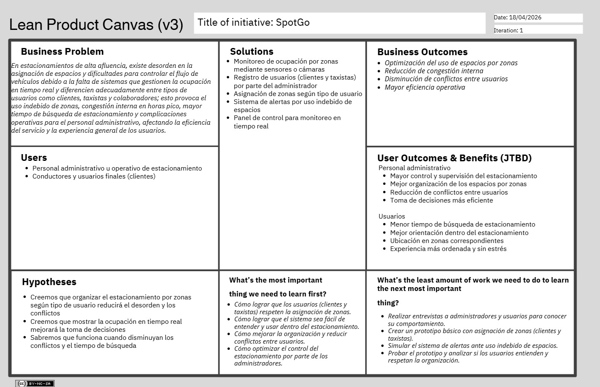

# Capítulo I: Introducción

## 1.1. Startup Profile

### 1.1.1. Descripción del startup

**Nombre de la startup**

Axiora

**Descripción**

Axiora es un ecosistema de desarrollo tecnológico de código abierto especializado en la convergencia del Internet de las Cosas (IoT) y la Inteligencia Artificial. Nos dedicamos a construir soluciones web y sistemas inteligentes que actúan como el tejido conectivo entre los datos del mundo real y la toma de decisiones automatizada. En Axiora, democratizamos el acceso a tecnología de vanguardia, creando herramientas que no solo analizan el presente, sino que están diseñadas para adaptarse a la infraestructura del futuro.

**Visión**

Liderar la transición global hacia un ecosistema digital abierto, donde la interconexión entre humanos, objetos y algoritmos sea fluida, ética y accesible, estableciendo el estándar para la próxima generación de infraestructuras inteligentes.

**Misión**

Facilitar la innovación tecnológica mediante el desarrollo de software open-source de alto impacto que integre hardware y software de forma coherente. Buscamos empoderar a organizaciones y desarrolladores con herramientas que utilicen el IoT y la IA para resolver retos complejos, garantizando la transparencia, la seguridad y la visión a largo plazo.

**Propuesta de Valor**

"Tecnología Abierta para un Mundo Conectado"

Axiora se posiciona en la frontera de la innovación colaborativa. A diferencia de las soluciones cerradas, ofrecemos transparencia total y flexibilidad mediante el desarrollo de código abierto, permitiendo que las aplicaciones IoT y las implementaciones de IA sean verdaderamente personalizables y seguras. Nuestra propuesta radica en eliminar las barreras entre el mundo físico y la web, transformando datos latentes en activos estratégicos con una perspectiva de escalabilidad infinita.

**Características principales**

* Ecosistema Web-IoT Unificado: Especialización en el desarrollo de interfaces web de baja latencia que interactúan en tiempo real con redes de sensores y actuadores, permitiendo el control y monitoreo total del entorno físico desde cualquier navegador.
* IA Predictiva y Prospección de Datos: Implementación de modelos de Inteligencia Artificial que no solo reaccionan a los datos actuales, sino que realizan prospección a futuro, permitiendo a las empresas anticipar fallos, tendencias y comportamientos del mercado.
* Filosofía Open Source y Colaboración: Desarrollo basado en la transparencia y la mejora continua. Al crear soluciones de código abierto, garantizamos que nuestras herramientas sean auditables, libres de vendor lock-in y alimentadas por la innovación de una comunidad global.
* Diseño de Sistemas Resilientes y Modulares: Arquitecturas preparadas para el crecimiento exponencial del tráfico de datos, utilizando tecnologías modernas que aseguran que las aplicaciones sean ligeras, seguras y capaces de operar en entornos de borde.
* Seguridad de Datos en el Borde: Enfoque riguroso en la protección de la información desde el dispositivo físico hasta la nube, aplicando protocolos de cifrado de última generación y prácticas de soberanía de datos para un mundo interconectado.

### 1.1.2. Perfiles de integrantes del equipo

| Foto | Nombre | Descripción |
| --- | --- | --- |
|  | Ruiz Mideyros, Adrian (U20241E177) | Estudiante de Ingeniería de Software, apasionado por la tecnología desde pequeño. Desarrollador de aplicaciones y videojuegos, con conocimientos en C++, Python, Web Stock y otras tecnologías. Me considero una persona proactiva, con gran disposición para aprender constantemente y apoyar en lo que se necesite. |
|  | Rojas Tello, Nestor Alonso (U202317099) | Estudiante de Ingeniería de Software. Tengo conocimientos en C++, Python, JavaScript y CSS. Me considero una persona colaborativa, responsable y con disposición para resolver dudas y proponer soluciones ante cualquier desafío. |
|  | Espinoza Lopez, Paul Alexandro (U20241E321) | Estudiante de Ingeniería de Software con conocimientos en C++, SQL y Python. Me considero una persona responsable que no duda para tomar decisiones fuertes en el momento que se presentan, suelo ser muy autocrítico y siempre estoy para ayudar y escuchar a mis demás compañeros. |
|  | Contreras Rojas, Cesar Jair (U20241D995) | Estudiante de ingeniería de Software. He practicado con Phyton, C++, Java entre otros. Me considero alguien responsable, colaborativo, amable y dispuesto a ayudar a mis compañeros, soy alguien que se esfuerza por encontrar soluciones a problemas. |
|  | Contreras Granados, Johan Alexis (U202423752) | Soy un estudiante de Ingeniería de Software organizado y responsable, orientado a la eficiencia y la calidad en proyectos individuales o grupales. Mi compromiso con el aprendizaje continuo en Ingeniería de Software me permite adaptarme a nuevos retos y aportar ideas innovadoras. Cuento con bases técnicas en Python, C++, JavaScript, desarrollo web (Vue.js, Tailwind) y bases de datos SQL/NoSQL. |

## 1.2. Solution Profile

### 1.2.1. Antecedentes y problemática

**Técnica 5W2H**

1. ¿Quiénes están involucrados o afectados? (Who?)

Este problema afecta tanto a los conductores, taxistas o transporte autorizado, colaboradores que pierden tiempo y se frustran al no encontrar espacios disponibles, como a los administradores de estacionamientos y personal de seguridad, que enfrentan complicaciones en la gestión del flujo de vehículos. También se ven perjudicadas las empresas o instituciones que brindan el servicio de estacionamiento, ya que una mala experiencia puede impactar en la satisfacción de los clientes y en la imagen del establecimiento.

2. ¿Qué ocurre o qué problema se presenta? (What?)

En la actualidad, los estacionamientos con alta afluencia presentan dificultades no solo en la gestión de espacios disponibles, sino también en la organización según el tipo de usuario. No existe una adecuada clasificación entre usuarios como clientes, taxistas, personal interno o administración, lo que genera desorden, uso ineficiente de los espacios y conflictos en la asignación de zonas.

Además, los conductores enfrentan demoras para encontrar un lugar adecuado según su necesidad, lo que provoca congestión, pérdida de tiempo y mala experiencia.

3. ¿Cuándo se presenta el problema? (When?)

Este problema ocurre principalmente en horas de alta demanda, como en las mañanas o tardes durante los días laborales, y con mayor frecuencia los fines de semana o feriados, cuando los centros comerciales, oficinas y estacionamientos privados reciben un gran número de vehículos. 
También se presenta en momentos de eventos especiales, como conciertos, partidos o ferias, donde la afluencia de personas se incrementa de manera significativa. En estas situaciones , la falta de información real sobre los espacios disponibles provoca demoras, congestión vehicular dentro del estacionamiento y desorganización en la gestión de los accesos. 

4. ¿Dónde sucede? (Where?)

Este problema se presenta en estacionamientos con gran afluencia de vehículos, como los centros comerciales, supermercados, aeropuertos, universidades, oficinas corporativas y hospitales. También ocurre en estacionamientos privados o públicos de alta rotación donde no existe un sistema  automatizado de control de espacios disponibles.

5. ¿Por qué ocurre? (Why?)

Por qué es importante para nosotros:
Reducir el tiempo perdido en la búsqueda de estacionamiento.
Mejor distribución por tipo de usuario
Reducción de conflictos entre usuarios
Favorecer una gestión más moderna y alineada. 
Mejorar la eficiencia en la administración de los espacios.
Disminuir la congestión vehicular y la contaminación ambiental. 

6. ¿Cómo se manifiesta el problema? (How?)

El problema ocurre debido a la falta de un sistema organizado que permita registrar y gestionar los vehículos según su tipo de usuario. Actualmente, el control se realiza de forma manual sin una estructura clara de clasificación, lo que dificulta asignar espacios adecuados y genera desorden en momentos de alta demanda.

7. ¿Cuánto cuesta o cuál es la magnitud? (How much?)

La magnitud varía según el tamaño del problema y la afluencia del estacionamiento, pero se presenta con mayor frecuencia en lugares con alta rotación de vehículos y durante las horas pico o fechas específicas. Se estima en estos escenarios que los conductores tardan entre 5 a 20 min para encontrar un espacio libre, lo que nos lleva a traducir esto en pérdida de tiempo, mayor gasto en combustible y malestar generalizado.

### 1.2.2. Lean UX Process

Queremos saber si el uso constante de nuestra aplicación puede mejorar la organización y gestión de los estacionamientos mediante la clasificación de usuarios y asignación de zonas específicas, permitiendo a los administradores registrar y controlar eficientemente el ingreso de vehículos.

Esto debería reflejarse en una reducción en los tiempos de búsqueda, una mejor distribución de los espacios según el tipo de usuario y una experiencia más ordenada y satisfactoria tanto para conductores como para el personal administrativo.

#### *1.2.2.1. Lean UX Problem Statements*

**Contexto**

Un estudio de IBM indica que los conductores pueden gastar entre el 25% y 30% de su tiempo buscando estacionamiento, llegando en algunos casos a más de 600 minutos perdidos al mes. En distritos como San Isidro, donde la afluencia vehicular es muy alta, esta situación se intensifica. Según el INEUR, la demanda de estacionamiento se divide en estadías largas (más de 4 horas) y cortas (menos de 4 horas). En el centro financiero, la demanda de corta estadía supera los 5,000 espacios en la mañana, lo que dificulta que vecinos y abonados encuentren lugares disponibles para estadías prolongadas.
 
**Problema**

La alta demanda y la falta de información en tiempo real sobre la disponibilidad de espacios provoca pérdida de tiempo para los conductores, congestión vehicular y dificultades en la administración de los estacionamientos. Esto impacta tanto en la experiencia de los usuarios como en la eficiencia de la gestión de los espacios disponibles.
 
**Pregunta clave**

¿De qué manera una aplicación de estacionamientos inteligentes, basada en sensores y notificaciones en tiempo real, puede optimizar la administración de espacios y mejorar la experiencia tanto de conductores como de administradores en zonas de alta demanda como San Isidro o Cercado de Lima? 

#### *1.2.2.2. Lean UX Assumptions*

**Assumptions**

1. ¿Quiénes son nuestros usuarios?
* Personal administrativo de estacionamiento
* Usuarios (clientes y colaboradores)

2. ¿Dónde encaja nuestro servicio en su trabajo o vida?
* Ayuda a los usuarios a encontrar y ubicarse en el estacionamiento de forma ordenada.
* Permite a los administradores gestionar y supervisar el estacionamiento por zonas.
* Facilita el control del uso adecuado de los espacios según el tipo de usuario.

3. ¿Qué problemas tiene nuestro producto?
* Requiere inversión inicial en sensores o cámaras.
* Depende del registro correcto de usuarios por parte del administrador.
* Necesita mantenimiento técnico periódico.
* Puede existir resistencia al cambio en el uso del sistema.

4. ¿Cómo y cuándo es usado nuestro producto?
* Se utiliza al momento de ingresar al estacionamiento para guiar al usuario.
* Funciona durante toda la permanencia del vehículo en el lugar.
* Los administradores lo utilizan constantemente para monitoreo y control.

5. ¿Qué características son importantes?
* Monitoreo en tiempo real por zonas
* Registro de usuarios
* Alertas por uso indebido de espacios
* Interfaz simple y clara
* Panel de control para administradores
* Sistema confiable y fácil de usar

6. ¿Cómo debe verse nuestro producto y cómo comportarse?
* Interfaz intuitiva y fácil de interpretar
* Visualización clara de zonas disponibles
* Respuesta rápida del sistema
* Alertas precisas y oportunas
* Funcionamiento continuo y estable

**Business outcomes**

* Reducción del tiempo de búsqueda de estacionamiento.
* Mejora en la organización y distribución de espacios.
* Disminución de conflictos por uso indebido de zonas.
* Mayor control y monitoreo en tiempo real para administradores.
* Optimización del uso de espacios disponibles.
* Mejora en la experiencia de los usuarios.

**Users**

* Administradores o personal operativo de estacionamiento
* Conductores y usuarios finales (clientes)

**Users outcomes**

* Administradores o personal operativo de estacionamiento
  * Encontrar espacios disponibles de forma rápida
  * Ubicarse en la zona que les corresponde
  * Reducir el tiempo de búsqueda y el estrés

* Conductores y usuarios finales (clientes)
  * Mejor control y supervisión del estacionamiento
  * Organización eficiente por tipo de usuario
  * Reducción de conflictos por uso indebido de zonas
  * Mejor toma de decisiones

**Features**

* Monitoreo de ocupación por zonas (sensores o cámaras)
* Registro manual de usuarios (clientes y taxistas)
* Asignación de zonas según tipo de usuario
* Sistema de alertas por uso indebido de espacios
* Panel de control para administradores
* Visualización en tiempo real
* Reportes de ocupación

#### *1.2.2.3. Lean UX Hypothesis Statements*

**Business Hypothesis**

Creemos que al optimizar la gestión de estacionamientos mediante el monitoreo por zonas y la organización de usuarios (clientes y taxistas), impulsaremos una mayor eficiencia en el uso de los espacios y en la movilidad dentro de estos entornos.
Sabremos que hemos logrado nuestra visión cuando observemos que el sistema es adoptado en estacionamientos de alta demanda y se reduce significativamente el tiempo de búsqueda, la congestión interna y los conflictos por uso indebido de zonas.

**User Hypothesis**

Creemos que al ofrecer información en tiempo real sobre la ocupación por zonas y una organización clara de usuarios (clientes y taxistas), mejoraremos la experiencia de los usuarios y la gestión del personal administrativo.
Sabremos que hemos mejorado el servicio cuando los usuarios reduzcan el tiempo de búsqueda de estacionamiento y se ubiquen correctamente en sus zonas asignadas, mientras que los administradores logren un mayor control y orden en el uso de los espacios.

#### *1.2.2.4. Lean UX Canvas*

Link: https://canva.link/i0pin0nnlvbg3rd

*Figura 1 (Lean Product Canvas)*

## 1.3. Segmentos objetivo

En esta sección se detallarán los segmentos objetivos a tener en cuenta en nuestra propuesta de solución de problemática.

**Primer Segmento Objetivo (Administradores o personal operativo de estacionamiento)**

* Datos demográficos
  * Edad: Adultos entre 25 y 60 años.
  * Ocupación: Personal de seguridad, supervisores o administradores de estacionamientos.
  * País de residencia: Perú.

* Datos conductuales
  * Dominio: Conocimientos básicos en gestión de estacionamientos y control de accesos.
  * Beneficios buscados: Mejorar la organización del estacionamiento, controlar el flujo de vehículos y asignar espacios según el tipo de usuario.

* Interacción con la plataforma
  * Frecuencia de uso: Uso constante durante la jornada laboral para registrar ingresos y gestionar los espacios disponibles.

**Segundo Segmento Objetivo (Conductores y usuarios finales (clientes))**

* Datos demográficos
  * Edad: Adultos entre 18 y 65 años.
  * Ocupación: Diversa (visitantes, compradores, usuarios ocasionales, etc.).
  * País de residencia: Perú.

* Datos conductuales
  * Dominio: Conocimientos básicos del uso de estacionamientos.
  * Beneficios buscados: Encontrar rápidamente un espacio disponible, reducir el tiempo de búsqueda y evitar congestión.

* Interacción con la plataforma
  * Frecuencia de uso: Uso frecuente al acceder a estacionamientos en distintos establecimientos.
