# Capítulo II: Requirements Elicitation & Analysis

## 2.1. Competidores

### 2.1.1. Análisis competitivo

**Competitive Analysis Landscape**

*¿Por qué llevar a cabo este análisis?*

Permite identificar cómo funcionan las soluciones actuales de estacionamiento, detectar sus limitaciones y diferenciar a Axiora mediante una mejor organización por zonas y control de usuarios.

*Logos*

| SpotGo | Apparka | iPark | Parkopedia |
| --- | --- | --- | --- |
|  |  | 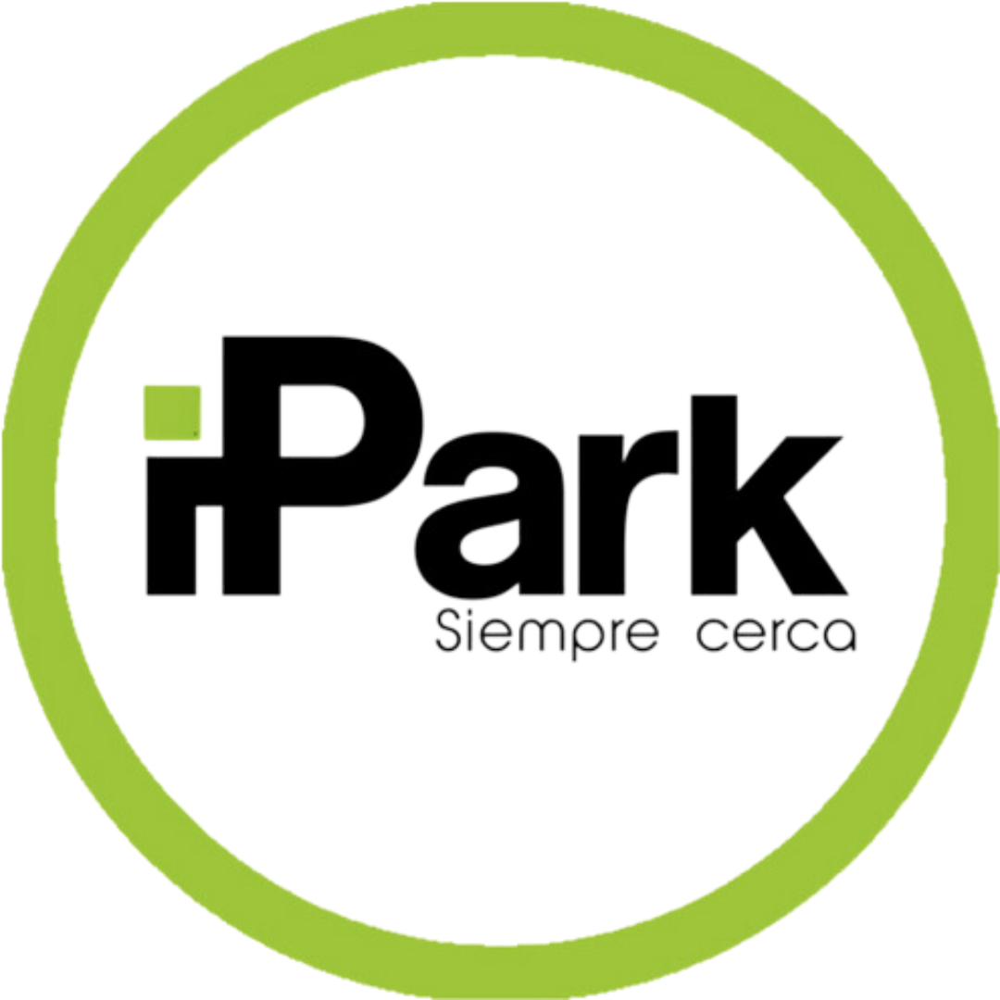 |  |

*Perfil*

|     | SpotGo | Apparka | iPark | Parkopedia |
| --- | --- | --- | --- | --- |
| Overview | Sistema que monitorea en tiempo real los estacionamientos por zonas, organiza a sus usuarios y genera alertas por su uso indebido. | Startup peruana que ofrece una plataforma de reserva y pago de estacionamientos en línea. | Plataforma integral de gestión de estacionamientos con enfoque en IoT y control de accesos. | Directorio global de estacionamientos con información de tarifas, ubicación y horarios.  |
| Ventaja competitiva ¿Qué valor ofrece a los clientes? | Datos en tiempo real de ocupación con alta precisión, junto a la organización por zonas y control de usuarios, permitiendo reducir conflictos y mejorar la eficiencia del estacionamiento. | Facilidad de pago digital y reservas anticipadas; cobertura local en Perú. | Integración de hardware (barreras, sensores, QR) con software centralizado. | Base de datos global con información masiva y comparaciones. |

*Perfil de marketing*

|     | SpotGo | Apparka | iPark | Parkopedia |
| --- | --- | --- | --- | --- |
| Mercado Objetivo | Conductores en áreas urbanas de alta demanda de estacionamiento; municipalidades y operadores privados. | Conductores urbanos que buscan optimizar tiempo en estacionar. | Empresas, centros comerciales, universidades, hospitales. | Conductores que buscan estacionamientos cercanos en distintas ciudades.  |
| Estrategias de Marketing | Pruebas piloto en distritos con alta congestión; alianzas con municipalidades y centros comerciales. | Alianzas con playas de estacionamiento privadas; difusión digital. | Marketing institucional y convenios con operadores de parking. | SEO, integración con Google Maps, Waze y fabricantes de autos. |

*Perfil de producto*

|     | SpotGo | Apparka | iPark | Parkopedia |
| --- | --- | --- | --- | --- |
| Productos y Servicios | Sensores de proximidad, identificación de tipo de usuario, app de notificación, panel de control. | App móvil para reservar estacionamientos, pagar online y visualizar disponibilidad. | Gestión de accesos, control de cobros, administración en la nube. | Información de estacionamientos (ubicación, tarifas, reseñas). |
| Precios y costos | Costo de hardware (sensores) + suscripción mensual para acceso al servicio. | Modelo SaaS con comisión por reserva. | Costos de implementación planes de servicio. | Gratuito para usuarios; ingresos por licencias de datos. |
| Canales de distribución (Web y/o móvil) | App móvil, panel web, integración API para municipios y operadores . | App móvil y página web. | Plataforma web + app + hardware en sitio. | Web, app, APIs integradas en vehículos inteligentes. |

*Análisis SWOT*

|     | SpotGo | Apparka | iPark | Parkopedia |
| --- | --- | --- | --- | --- |
| Fortalezas | Datos en tiempo real, tecnología simple y precisa; adaptable a distintos entornos. | Local, conoce mercado peruano; interfaz sencilla. | Infraestructura tecnológica completa (IoT + software). | Base de datos global; integración en autos inteligentes. |
| Debilidades | Requiere inversión inicial en sensores; depende de la aceptación de usuarios y municipios. | Depende de acuerdos con playas privadas; sin sensores en tiempo real. | Alto costo de implementación; complejo para usuarios pequeños. | Información no siempre en tiempo real; depende de terceros. |
| Oportunidades | Alianzas con municipalidades, centros comerciales, universidades. | Expandirse a más distritos y alianzas municipales. | Escalar en Latinoamérica; integración con smart cities. | Aliarse con municipios para ofrecer datos más exactos. |
| Amenazas | Entrada de competidores grandes con recursos (Google, Waze, Parkopedia). | Competencia con apps globales y nuevas startups IoT. | Aparición de soluciones más baratas y modulares. | Startups locales con datos en vivo vía sensores. |

### 2.1.2. Estrategias y tácticas frente a competidores

1. Diferenciación mediante IoT y datos en tiempo real:
A diferencia de soluciones como Apparka o Parkopedia, que dependen de reportes manuales o información de terceros, el sistema propuesto utiliza sensores IoT instalados en cada espacio de estacionamiento, permitiendo:
\- Detección automática de ocupación en tiempo real
\- Actualización inmediata de disponibilidad
\- Reducción de errores y desactualización de información
Esto convierte al sistema en una solución más precisa, confiable y automatizada, siendo su principal ventaja competitiva. 

2. Modelo modular y escalable:
A diferencia de soluciones como iPark, que requieren inversiones elevadas desde la implementación inicial, el sistema se diseña bajo un enfoque modular:
\- Implementación por etapas (por zonas o niveles de estacionamiento)
\- Escalabilidad desde pequeños estacionamientos hasta infraestructuras complejas (aeropuertos, centros comerciales, hospitales, universidades)
\- Reducción de barreras de entrada para adopción inicial
Esto permite una mayor flexibilidad económica y técnica para los operadores.
  
3. Gestión inteligente por tipos de usuario
El sistema incorpora un enfoque diferenciado según el tipo de usuario:
\- Clientes regulares: búsqueda rápida de espacios disponibles
\- Taxistas y transportistas: zonas asignadas o priorizadas en centros comerciales y aeropuertos
\- Administración del estacionamiento: control total de ocupación y flujos
\- Colaboradores internos: acceso a zonas operativas específicas
 
4. Experiencia de usuario centrada en información inmediata
La aplicación prioriza la toma de decisiones rápida mediante:
\- Notificaciones en tiempo real sobre disponibilidad
\- Mapas de ocupación del estacionamiento
\- Rutas sugeridas hacia espacios libres
Esto reduce significativamente el tiempo de búsqueda de estacionamiento y mejora la experiencia del conductor. 

5. Posicionamiento de SmartParking para ciudades inteligentes
El sistema no se plantea únicamente como una aplicación de estacionamiento, sino como una infraestructura de movilidad urbana inteligente, aportando valor a:
\- Centros comerciales y empresas (mayor rotación de vehículos y clientes)
\- Ciudadanos (optimización del tiempo de búsqueda de estacionamiento)
Este enfoque permite diferenciarse de aplicaciones convencionales de parking
 
6. Analítica de datos y soporte a la toma de decisiones
El sistema incluye un módulo de analítica avanzada para administradores, permitiendo:
\- Tasas de ocupación por hora y zona
\- Identificación de horas pico
\- Rotación de vehículos
\- Ingresos estimados por estacionamiento 

## 2.2. Entrevistas

### 2.2.1. Diseño de entrevistas

**Primer Segmento Objetivo (Administradores o personal operativo de estacionamiento)**

1. ¿Cuáles son los principales retos que enfrenta en la gestión del estacionamiento?
2. ¿Cómo organizan actualmente la distribución de espacios dentro del estacionamiento?
3. ¿De qué manera registran y diferencian a los usuarios como clientes o colaboradores?
4. ¿Qué situaciones ocurren cuando un vehículo ocupa un espacio que no le corresponde?
5. ¿Cómo monitorean la ocupación de las diferentes zonas del estacionamiento?
6. ¿Qué problemas se presentan con mayor frecuencia en horas de alta demanda?
7. ¿Qué dificultades enfrentan los vigilantes para mantener el orden?
8. ¿Qué herramientas o sistemas utilizan actualmente para la gestión del estacionamiento?
9. ¿Qué limitaciones o inconvenientes encuentran en el sistema actual?
10. ¿Cómo cree que la visualización en tiempo real de la ocupación podría ayudar en la gestión?
11. ¿Qué tipo de alertas o notificaciones considera necesarias para mejorar el control?
12. ¿Cómo influye el registro de usuarios en la organización del estacionamiento?
13. ¿Qué beneficios esperaría obtener de un sistema inteligente de estacionamiento?
14. ¿De qué manera considera que se podría reducir el tiempo de búsqueda de espacios?
15. ¿Cómo evaluaría la implementación de una solución como SpotGo en su entorno?

**Segundo Segmento Objetivo (Conductores y usuarios finales (clientes))**

1. ¿Cómo suele ser su experiencia al buscar estacionamiento en lugares concurridos?
2. ¿En qué tipos de lugares encuentra más dificultades para estacionar y por qué?
3. ¿Cuánto tiempo suele invertir en encontrar un espacio disponible?
4. ¿Qué siente o piensa cuando no logra encontrar estacionamiento rápidamente?
5. ¿Qué acciones suele tomar cuando no encuentra un espacio libre?
6. ¿Cómo describiría la organización de los estacionamientos que frecuenta?
7. ¿Qué tan fácil le resulta orientarse dentro de un estacionamiento grande?
8. ¿Cómo cree que una aplicación podría ayudarle durante la búsqueda de estacionamiento?
9. ¿Qué tipo de información le gustaría recibir antes de ingresar a un estacionamiento?
10. ¿Qué información le sería útil mientras busca un espacio dentro del lugar?
11. ¿Cómo prefiere visualizar la disponibilidad de espacios: por zonas o de otra forma?
12. ¿Qué opinión tiene sobre la existencia de zonas exclusivas dentro de un estacionamiento?
13. ¿Qué problemas ha tenido relacionados con la señalización dentro del estacionamiento?
14. ¿Cómo mejoraría su experiencia al momento de estacionar?
15. ¿Qué valor le daría a un sistema que reduzca el tiempo de búsqueda de espacios?

### 2.2.2. Registro de entrevistas

Link: https://www.capcut.com/sv2/ZS9LoHLMkdL5V-kGTXS/

**Primer Segmento Objetivo (Administradores de establecimientos de PNAS)**

**Entrevista 1**

| Screenshot: | 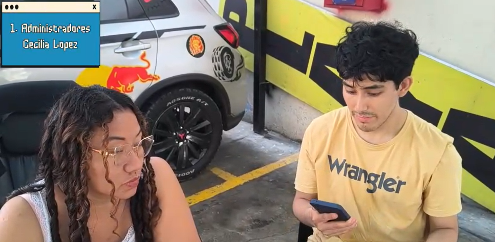 |
| --- | --- |
| Inicia: | 00:00 |
| Duración:| 4:50 |
| Nombre completo: | Cecilia Lopez |
| Edad: | 31 |
| Distrito: | Cercado de Lima |
| Resumen: | Cecilia nos indica que la gestión del estacionamiento se basa en organización manual y registro mediante boletas y tablas, sin asignación de zonas específicas, ya que los vehículos ocupan cualquier espacio disponible. El monitoreo se realiza con cámaras y control físico, y en horas de alta demanda surgen dificultades para movilizar vehículos debido al espacio reducido. Aunque el sistema actual funciona, depende en gran medida de la intervención manual, incluso solicitando llaves para reorganizar los autos. Considera que un sistema inteligente podría mejorar la organización, visibilidad y control, además de aportar beneficios para atraer más clientes. |

**Entrevista 2**

| Screenshot: |  |
| --- | --- |
| Inicia: | 04:50 |
| Duración:| 5:04 |
| Nombre completo: | Reinaldo Torres |
| Edad: | 42 |
| Distrito: | Breña |
| Resumen: | Nos comenta que la gestión de su estacionamiento combina métodos manuales y digitales, registrando a los clientes sin asignación fija de espacios, ya que ocupan cualquier lugar disponible.
El monitoreo se realiza mediante un aplicativo que permite control remoto, pero en horas de alta demanda surgen problemas de congestión y necesidad de movilizar vehículo. Él nos destaca que un sistema en tiempo real mejoraría  significativamente la gestión, permitiendo mayor control y reducción de pérdidas económicas. También resalta la importancia de alertas, especialmente para pagos, y considera que la implementación de una solución inteligente sería beneficiosa, aunque requeriría capacitación del personal. |

**Entrevista 3**

| Screenshot: |  |
| --- | --- |
| Inicia: | 10:44 |
| Duración:| 6:16 |
| Nombre completo: | Juan Vega |
| Edad: | 30 |
| Distrito: | La Victoria |
| Resumen: | La entrevista a Juan Carlos, un administrador de estacionamientos de 30 años, expone las dificultades de una gestión basada en procesos manuales, registros en papel y vigilancia visual, lo que genera desorden en horas pico y un control ineficiente de los espacios reservados. Debido a la falta de un sistema en tiempo real, el personal debe realizar rondas a pie y vocear placas para gestionar la ocupación, una carga operativa que el administrador busca eliminar. En este contexto, la propuesta de la aplicación "Spotg" es recibida con gran optimismo, ya que el uso de sensores para identificar vehículos y un mapa en vivo permitiría automatizar la asignación de lugares, mejorar el control de pagos y proyectar una imagen mucho más profesional y organizada de la empresa. |

**Segundo Segmento Objetivo (Conductores y usuarios finales (clientes))**

**Entrevista 1**

| Screenshot: | 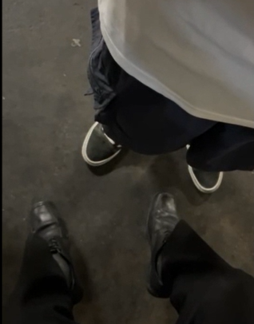 |
| --- | --- |
| Inicia: | 17:01 |
| Duración:| 3:53 |
| Nombre completo: | Emiliano Lozano |
| Edad: | 51 |
| Distrito: | San Martin de Porres |
| Resumen: | Emiliano nos señala que , como taxista, cuenta con un espacio asignado dentro del estacionamiento, lo que facilita su experiencia y evita dificultades para encontrar lugar. La organización se apoya en señalización básica como carteles, y en algunos casos utilizan conos para asegurar sus espacios. En momentos de alta demanda, otros usuarios ocupan sus espacios, obligándolos a esperar o buscar alternativas. Además, señala que los clientes tienen más dificultades para estacionar. Considera que una solución tecnológica con señales o alertas podría mejorar la organización. |

**Entrevista 2**

| Screenshot: |  |
| --- | --- |
| Inicia: | 20:54 |
| Duración:| 6:34 |
| Nombre completo: | Fabio Cordova |
| Edad: | 24 |
| Distrito: | San Isidro |
| Resumen: | Fabio nos indica que su experiencia al buscar estacionamiento puede ser complicada, especialmente en lugares nuevos o muy concurridos como centros comerciales en fines de semana. Aunque en condiciones normales encuentra espacio en pocos minutos, la falta de conocimiento del lugar incrementa el tiempo y genera ansiedad. Señala que la organización suele ser aceptable, pero existen problemas de orientación, señalización y ubicación de salidas, lo que dificulta la experiencia. Además, considera importante contar con información previa como disponibilidad, tarifas y horarios. Él valora positivamente una solución tecnológica que le permita visualizar espacios por zonas o pisos, mejorar la orientación y reducir el tiempo de búsqueda. |

**Entrevista 3**

| Screenshot: | 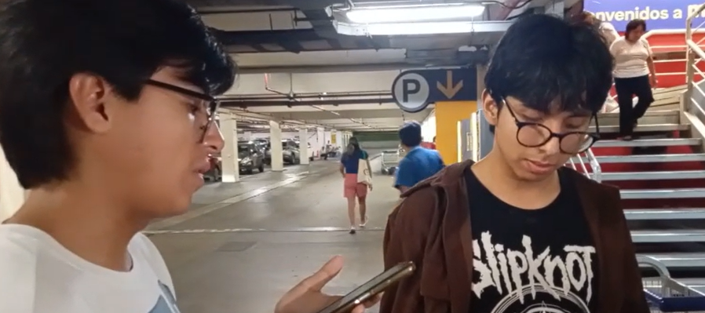 |
| --- | --- |
| Inicia: | 27:28 |
| Duración:| 3:44 |
| Nombre completo: | Sebastian Tarro |
| Edad: | 22 |
| Distrito: | Independencia |
| Resumen: | Nos indica que encontrar estacionamiento en lugares concurridos puede tomar entre 15 y 30 minutos, generando estrés y congestión, especialmente en centros comerciales y universidades. Señala problemas de mala organización en entradas y salidas, así como dificultades para identificar espacios disponibles. También destaca la necesidad de mejor señalización, rutas claras y visualización por zonas, además de información sobre disponibilidad en tiempo real. Considera que la tecnología podría mejorar significativamente la experiencia, reduciendo el tiempo de búsqueda y facilitando el acceso. |

**Entrevista 4**

| Screenshot: |  |
| --- | --- |
| Inicia: | 31:12 |
| Duración:| 5:42 |
| Nombre completo: | Sergio Evangelista |
| Edad: | 21 |
| Distrito: | San Miguel |
| Resumen: | Nos menciona que su experiencia varía según el lugar: es positiva en centros comerciales amplios, pero negativa en espacios reducidos o en la vía pública, donde puede tardar más tiempo y sentir frustración. Destaca problemas como la falta de espacios, dificultad para encontrar salidas y seguridad en la calle. Valora positivamente la idea de una aplicación que brinde información sobre disponibilidad, precios y ubicación de espacios, además de un sistema visual por zonas o mapas. Considera que una solución así tendría un alto valor, ya que permitiría ahorrar tiempo en la búsqueda de estacionamiento. |

### 2.2.3. Análisis de entrevistas

**Primer Segmento Objetivo (Administradores o personal operativo de estacionamiento)**

Este segmento es clave porque son responsables de la organización, control y funcionamiento del estacionamiento. Las entrevistas realizadas evidencian cómo se gestionan actualmente estos espacios y las principales limitaciones que enfrentan, así como la oportunidad de mejora mediante soluciones tecnológicas.

*¿Quienes son?*
Se trata de administradores y personal operativo encargados de supervisar el estacionamiento y organizar el flujo de vehículos.
* Utilizan una combinación de métodos manuales y sistemas básicos (boletas, registros, aplicativos).
* Se encargan del control de ingresos, ocupación y organización de los vehículos.
* En muchos casos, deben intervenir directamente para reordenar los autos.

*¿Qué les preocupa y  anhelan?*
- Desorden en la ocupación: No existen zonas definidas, los usuarios ocupan cualquier espacio disponible.
- Congestión en horas pico: Dificultad para movilizar vehículos en espacios reducidos.
- Dependencia de procesos manuales: Uso de boletas, registros y control físico. 
- Necesidad de control: Buscan mayor visibilidad sin tener que estar presentes todo el tiempo.
- Pérdidas operativas: Riesgo de errores en cobros o control del tiempo de permanencia.

*Requisitos del producto*
- Eficiente, permitiendo una mejor organización del estacionamiento.
- Clara y visual, mostrando la ocupación por zonas en tiempo real.
- Con alertas, para detectar uso indebido de espacios o eventos importantes.
- De fácil control remoto, para que el administrador supervise sin estar presente.
- Apoyo a la gestión, reduciendo la dependencia de procesos manuales.

**Segundo Segmento Objetivo (Conductores y usuarios finales (clientes))**

Este segmento es fundamental porque son quienes utilizan directamente el estacionamiento y experimentan los problemas al momento de buscar un espacio. Las entrevistas realizadas evidencian dificultades relacionadas con el tiempo de búsqueda, la organización del lugar y la falta de información clara, lo que impacta en su experiencia.

*¿Quienes son?*
Se trata de conductores que utilizan estacionamientos en centros comerciales, universidades u otros espacios concurridos.
* Buscan estacionar de forma rápida, segura y sencilla.
* Su experiencia varía según el nivel de congestión y organización del lugar.
* Dependen de la señalización, su conocimiento del lugar o apoyo del personal.
* En algunos casos, recurren a alternativas como estacionar en la calle.

*¿Qué les preocupa y anhelan?*
* Tiempo de búsqueda elevado: Puede tomar varios minutos encontrar un espacio, especialmente en horas pico.
* Congestión y desorden: Tráfico interno y mala organización en entradas, salidas o pisos.
* Falta de orientación: Dificultad para ubicarse dentro del estacionamiento o encontrar salidas.
* Información limitada: No conocen disponibilidad, tarifas o condiciones antes de ingresar.
* Estrés y frustración: Sensaciones negativas cuando no encuentran espacio rápidamente. 

*Requisitos del producto*
* Rápida y eficiente, reduciendo el tiempo de búsqueda de espacios.
* Visual y clara, mostrando disponibilidad por zonas o pisos.
* Informativa, incluyendo datos como espacios libres, tarifas y horarios.
* Fácil de usar, con una interfaz intuitiva que ayude a la orientación.
* Con apoyo en tiempo real, guiando al usuario dentro del estacionamiento.

## 2.3. Needfinding

### 2.3.1. User Personas

**Primer Segmento Objetivo (Administradores o personal operativo de estacionamiento)**

*Figura 2 (User Persona 1)*
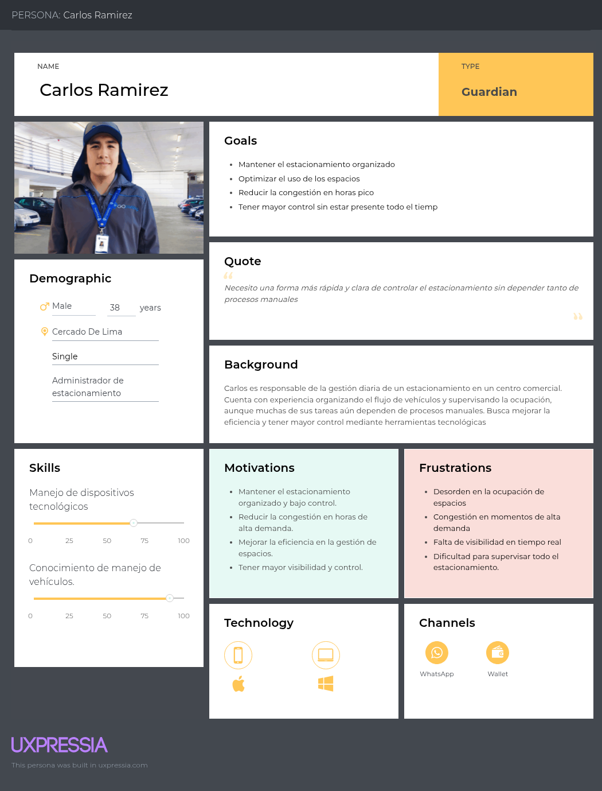

**Segundo Segmento Objetivo (Conductores y usuarios finales (clientes))**

*Figura 3 (User Persona 2)*
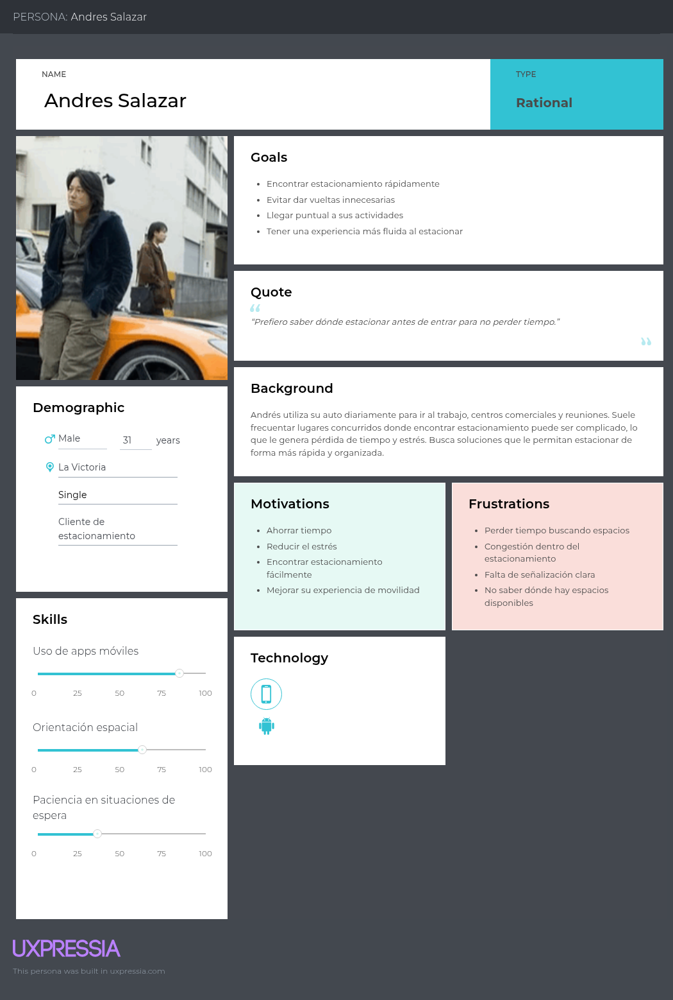

### 2.3.2. User Task Matrix

**Primer Segmento Objetivo (Administradores o personal operativo de estacionamiento)**

*Figura 4 (User Task Matrix 1)*
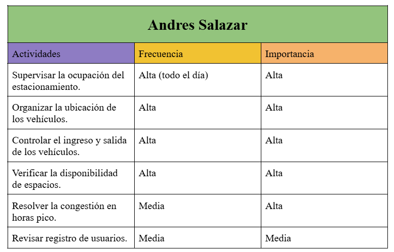

**Segundo Segmento Objetivo (Conductores y usuarios finales (clientes))**

*Figura 5 (User Task Matrix 2)*
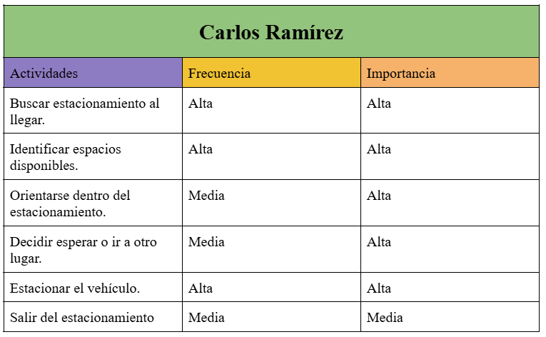

### 2.3.3. User Journey Mapping

**Primer Segmento Objetivo (Administradores o personal operativo de estacionamiento)**

*Figura 6 (User Journey Mapping 1)*
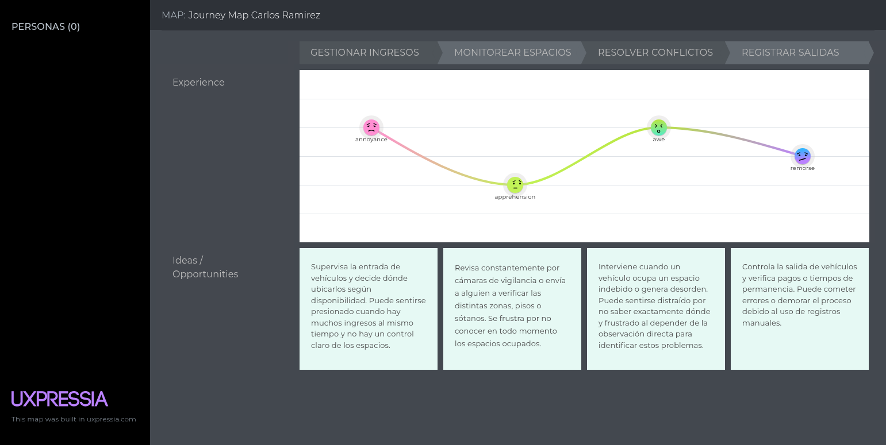

**Segundo Segmento Objetivo (Conductores y usuarios finales (clientes))**

*Figura 7 (User Journey Mapping 2)*
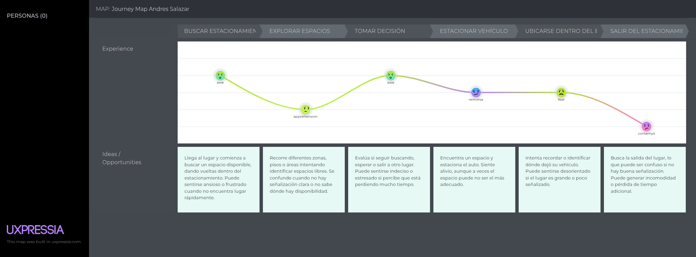

### 2.3.4. Empathy Mapping

**Primer Segmento Objetivo (Administradores o personal operativo de estacionamiento)**

*Figura 8 (Empathy Mapping 1)*
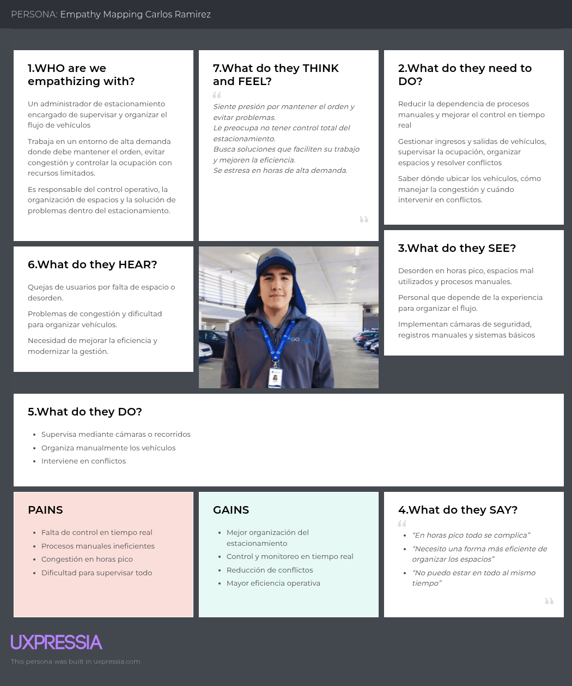

**Segundo Segmento Objetivo (Conductores y usuarios finales (clientes))**

*Figura 9 (Empathy Mapping 2)*
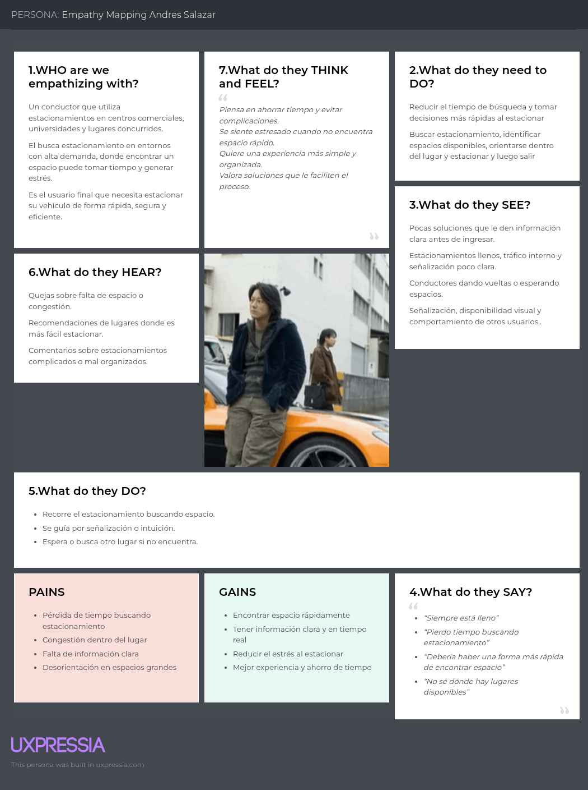

## 2.4. Big Picture EventStorming

*Figura 10 (Big Picture EventStorming)*
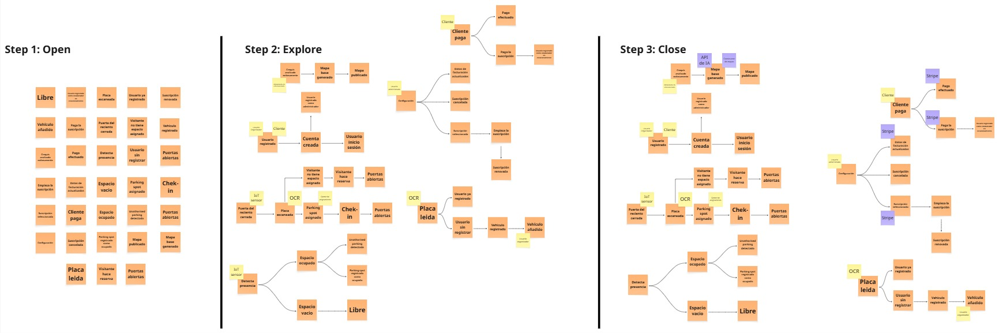

## 2.5. Ubiquitous Language

* **Parking Spot (Espacio de estacionamiento):** Espacio físico individual delimitado dentro de las instalaciones destinado para que un solo vehículo se estacione.
* **Parking Zone (Zona de estacionamiento):** Área o sector específico dentro de la playa de estacionamiento que agrupa múltiples *Parking Spots* y que está designada exclusivamente para un *User Profile* en particular (ej. zona verde para visitantes, zona amarilla para taxistas).
* **User Profile (Perfil de usuario):** Categoría asignada a un conductor que determina sus privilegios, tarifas y la *Parking Zone* a la cual debe dirigirse. Los perfiles principales incluyen *Visitor* (visitante), *Taxi Driver* (taxista) y *Staff* (personal).
* **Occupancy Status (Estado de ocupación):** Condición actual en tiempo real de un *Parking Spot* o *Parking Zone*. Puede encontrarse en estado *Available* (disponible), *Occupied* (ocupado) o *Reserved* (reservado).
* **Smart Routing (Enrutamiento inteligente):** Proceso mediante el cual el sistema asigna y guía automáticamente a un vehículo hacia su *Parking Zone* correspondiente basándose en su *User Profile* al momento del ingreso.
* **Unauthorized Parking (Estacionamiento indebido):** Evento o infracción que ocurre cuando un vehículo ocupa un *Parking Spot* que pertenece a una *Parking Zone* no autorizada para su *User Profile*.
* **Real-time Monitoring (Monitoreo en tiempo real):** Acción de supervisión continua por parte de los administradores para visualizar el flujo de vehículos y el *Occupancy Status* actualizado al instante gracias a los sensores en la infraestructura.
* **Check-in / Check-out (Ingreso / Salida):** Eventos que marcan el momento exacto en el que un vehículo cruza la barrera de entrada al estacionamiento (iniciando su estadía) y el momento en el que se retira (finalizando su estadía y procesando el pago).
* **Availability Alert (Alerta de disponibilidad):** Notificación automática enviada al dispositivo del usuario informando sobre los espacios libres en su zona, o al administrador alertando sobre un *Unauthorized Parking* o capacidad máxima alcanzada.
* **Dashboard (Panel de control):** Interfaz visual y de gestión utilizada exclusivamente por el personal administrativo para supervisar las zonas, controlar el flujo vehicular y obtener analíticas de ocupación.
* **IoT Sensor (Sensor IoT):** Dispositivo de hardware físico instalado en cada *Parking Spot* o barrera de acceso que detecta la presencia del vehículo y alimenta al sistema central con datos del entorno físico.
* **Digital Payment (Pago digital):** Transacción económica realizada directamente desde la aplicación por el usuario (conductor) para cancelar el tiempo de uso de su *Parking Spot* sin necesidad de interactuar con cajeros físicos.
