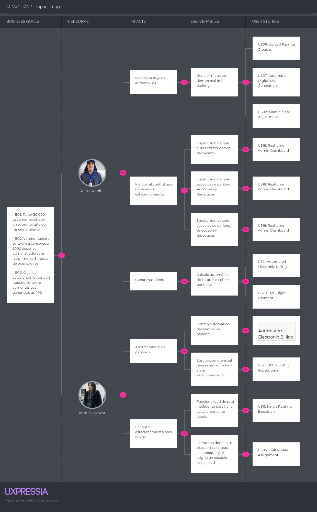
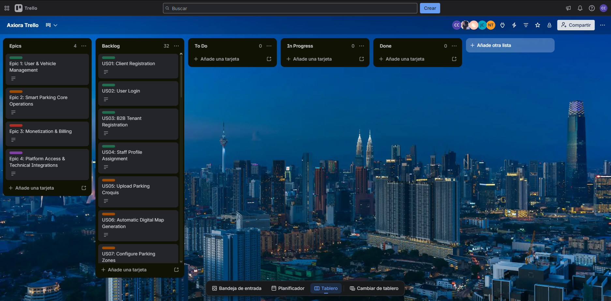

# Capítulo III: Requirements Specification

## 3.1. User Stories

**Epics**

| Epic ID | Title | Description |
| --- | --- | --- |
| E1 | User & Vehicle Management | Gestión integral de la identidad (IAM), registro de clientes B2C, inquilinos B2B (Tenants), autenticación, y administración de vehículos y perfiles (Visitor, Taxi, Staff). |
| E2 | Smart Parking Core Operations | El núcleo operativo del parqueo. Abarca la configuración de infraestructura (mapas y zonas), ejecución logística mediante sensores IoT (Check-in/out, Smart Routing) y monitoreo analítico en tiempo real. |
| E3 | Monetization & Billing | Procesamiento financiero del sistema. Incluye pagos digitales B2C vía pasarela, suscripciones SaaS para B2B y el motor automatizado de facturación electrónica. |
| E4 | Platform Access & Technical Integrations | Capa de acceso e integración. Agrupa la Landing Page de conversión, configuración técnica de accesibilidad (a11y), internacionalización (i18n) y desarrollo de APIs/Webhooks. |

**User Stories**

| Story ID | Title | Description | Acceptance Criteria | Epic ID |
| --- | --- | --- | --- | --- |
| US01 | Client Registration | **As a** Client, **I want** to register an account in the SpotGo app, **so that** I can use the smart parking services. | **Scenario 1: Successful registration** **Given** the client is on the registration screen **When** they enter valid personal details and submit **Then** the system creates the account and assigns a default "Visitor" profile.  **Scenario 2: Existing email** **Given** the client is on the registration screen **When** they enter an email already in use **Then** the system displays an error message. | E1 |
| US02 | User Login | **As a** User (Client or Admin), **I want** to log into my account, **so that** I can access my personalized dashboard or profile. | **Scenario 1: Valid credentials** **Given** the user is on the login page **When** they enter a valid email and password **Then** the system grants access and generates an authentication token.  **Scenario 2: Invalid credentials** **Given** the user is on the login page **When** they enter an incorrect password **Then** access is denied with an error message. | E1 |
| US03 | B2B Tenant Registration | **As a** SuperAdmin, **I want** to register a new parking lot facility, **so that** I can generate administrator credentials for our B2B clients. | **Scenario 1: Create new parking tenant** **Given** the SuperAdmin is in the Tenant Manager **When** they input the parking lot details and submit **Then** the system registers the facility and sends a welcome email with credentials to the local Admin.  **Scenario 2: Missing required fields** **Given** the SuperAdmin is in the Tenant Manager **When** they submit without providing the facility name **Then** the system highlights the missing field and prevents creation. | E1 |
| US04 | Staff Profile Assignment | **As an** Administrator, **I want** to assign a "Staff" profile to specific vehicles, **so that** employees can access restricted parking zones. | **Scenario 1: Assign staff profile** **Given** the admin is in the User Profiles section **When** they flag a registered vehicle as part of the local fleet **Then** the system updates the User Profile to "Staff".  **Scenario 2: Revoke staff profile** **Given** the admin is in the User Profiles section **When** they remove the staff flag from a vehicle **Then** the system downgrades the User Profile back to default "Visitor". | E1 |
| US05 | Upload Parking Croquis | **As an** Administrator, **I want** to upload a floor plan (croquis) of my parking lot, **so that** the system can automatically generate a digital map. | **Scenario 1: Successful upload** **Given** the admin is in the Infrastructure Configurator **When** they upload a valid image file (PNG/JPG) **Then** the system analyzes the image successfully.  **Scenario 2: Invalid file format** **Given** the admin is in the Infrastructure Configurator **When** they upload a PDF or text document **Then** the system rejects the file and displays an "Invalid Format" error. | E2 |
| US06 | Automatic Digital Map Generation | **As an** Administrator, **I want** the system to process my croquis, **so that** it initializes Parking Spots and Zones automatically. | **Scenario 1: Map generation** **Given** a croquis has been uploaded and analyzed **When** the initialization command is triggered **Then** the system creates a base map and sets all spots to "Available" by default.  **Scenario 2: Unclear image analysis** **Given** a croquis is uploaded but is too blurry to detect nodes **When** the initialization command is triggered **Then** the system aborts auto-generation and prompts the admin to use manual setup. | E2 |
| US07 | Configure Parking Zones | **As an** Administrator, **I want** to create and assign Parking Zones, **so that** I can separate areas for Visitors, Taxis, and Staff. | **Scenario 1: Create Taxi Zone** **Given** the admin is in the Infrastructure Configurator **When** they select multiple spots and assign them to the "Taxi Driver" profile **Then** those spots become a restricted Parking Zone.  **Scenario 2: Overlapping zones** **Given** the admin attempts to assign spots to a new zone **When** those spots already belong to a "Staff" zone **Then** the system warns the admin and prompts for confirmation to reassign. | E2 |
| US08 | Virtual Receipt Generation | **As a** Client, **I want** to receive a virtual receipt on my phone, **so that** I know exactly which spot was assigned to me. | **Scenario 1: Ticket display** **Given** a successful reservation **When** the client opens the SpotGo app **Then** the assigned spot number and a guided route are displayed.  **Scenario 2: Spot reassigned dynamically** **Given** the client has an active virtual booking **When** an admin manually reassigns their spot **Then** the virtual receipt updates instantly with the new spot number via WebSockets. | E2 |
| US09 | Spot Occupancy Detection | **As the** System, **I want** to report when client reserves a spot, **so that** the system updates the spot status to Occupied. | **Scenario 1: Vehicle parks** **Given** a Parking Spot is "Available" **When** the client reserves it **Then** the status to "Occupied".  **Scenario 2: System malfunction** **Given** a Parking Spot is operational **When** the system fails to connect with the backend **Then** the system marks the spot as "Unknown Status" for manual review. | E2 |
| US10 | Spot Availability Detection | **As the** System, **I want** to report when a resevation ends, **so that** the system updates the spot status to Available. | **Scenario 1: Vehicle leaves** **Given** a Parking Spot is "Occupied" **When** the reservation ends **Then** the occupancy status goes back to "Available".  **Scenario 2: Brief disruption** **Given** a Parking Spot is "Occupied" **When** the System fails to connect to the backend **Then** the status remains "Occupied" to prevent false departures. | E2 |
| US11 | Availability Alerts | **As an** Administrator, **I want** to receive real-time alerts, **so that** I can react immediately to parking infractions. | **Scenario 1: Receive infraction alert** **Given** an Unauthorized Parking event occurs **When** the policy is triggered **Then** an Availability Alert is pushed to the Admin Dashboard.  **Scenario 2: High capacity alert** **Given** the parking lot fills up **When** total occupancy exceeds 95% **Then** a critical "High Capacity" alert is pushed to the Admin Dashboard. | E2 |
| US12 | Real-time Admin Dashboard | **As an** Administrator, **I want** to view the live occupancy map, **so that** I can monitor the parking lot's status at a glance. | **Scenario 1: View live data** **Given** the admin is logged in **When** they navigate to the Real-time Monitoring dashboard **Then** they see color-coded spots reflecting current Occupancy Statuses.  **Scenario 2: Filter map by zone** **Given** the admin is viewing the live map **When** they select the "Taxi Zone" filter **Then** all other zones are dimmed to focus only on Taxi spots. | E2 |
| US13 | Client Occupancy View | **As a** Client, **I want** to view available spots on the app map, **so that** I can easily navigate to my designated area. | **Scenario 1: Navigate app map** **Given** the client is inside the parking lot **When** they view the Availability Map **Then** they see their assigned zone highlighted with available spots.  **Scenario 2: Manual refresh** **Given** the client is viewing the map **When** they pull down to refresh the screen **Then** the app forces a fetch of the latest spot occupancy data. | E2 |
| US14 | B2C Digital Payment | **As a** Client, **I want** to pay for my parking stay digitally, **so that** I don't have to wait in line at a physical cashier. | **Scenario 1: Successful Stripe payment** **Given** the client initiates Check-out **When** they process the payment via Stripe API **Then** the payment is confirmed and Check-out is authorized for 15 minutes.  **Scenario 2: Declined card** **Given** the client initiates Check-out **When** the card is declined by Stripe **Then** the system displays a "Payment Failed" error and prompts for a new card. | E3 |
| US15 | B2C Monthly Subscription | **As a** Client, **I want** to purchase a monthly parking pass, **so that** I can enter and exit without paying per hour. | **Scenario 1: Buy monthly pass** **Given** the client is in the Payment section **When** they select and pay for a monthly plan **Then** the system flags their profile as a subscriber for 30 days.  **Scenario 2: Cancel subscription auto-renewal** **Given** the client has an active monthly pass **When** they click "Cancel Subscription" **Then** the pass remains valid until the end of the 30-day cycle but stops auto-renewing. | E3 |
| US16 | Automated Electronic Billing | **As the** System, **I want** to automatically generate an electronic receipt (Boleta/Factura), **so that** the transaction complies with SUNAT tax regulations. | **Scenario 1: Generate Boleta after payment** **Given** a Client's Digital Payment is successful **When** the Billing Engine communicates with the Billing API **Then** an electronic receipt is issued using the user's DNI profile.  **Scenario 2: Generate Factura for business** **Given** a Client requests a Factura and provides a valid RUC **When** the digital payment is successful **Then** the system issues a Factura instead of a standard Boleta. | E3 |
| US17 | View Digital Receipts | **As a** Client, **I want** to view my payment history and download receipts, **so that** I can track my parking expenses. | **Scenario 1: Download receipt PDF** **Given** the client has previous transactions **When** they go to the Digital Receipt section and click download **Then** a PDF of their electronic bill is downloaded.  **Scenario 2: Send receipt via email** **Given** the client is viewing a specific transaction **When** they click the "Email Receipt" button **Then** the system sends the PDF receipt to their registered inbox. | E3 |
| US18 | Admin B2B Billing Panel | **As an** Administrator, **I want** to access a B2B billing panel, **so that** I can view the invoices for my SpotGo SaaS subscription. | **Scenario 1: Access SaaS invoices** **Given** the admin is in the Billing Panel **When** they request past invoices **Then** a list of Stripe/SUNAT invoices for the software use is displayed.  **Scenario 2: Update tax details** **Given** the admin is in the Billing Panel **When** they update their company's RUC or Address **Then** future invoices are generated using the updated information. | E3 |
| US19 | Landing Page Value Proposition | **As a** Visitor, **I want** view a fast, static landing page built purely with HTML, CSS, and JS, **so that** I can understand the SpotGo system without loading delays. | **Scenario 1: Fast initial load** **Given** the visitor accesses the URL **When** the page loads **Then** it renders purely static HTML/CSS/JS content instantly without framework overhead.  **Scenario 2: Responsive design** **Given** the visitor uses a mobile device **When** they view the features section **Then** CSS media queries stack the elements vertically for proper reading. | E4 |
| US20 | Landing Page Navigation | **As a** Visitor, **I want** to click on clear HTML anchor links and buttons, **so that** I can easily navigate the page or be redirected to the Web App. | **Scenario 1: Anchor scrolling** **Given** the visitor is on the Hero section **When** they click "Features" **Then** vanilla JS or CSS smooth-scrolling navigates down to that specific section.  **Scenario 2: Web App redirection** **Given** the visitor clicks "Open app" **When** the click is registered **Then** a static HTML link redirects them externally to the Angular Web App login. | E4 |
| US21 | Product Promotional Video | **As a** Visitor, **I want** to watch a promotional video directly on the static page, **so that** I can see the system in action. | **Scenario 1: Play video** **Given** the visitor is on the Landing Page **When** they click play on the embedded YouTube iframe **Then** the video plays natively within the static HTML structure.  **Scenario 2: Fallback loading** **Given** the iframe fails to load **When** the section renders **Then** a static CSS background image is shown instead. | E4 |
| US22 | Asynchronous Payment Confirmation | **As a** Developer, **I want** to implement a Stripe webhook endpoint, **so that** the system can listen to asynchronous payment confirmations. | **Scenario 1: Payment success event** **Given** a user completes a payment on Stripe **When** Stripe sends a `payment_intent.succeeded` event payload **Then** the backend updates the transaction status to paid and authorizes checkout.  **Scenario 2: Payment failed event** **Given** a user's payment is declined on Stripe **When** Stripe sends a `payment_intent.payment_failed` event payload **Then** the backend updates the transaction status to failed and notifies the user. | E4 |
| US23 | Screen Reader Accessibility | **As a** Developer, **I want** to configure ARIA attributes in the Angular Web App, **so that** the application complies with a11y accessibility standards. | **Scenario 1: Screen reader compatibility** **Given** the user utilizes a screen reader **When** they navigate the Web App dashboard **Then** the ARIA tags correctly describe the UI elements.  **Scenario 2: Keyboard focus navigation** **Given** a user relies on keyboard navigation **When** they press the "Tab" key through the application **Then** interactive elements receive visible focus in a logical DOM order. | E4 |
| US24 | Platform Language Selection | **As a** Developer, **I want** to configure i18n support for English and Spanish, **so that** users can choose their preferred language. | **Scenario 1: Switch language to Spanish** **Given** the default language is English (en\_US) **When** the user selects Spanish (es\_419) **Then** the UI labels update to Latin American Spanish.  **Scenario 2: Missing translation fallback** **Given** the user is navigating the app in Spanish **When** a specific new label lacks a Spanish translation key **Then** the system safely falls back to displaying the English default text. | E4 |
| US25 | API Integration Documentation | **As a** Developer, **I want** to generate OpenAPI documentation via Swagger, **so that** front-end developers can easily integrate the RESTful API. | **Scenario 1: Access Swagger UI** **Given** the backend is deployed **When** navigating to the `/swagger-ui` route **Then** all active endpoints are listed with parameters, verbs, and response examples.  **Scenario 2: Try out endpoint** **Given** a developer is in the Swagger UI **When** they fill the parameters for a GET request and click "Execute" **Then** Swagger performs the real HTTP call and displays the live JSON response. | E4 |
| US26 | Landing Page Language Switcher | **As a** Visitor, **I want** toggle the landing page language between Spanish and English using a simple JS script, **so that** I can read it in my preferred language. | **Scenario 1: Switch to English** **Given** the site is currently in Spanish **When** the user clicks the "EN" toggle button **Then** a simple Vanilla JS script updates the text nodes to English instantly without reloading the page.  **Scenario 2: Switch back to Spanish** **Given** the site is in English **When** the user clicks "ES" **Then** the JS script restores the original Spanish text dictionary. | E4 |

## 3.2. Impact Mapping

El Impact Mapping desarrollado para SpotGo tiene como propósito alinear las funcionalidades del sistema con nuestros objetivos estratégicos de negocio, asegurando que cada línea de código aporte valor real. 

Para este mapa, hemos definido la siguiente estructura:
* **Business Goal (¿Por qué?):** Reducir el tiempo promedio de búsqueda de estacionamiento en zonas de alta afluencia y optimizar la eficiencia operativa de los operadores de estacionamiento.
* **Actors (¿Quiénes?):** Conductores (clientes finales B2C) y Administradores o personal operativo (clientes B2B).
* **Impacts (¿Cómo?):** Buscamos que los conductores puedan ubicar y pagar su espacio sin fricciones, y que los administradores puedan monitorear la ocupación en tiempo real y reaccionar inmediatamente ante infracciones de uso de zonas.
* **Deliverables (¿Qué?):** Las soluciones técnicas que construirán este impacto incluyen el mapa de disponibilidad en tiempo real, el motor de *Smart Routing* automatizado con cámaras IoT, alertas del sistema y pagos digitales integrados.

*Figura 11 (Impact Map)*

## 3.3. Product Backlog

**Trello link:** [https://trello.com/invite/b/6a3044b58529d68c1f19afee/ATTIa322332a59d2dc5bf472752e3591fc3f5CBEB433/axiora-trello](https://trello.com/invite/b/6a3044b58529d68c1f19afee/ATTIa322332a59d2dc5bf472752e3591fc3f5CBEB433/axiora-trello)

*Trello Evidence*

| #Orden | User Story Id | Título | Descripción | Story Points |
| --- | --- | --- | --- | --- |
| 1 | US01 | Client Registration | **As a** Client, **I want** to register an account in the SpotGo app, **so that** I can use the smart parking services. | 3 |
| 2 | US02 | User Login | **As a** User (Client or Admin), **I want** to log into my account, **so that** I can access my personalized dashboard or profile. | 2 |
| 3 | US03 | B2B Tenant Registration | **As a** SuperAdmin, **I want** to register a new parking lot facility, **so that** I can generate administrator credentials for our B2B clients. | 3 |
| 4 | US04 | Staff Profile Assignment | **As an** Administrator, **I want** to assign a "Staff" profile to specific vehicles, **so that** employees can access restricted parking zones. | 2 |
| 5 | US05 | Upload Parking Croquis | **As an** Administrator, **I want** to upload a floor plan (croquis) of my parking lot, **so that** the system can automatically generate a digital map. | 5 |
| 6 | US06 | Automatic Digital Map Generation | **As an** Administrator, **I want** the system to process my croquis, **so that** it initializes Parking Spots and Zones automatically. | 5 |
| 7 | US07 | Configure Parking Zones | **As an** Administrator, **I want** to create and assign Parking Zones, **so that** I can separate areas for Visitors, Taxis, and Staff. | 3 |
| 8 | US09 | Virtual Receipt Generation | **As a** Client, **I want** to receive a virtual ticket on my phone, **so that** I know exactly which spot was assigned to me. | 3 |
| 9 | US10 | Spot Occupancy Detection | **As the** System, **I want** to report when client reserves a spot, **so that** the system updates the spot status to Occupied. | 5 |
| 10 | US11 | Spot Availability Detection | **As the** System, **I want** to report when a resevation ends, **so that** the system updates the spot status to Available. | 3 |
| 11 | US13 | Availability Alerts | **As an** Administrator, **I want** to receive real-time alerts, **so that** I can react immediately to parking infractions. | 3 |
| 12 | US14 | Real-time Admin Dashboard | **As an** Administrator, **I want** to view the live occupancy map, **so that** I can monitor the parking lot's status at a glance. | 5 |
| 13 | US15 | Client Occupancy View | **As a** Client, **I want** to view available spots on the app map, **so that** I can easily navigate to my designated area. | 3 |
| 14 | US16 | B2C Digital Payment | **As a** Client, **I want** to pay for my parking stay digitally, **so that** I don't have to wait in line at a physical cashier. | 5 |
| 15 | US17 | B2C Monthly Subscription | **As a** Client, **I want** to purchase a monthly parking pass, **so that** I can enter and exit without paying per hour. | 3 |
| 16 | US20 | Automated Electronic Billing | **As the** System, **I want** to automatically generate an electronic receipt (Boleta/Factura), **so that** the transaction complies with SUNAT tax regulations. | 5 |
| 17 | US21 | View Digital Receipts | **As a** Client, **I want** to view my payment history and download receipts, **so that** I can track my parking expenses. | 2 |
| 18 | US22 | Admin B2B Billing Panel | **As an** Administrator, **I want** to access a B2B billing panel, **so that** I can view the invoices for my SpotGo SaaS subscription. | 3 |
| 19 | US23 | Landing Page Value Proposition | **As a** Visitor, **I want** view a fast, static landing page built purely with HTML, CSS, and JS, **so that** I can understand the SpotGo system without loading delays. | 3 |
| 20 | US24 | Landing Page Navigation | **As a** Visitor, **I want** to click on clear HTML anchor links and buttons, **so that** I can easily navigate the page or be redirected to the Web App. | 2 |
| 21 | US25 | Product Promotional Video | **As a** Visitor, **I want** to watch a promotional video directly on the static page, **so that** I can see the system in action. | 2 |
| 22 | US26 | Asynchronous Payment Confirmation | **As a** Developer, **I want** to implement a Stripe webhook endpoint, **so that** the system can listen to asynchronous payment confirmations. | 3 |
| 23 | US27 | Screen Reader Accessibility | **As a** Developer, **I want** to configure ARIA attributes in the Angular Web App, **so that** the application complies with a11y accessibility standards. | 2 |
| 24 | US28 | Platform Language Selection | **As a** Developer, **I want** to configure i18n support for English and Spanish, **so that** users can choose their preferred language. | 3 |
| 25 | US29 | API Integration Documentation | **As a** Developer, **I want** to generate OpenAPI documentation via Swagger, **so that** front-end developers can easily integrate the RESTful API. | 2 |
| 26 | US30 | Landing Page Language Switcher | **As a** Visitor, **I want** toggle the landing page language between Spanish and English using a simple JS script, **so that** I can read it in my preferred language. | 3 |
