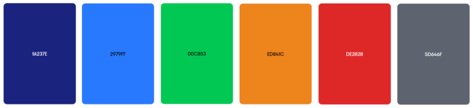

# Capítulo IV: Product Design

## 4.1. Style Guidelines

Esta sección establece un repositorio centralizado de diseño que permite mantener la consistencia visual y funcional del sistema SpotGo. Este repositorio incluye la definición de assets, tipografías, paleta de colores, reglas de espaciado y lineamientos de interacción, los cuales son utilizados de forma uniforme por todo el equipo de desarrollo. El objetivo es asegurar una presentación coherente, facilitar la escalabilidad del producto y reducir inconsistencias durante la implementación. Para ello, se toman como base principios de diseño centrado en el usuario, consistencia visual, accesibilidad y eficiencia en la interacción.

### 4.1.1. General Style Guidelines

Los General Style Guidelines definen las decisiones visuales fundamentales del sistema, incluyendo branding, tipografía, colores, espaciado y tono de comunicación, sustentadas en principios UX/UI y en las necesidades identificadas en los usuarios.

**Branding**

El branding de SpotGo fue diseñado para transmitir confianza, eficiencia y modernidad, valores clave en un sistema que gestiona información en tiempo real. Se emplea un color primario azul oscuro (#1A237E), comúnmente asociado con seguridad y tecnología, reforzando la percepción de confiabilidad en el servicio. El logotipo utiliza formas geométricas con bordes redondeados (rounded-lg), lo que reduce la rigidez visual y genera una experiencia más amigable y accesible para el usuario. Esta combinación permite equilibrar profesionalismo con cercanía.

**Typography**

La tipografía principal seleccionada es Inter, acompañada de fuentes de respaldo (ui-sans-serif, system-ui). Esta elección se fundamenta en su alta legibilidad en pantallas digitales, su adecuada altura de x (x-height) y su diseño optimizado para interfaces modernas. Se definió una jerarquía tipográfica clara:

- **Títulos principales:** text-xl font-bold
- **Subtítulos y navegación:** text-sm font-medium
- **Etiquetas e indicadores:** text-xs font-semibold
- **Datos críticos (tiempo, códigos):** font-mono

El uso limitado de pesos tipográficos (medium, semibold, bold) evita ruido visual y mejora la comprensión rápida de la información.

**Colors**

La paleta de colores sigue un enfoque semántico, donde cada color representa un estado o acción específica dentro del sistema:

- **Primary (Azul oscuro #1A237E):** acciones principales, ---navegación activa
- **Secondary (Azul brillante #2979FF):** interacciones, enlaces, foco
- **Success (Verde #00C853):** espacios disponibles, acciones exitosas
- **Warning (Naranja):** alertas de tiempo o expiración
- **Destructive (Rojo):** errores críticos o acciones irreversibles
- **Occupied (Gris):** espacios no disponibles

*Figura 12 (Color Palette)*

Una decisión clave es el uso de gris para espacios ocupados en lugar de rojo, con el fin de evitar generar estrés innecesario en el usuario. Esta estrategia reduce la carga cognitiva y mejora la interpretación visual del mapa.

**Spacing**

Se implementa un sistema de espaciado basado en una escala modular de 8px, alineado con CSS. Esto incluye valores como 8px, 16px, 24px y 32px para márgenes, paddings y separación entre componentes.

- Espaciado interno de contenedores: 24px
- Separación entre elementos relacionados: 8px–16px
- Separación entre secciones: 24px–32px

Este sistema garantiza consistencia visual, alineación precisa y facilita la escalabilidad del diseño.

**Tone of Communication**

El tono de comunicación definido es directo, funcional y conciso, evitando frases largas o ambiguas. Ejemplos incluyen:

- “Live updates”
- “Reserve”

Este enfoque responde a usuarios en contextos de alta carga cognitiva (conductores en movimiento), permitiendo una rápida comprensión de la información sin distracciones innecesarias.

**Design System**

El sistema de diseño se basa en tecnologías modernas como typescript, angular, css y html5 lo que permite la creación de componentes reutilizables, accesibles y consistentes. Este enfoque facilita el mantenimiento del sistema, reduce la duplicación de estilos y asegura una experiencia uniforme en toda la aplicación.

### 4.1.2. Web Style Guidelines

Los Web Style Guidelines definen los estándares visuales y de interacción para interfaces web responsivas, asegurando una experiencia consistente, eficiente y accesible.

**Responsive Design**

El diseño utiliza layouts flexibles basados en Flexbox y Grid, evitando dimensiones fijas. Se implementan contenedores adaptables y unidades relativas para garantizar una correcta visualización en diferentes resoluciones.

**Navigation System**

Se adopta un patrón de navegación tipo dashboard, compuesto por:

- **Sidebar persistente:** permite acceso rápido a las secciones principales
- **Navbar superior fija:** contiene acciones globales y estado del sistema

Este enfoque permite mantener el contexto del usuario en todo momento, reduciendo la desorientación y mejorando la eficiencia en la navegación.

**UI Components**

Se definen componentes reutilizables como:

- Botones (primarios, secundarios, estados hover/active)
- Tarjetas (cards) para información estructurada
- Indicadores de estado (disponible, ocupado, alerta)
- Badges y etiquetas informativas

Estos componentes siguen patrones consistentes en tamaño, color y comportamiento, facilitando su reconocimiento por parte del usuario.

**Visual Feedback**

El sistema incorpora mecanismos de retroalimentación visual para mejorar la interacción:

- Animaciones suaves (hover, transitions)
- Cambios de estado visibles en botones e interfaces
- Notificaciones discretas (ej. icono de alerta)

Esto permite al usuario entender rápidamente el resultado de sus acciones y el estado del sistema.

**Accessibility**

Se consideran principios de accesibilidad como:

- Contraste adecuado-
- Tamaños mínimos de interacción-
- Navegación mediante teclado
- Uso de múltiples indicadores (color + texto + iconos)

Esto garantiza una experiencia inclusiva para diferentes tipos de usuarios.

**Relación con el problema**

Todas las decisiones de diseño están alineadas con los problemas identificados en los usuarios:

- **Reducción del tiempo de búsqueda:** mediante visualización clara y en tiempo real
- **Mejor organización:** gracias a estructuras visuales jerárquicas
- **Disminución del estrés:** uso de colores suaves, información clara y feedback inmediato

## 4.2. Information Architecture

### 4.2.1. Organization Systems

### 4.2.2. Labeling Systems

### 4.2.3. SEO Tags and Meta Tags

### 4.2.4. Searching Systems

### 4.2.5. Navigation Systems

## 4.3. Landing Page UI Design

### 4.3.1. Landing Page Wireframe

### 4.3.2. Landing Page Mock-up

## 4.4. Web Applications UX/UI Design

En esta sección se presenta la propuesta de diseño UX/UI de las aplicaciones web de SpotGo, describiendo la estructura visual, los elementos de interfaz y los patrones de interacción que guían la experiencia del usuario.

El diseño está orientado a los dos segmentos del sistema: usuarios y administradores, priorizando una interacción clara, eficiente y alineada con sus necesidades. Asimismo, se asegura la coherencia con los Style Guidelines y la Information Architecture, garantizando una experiencia intuitiva y consistente en toda la plataforma.

### 4.4.1. Web Applications Wireframes

**Pantallas de Usuario:**

*Figura 13 (Wireframe Login)*

*Figura 14 (Dashboard)*

*Figura 15 (My Reservations)*

*Figura 16 (Subscription)*

*Figura 17 (Receipts)*

*Figura 18 (Favorites)*

*Figura 19 (Parking History)*

**Pantallas de Administrador:**

*Figura 20 (Analytics - Insights Hub)*

*Figura 21 (Overview - Real time map)*

*Figura 22 (Overview - Main terminal hub)*

*Figura 23 (Reports)*

*Figura 24 (Reports List)*

*Figura 25 (Employees)*

*Figura 26 (Employees List)*

### 4.4.2. Web Applications Wireflow Diagrams

**Wireflow Usuarios:**

*Figura 27 (Registro)*

*Figura 28 (Buscar estacionamiento)*

*Figura 29 (Reservar espacio)*

*Figura 30 (Recibos digitales)*

*Figura 31 (Suscripciones)*

*Figura 32 (Extender tiempo)*

*Figura 33 (Historial y calificacion)*

*Figura 34 (Historial y calificacion)*

**Wireflow Administradores:**

*Figura 35 (Observar parametros del analisis)*

*Figura 36 (Eliminar Parking)*

*Figura 37 (Vista de Reportes)*

*Figura 38 (Vista de Empleados)*

### 4.4.3. Web Applications Mock-ups

**Pantallas de Administrador:**

*Figura 39 (SpotGo Analytics & Patterns)*

*Figura 40 (SpotGo Analytics - Patterns)*

*Figura 41 (SpotGo Insight hub)*

*Figura 42 (SpotGo Employees)*

*Figura 43 (SpotGo List Reports)*

*Figura 44 (Main Terminal Hub)*

*Figura 45 (Report)*

*Figura 46 (List Employees)*

**Pantallas de Usuario:**

*Figura 47 (Dashboard)*

*Figura 48 (Favorites)*

*Figura 49 (Parking History)*

*Figura 50 (Receipts)*

*Figura 51 (Reservation)*

*Figura 52 (Subscription)*

### 4.4.4. Web Applications User Flow Diagrams

*Figura 53 (Registro)*

*Figura 54 (Buscar estacionamiento)*

*Figura 55 (Reservar Espacio)*

*Figura 56 (Recibos Digitales)*

*Figura 57 (Suscripciones)*

*Figura 58 (Extender tiempo)*

*Figura 59 (Eliminar Parking)*

*Figura 60 (Consultar historial y calificar experiencia)*

## 4.5. Web Applications Prototyping

- Landing Page Prototype Link: https://www.figma.com/proto/LMAhXrMKRKaUJjckWtSebJ/spotgo-design?node-id=238-6314&t=rTgWt8HVJ9AypDPo-0&scaling=min-zoom&content-scaling=fixed&page-id=1%3A2&starting-point-node-id=238%3A6314&show-proto-sidebar=1
- Client Prototype Link: https://www.figma.com/proto/LMAhXrMKRKaUJjckWtSebJ/spotgo-design?node-id=93-3977&t=rTgWt8HVJ9AypDPo-0&scaling=min-zoom&content-scaling=fixed&page-id=1%3A2&starting-point-node-id=93%3A3977&show-proto-sidebar=1
- Admin Prototype Link: https://www.figma.com/proto/LMAhXrMKRKaUJjckWtSebJ/spotgo-design?node-id=413-222&t=rTgWt8HVJ9AypDPo-0&scaling=scale-down&content-scaling=fixed&page-id=0%3A1&starting-point-node-id=413%3A222
- Login Protype Link: https://www.figma.com/proto/LMAhXrMKRKaUJjckWtSebJ/spotgo-design?node-id=337-2099&t=rTgWt8HVJ9AypDPo-0&scaling=min-zoom&content-scaling=fixed&page-id=1%3A2&starting-point-node-id=337%3A2099&show-proto-sidebar=1

## 4.6. Domain-Driven Software Architecture

### 4.6.1. Design-Level EventStorming

### 4.6.2. Software Architecture Context Diagram

### 4.6.3. Software Architecture Container Diagrams

### 4.6.4. Software Architecture Components Diagrams

## 4.7. Software Object-Oriented Design

### 4.7.1. Class Diagrams

## 4.8. Database Design

### 4.8.1. Database Diagrams

