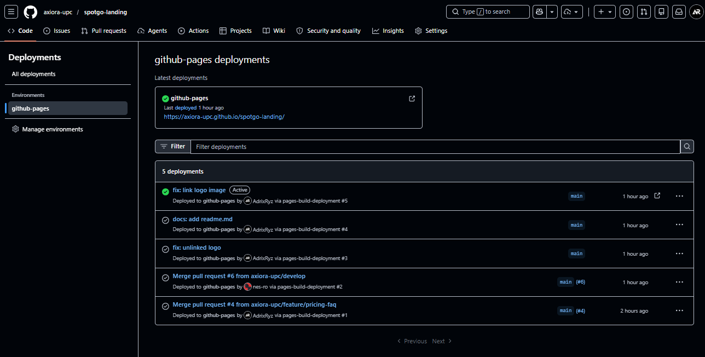
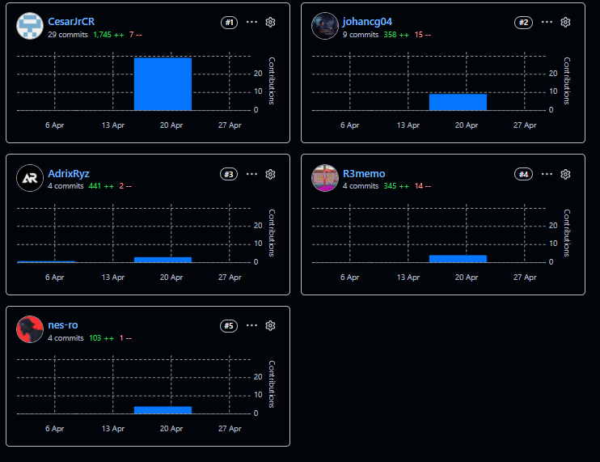

### 5.2.1. Sprint 1

#### *5.2.1.1. Sprint Planning 1*

Para el desarrolo del primer sprint nos centramos en el desarrollo de la landing page de nuestra aplicación. Para ello designamos tareas específicas para cada sección, de modo que podamos repartirnos estas tareas entre los integrantes del grupo por seccion de la landing, agilizando su desarrollo. Dentro de la landing se presenta quienes somos, funcionalidades, planes, manera de contactarnos y sobre la organización.

| **Sprint #** | 1 |
| --- | --- |
| **Date** | 2026-04-10 |
| **Time** | 4:00 PM |
| **Location** | Reunión virtual |
| **Prepared By** | Adrian Ruiz Mideyros |
| **Attendees** | Adrian Ruiz Mideyros, Nestor Alonso Rojas Tello, Paul Alexandro Espinoza Lopez, Cesar Jair Contreras Rojas, Johan Alexis Contreras Granados |
| **Sprint 1 Goal** | OOur focus is on delivering a fast, static Landing Page (HTML/CSS/JS) with language support to attract clients and validate our value proposition. This will be confirmed when the Landing Page is deployed and fully navigable by users. |
| **Sprint 1 Velocity** | 10 Story Points (Velocidad estimada para el primer ciclo del equipo). |
| **Sum of Story Points** | 10 |

#### *5.2.1.2. Aspect Leaders and Collaborators*

A continuación se detalla la matriz de liderazgo y colaboración (LACX) para brindar claridad en la comunicación del equipo durante el desarrollo de las tareas de este Sprint.

| Team Member (Last Name, First Name) | GitHub Username | Landing Page UI/UX | Landing Page Structure | Basic Funcs | Special Funcs |
| --- | --- | --- | --- | --- | --- |
| Ruiz Mideyros, Adrian | @AdrixRyz | C | L | C | C |
| Rojas Tello, Nestor Alonso | @nes-ro | C | C | C | L |
| Espinoza Lopez, Paul Alexandro | @R3memo | C | C | L | C |
| Contreras Rojas, Cesar Jair | @CesarJrCR | C | C | L | C |
| Contreras Granados, Johan Alexis | @johancg04 | L | C | C | C |

#### *5.2.1.3. Sprint Backlog 1*

Se presentan los User Stories asignados a este Sprint y su descomposición en Work-items o tareas técnicas específicas.

| User Story Id | User Story Title | Work-Item / Task Id | Work-Item / Task Title | Description | Estimation (Hours) | Assigned To | Status |
| :--- | :--- | :--- | :--- | :--- | :--- | :--- | :--- |
| US28 | Static Landing Page Value Prop. | TS28.1 | Setup Static Proj | Inicializar el repositorio del Landing con la estructura base HTML5 y CSS (Tailwind/CSS puro). | 2 | @nes-ro | Done |
| US28 | Static Landing Page Value Prop. | TS28.2 | Implement Hero Section | Desarrollar la sección principal responsiva con Flexbox/Grid. | 4 | @johancg04 | Done |
| US29 | Static Call to Action Routing | TS29.1 | Vanilla JS Smooth Scroll | Implementar el script JS para navegación interna y el anchor tag externo hacia la Web App. | 2 | @AdrixRyz | Done |
| US30 | Embedded Promotional Video | TS30.1 | Embed YouTube Iframe | Integrar el componente de video nativo con fallbacks de imagen vía CSS. | 2 | @R3memo | Done |
| US36 | Vanilla JS Language Switcher | TS36.1 | Implement JS Dictionary | Crear el script Vanilla JS para alternar los nodos de texto entre Español e Inglés del DOM. | 3 | @CesarJrCR | Done |

#### *5.2.1.4. Development Evidence for Sprint Review*

En la siguiente tabla se resumen los principales commits realizados en los repositorios de SpotGo correspondientes al alcance del primer Sprint, aplicando Conventional Commits.

| Repository | Branch | Commit Id | Commit Message | Commit Message Body | Commited on |
| --- | --- | --- | --- | --- | --- |
| axiora-upc/spotgo-landing | feature/struct | 0ea6e9e | feat: add initial structure | Implementa la estrucutra principal del proyecto así como el header y el footer. | 2026-04-24 |
| axiora-upc/spotgo-landing | feature/hero-trustedbar-drivers | a5693ee | feat: add structure and styles of hero, trustedbar and drivers section | Implementa las secciones de hero, trustedbar y drivers section. | 2026-04-24 |
| axiora-upc/spotgo-landing | feature/operators-stats | 58c8633 | feat: add operators and stats sections | Implementa las secciones de operators y stats | 2026-04-25 |
| axiora-upc/spotgo-landing | feature/pricing-faq | 11ed754 | feat: add pricing, testimonials and faq sections | Implementa las secciones de pricing, testimonials y faq | 2026-04-25 |
| axiora-upc/spotgo-landing | feature/cta-section-lang | e3a5413 | feat: add cta section and language features | Implementa la sección cta section y las language features | 2026-04-25 |

#### *5.2.1.5. Execution Evidence for Sprint Review*

Durante este Sprint, el equipo logró implementar la versión inicial del Landing Page funcional, rápido y estático, incluido el sistema de idiomas.

Video de Demostración de Navegación (Landing Page): https://upcedupe-my.sharepoint.com/:v:/g/personal/u20241e177_upc_edu_pe/IQDYdXQpcuFATYFoR1HYgMP_AQa4ZqLQcXEe6XCnQa2-WBY?nav=eyJyZWZlcnJhbEluZm8iOnsicmVmZXJyYWxBcHAiOiJPbmVEcml2ZUZvckJ1c2luZXNzIiwicmVmZXJyYWxBcHBQbGF0Zm9ybSI6IldlYiIsInJlZmVycmFsTW9kZSI6InZpZXciLCJyZWZlcnJhbFZpZXciOiJNeUZpbGVzTGlua0NvcHkifX0&e=rETy8f

#### *5.2.1.6. Services Documentation Evidence for Sprint Review*

N/A. Durante el Sprint 1 el esfuerzo de desarrollo se enfocó exclusivamente en la creación del sitio web estático promocional (Landing Page), por lo que aún no se han implementado APIs RESTful ni Endpoints que requieran documentación con Swagger/OpenAPI. Esta documentación se generará a partir del Sprint 2.

#### *5.2.1.7. Software Deployment Evidence for Sprint Review*

Para el despliegue continuo (CI/CD) de este Sprint, se configuró el entorno de GitHub Pages conectado directamente al repositorio de GitHub del Landing Page estático, permitiendo publicaciones automáticas y ultra-rápidas con cada PR fusionado en la rama main.

*Figura 79 (Software Deployment 1)*

#### *5.2.1.8. Team Collaboration Insights during Sprint*

Todos los miembros del equipo han participado activamente en la implementación de los productos del Sprint 1, lo cual se evidencia mediante los reportes de actividad y contribución del repositorio de GitHub de la organización Axiora.

*Figura 80 (Team Insights Sprint 1)*

