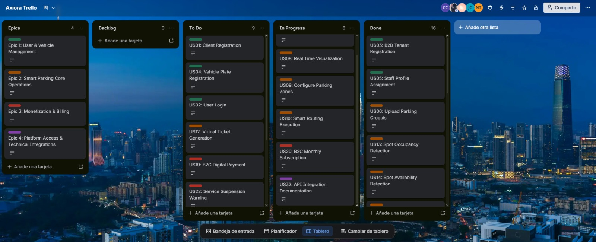
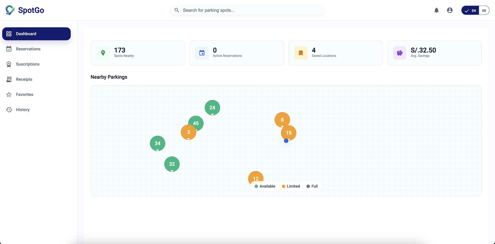
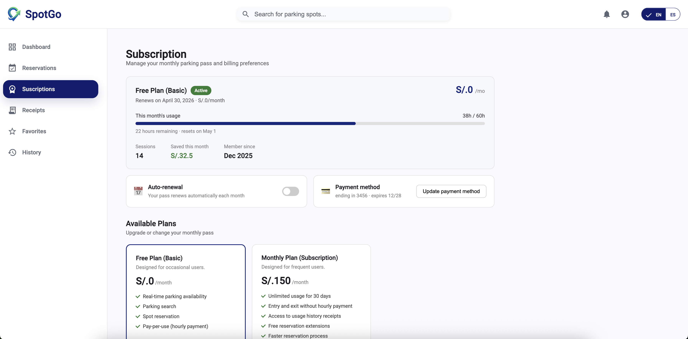
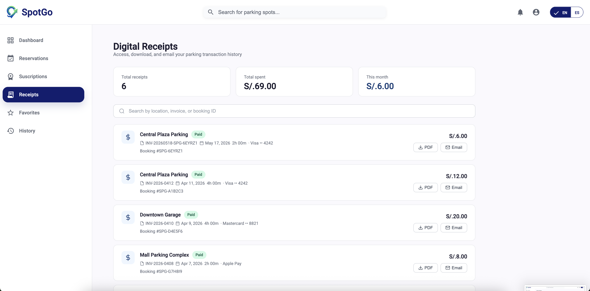
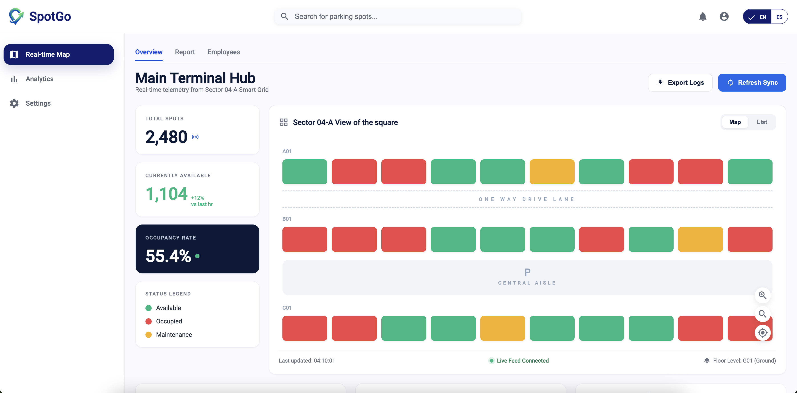
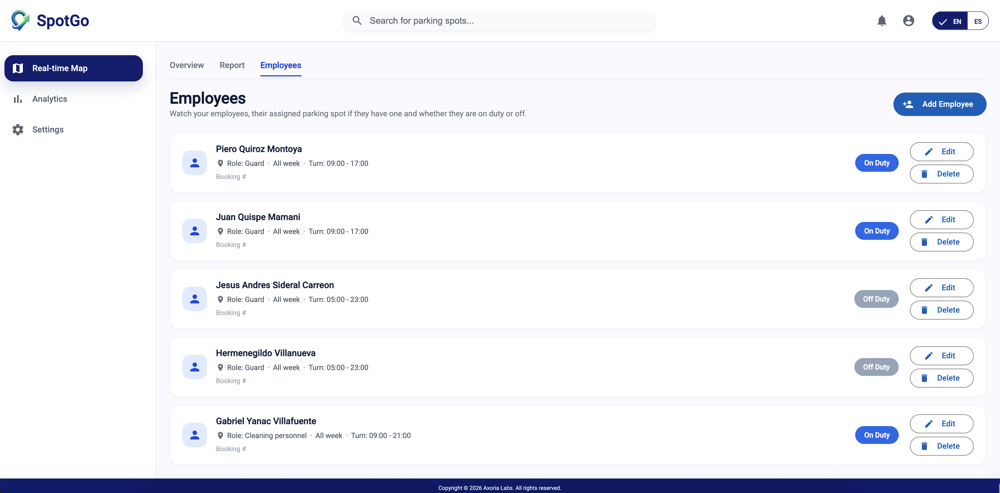
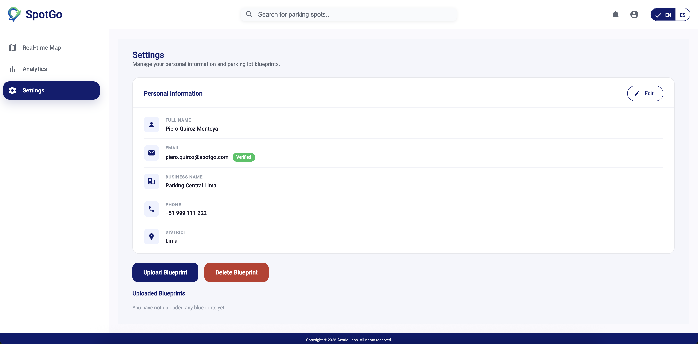
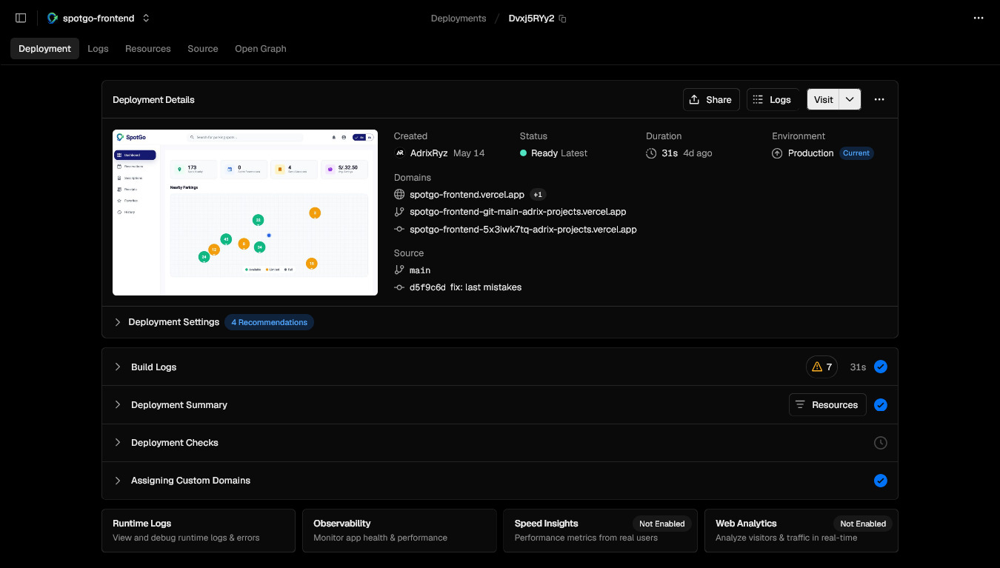

### 5.2.2. Sprint 2

#### *5.2.2.1. Sprint Planning 2*

Para el desarrollo del segundo sprint nos centramos en el elaboracion del frontend de nuetra aplicación, para ello lo  dividimos de acuerdo a la cantidad de bounded context con cada integrante del grupo (fueron 5 bounded context, 1 por cada integrante). En el Frontend podemos encontrar Dashboard, Reservaciones de estacionamiento, Suscripciones, Recibos, Favoritos y Historial de estacionamientos visitados.

| **Sprint #** | 2 |
| --- | --- |
| **Sprint Planning Background** | |
| **Date** | 2026-05-05 |
| **Time** | 6:00 PM |
| **Location** | Reunión virtual |
| **Prepared By** | Adrian Ruiz Mideyros |
| **Attendees** | Adrian Ruiz Mideyros, Nestor Alonso Rojas Tello, Paul Alexandro Espinoza Lopez, Cesar Jair Contreras Rojas, Johan Alexis Contreras Granados |
| **Sprint 1 Review Summary** | During Sprint 1, the team successfully established the initial project foundations, including repository configuration, cloud infrastructure setup, GitFlow workflow definition, and collaborative development standards using Conventional Commits. In addition, the team refined the Lean UX process to better align the value proposition with the identified User Personas and business problem. The initial Product Backlog was reorganized to improve traceability between User Stories, acceptance criteria, Impact Mapping, and the defined project scope. |
| **Sprint 1 Retrospective Summary** | During the retrospective, the team identified the need to improve the specificity and consistency of User Stories and acceptance criteria to ensure complete alignment with the project scope and Lean UX Canvas. The team also agreed to strengthen documentation quality, maintain consistent English writing standards, and include more alternative user flows and responsive design considerations in future prototypes. Additionally, the team reinforced the mandatory use of GitFlow, Conventional Commits, branch naming conventions, and task estimation practices for all future sprints. |
| **Sprint Goal & User Stories** | |
| **Sprint 2 Goal** | Our focus is on delivering a responsive, fast, and fully navigable static Landing Page using HTML, CSS, and JavaScript, including multilingual support and a clear value proposition aligned with the identified User Personas. This sprint also aims to strengthen the visual identity, improve user flows, and validate the business idea through an accessible and responsive user experience. Success will be confirmed when users can navigate the deployed Landing Page seamlessly across different devices and clearly understand the platform’s innovative value proposition. |
| **Sprint 1 Velocity** | 10 Story Points (Velocidad estimada para el primer ciclo del equipo). |
| **Sum of Story Points** | 10 |

#### *5.2.2.2. Aspect Leaders and Collaborators*

A continuación se detalla la matriz de liderazgo y colaboración (LACX) para brindar claridad en la comunicación del equipo durante el desarrollo de las tareas de este Sprint.

| Team Member (Last Name, First Name) | GitHub Username | Bounded context IoT | Bounded context profiles | Bounded context Payment | Bounded context Occupancy | Bounded context Infrastructure |
| --- | --- | --- | --- | --- | --- | --- |
| Ruiz Mideyros, Adrian | @AdrixRyz | L | C | C | C | C |
| Rojas Tello, Nestor Alonso | @nes-ro | C | C | L | C | C |
| Espinoza Lopez, Paul Alexandro | @R3memo | C | L | C | C | C |
| Contreras Rojas, Cesar Jair | @CesarJrCR | C | C | C | L | C |
| Contreras Granados, Johan Alexis | @johancg04 | C | C | C | C | L |

#### *5.2.2.3. Sprint Backlog 2*

El sprint Backlog se centra en la elaboración del frontend principal de SpotGo, esto incluye el diseño responsivo, el dashboard y el acceso por roles tanto el de administrador como el de conductor. Es gracias a estas implemetanciones que hemos logrado una aplicación interactiva conectada a servicios simulados para validar la experiencia antes de agregar las API's

| User Story Id | User Story Title | Work-Item / Task Id | Work-Item / Task Title | Description | Estimation (Hours) | Assigned To | Status |
| --- | --- | --- | --- | --- | --- | --- | --- |
| US01 | Client Registration | TS01.1 | Develop User Registration Module | Ejecutar formulario de registro de usuarios con validación de credenciales y persistencia de datos. | 4 | @AdrixRyz | To Do |
| US02 | User Login | TS02.1 | Develop Authentication Module | Poner en marcha el inicio de sesión seguro con validación de credenciales y generación de tokens. | 4 | @CesarJrCR | To Do |
| US03 | B2B Tenant Registration | TS03.1 | Develop Tenant Registration Module | Aplicar el registro de nuevos tenants y generación de credenciales administrativas. | 4 | @AdrixRyz | To Do |
| US04 | Staff Profile Assignment | TS04.1 | Develop Staff Profile Assignment Module | Poner en marcha asignación y revocación de perfiles Staff para vehículos autorizados. | 3 | @AdrixRyz | Done |
| US05 | Upload Parking Croquis | TS05.1 | Develop Croquis Upload Module | Implementar el módulo de carga de croquis permitiendo subir imágenes PNG/JPG y validar formatos soportados. | 4 | @nes-ro | Done |
| US06 | Automatic Digital Map Generation | TS06.1 | Develop Automatic Map Generator | Aplicar la lógica de procesamiento del croquis para generar automáticamente zonas y espacios del estacionamiento. | 3 | @johancg04 | In Progress |
| US07 | Configure Parking Zones | TS07.1 | Develop Parking Zone Manager | Poner en practica la configuración y asignación de zonas de estacionamiento para visitantes, taxis y personal. | 3 | @AdrixRyz | In Progress |
| US08 | Smart Routing Execution | TS08.1 | Develop Smart Routing Engine | Implementar el motor de enrutamiento inteligente para asignar espacios según el perfil del vehículo detectado. | 4 | @CesarJrCR | To Do |
| US09 | Entry Barrier Check-in | TS09.1 | Implement Entry Barrier Automation | Aplicar la automatización de apertura de barrera basada en validación de acceso y asignación de espacio. | 2 | @AdrixRyz | In Progress |
| US10 | Virtual Ticket Generation | TS10.1 | Develop Virtual Ticket Module | Llevar a cabo la generación y visualización de tickets virtuales con información del espacio asignado. | 3 | @nes-ro | Done |
| US11 | Spot Occupancy Detection | TS11.1 | Develop Occupancy Detection Logic | Aplicar la lógica de actualización automática del estado de ocupación mediante sensores IoT. | 3 | @johancg04 | Done |
| US12 | Spot Availability Detection | TS12.1 | Develop Spot Availability Tracker | Poner en marcha la actualización automática de disponibilidad de espacios mediante sensores IoT. | 4 | @CesarJrCR | Done |
| US13 | Unauthorized Parking Detection | TS13.1 | Develop Parking Infraction Detection | Implementar la detección de estacionamiento no autorizado según reglas de zonas y perfiles. | 2 | @CesarJrCR | Done |
| US14 | Availability Alerts | TS14.1 | Develop Alert Notification System | Poner en marcha sistema de alertas en tiempo real para ocupación alta e infracciones. | 4 | @nes-ro | Done |
| US15 | Real-time Admin Dashboard | TS15.1 | Develop Real-time Monitoring Dashboard | Poner en marcha dashboard en tiempo real con visualización dinámica de ocupación y filtros por zonas. | 4 | @CesarJrCR | Done |
| US16 | Client Occupancy View | TS16.1 | Develop Client Parking Map View | Implementar vista interactiva para clientes mostrando espacios disponibles y rutas asignadas. | 3 | @CesarJrCR | Done |
| US17 | B2C Digital Payment | TS17.1 | Integrate Digital Payment Gateway | Integrar pagos digitales mediante Stripe API para autorización de checkout. | 3 | @johancg04 | In Progress |
| US18 | B2C Monthly Subscription | TS18.1 | Develop Subscription Management Module | Poner en marcha la gestión de suscripciones mensuales y renovación automática de planes. | 2 | @johancg04 | In Progress |
| US19 | B2B SaaS Subscription Payment | TS19.1 | Develop SaaS Billing Module | Poner en practica pagos recurrentes y actualización de planes SaaS para administradores B2B. | 2 | @johancg04 | In Progress |
| US20 | Service Suspension Warning | TS20.1 | Develop Payment Failure Alert System | Aplicar alertas automáticas de suspensión por fallos en pagos recurrentes. | 4 | @R3memo | To Do |
| US21 | Automated Electronic Billing | TS21.1 | Develop Electronic Billing Integration | Llevar a cabo generación automática de comprobantes electrónicos compatibles con SUNAT. | 3 | @CesarJrCR | Done |
| US22 | View Digital Receipts | TS22.1 | Develop Digital Receipt Viewer | Implementar módulo para visualizar y descargar comprobantes electrónicos en PDF. | 3 | @CesarJrCR | Done |
| US23 | Admin B2B Billing Panel | TS23.1 | Develop Billing Administration Panel | Ejecutar el panel administrativo para visualización de facturas y datos tributarios. | 4 | @R3memo | To Do |
| US24 | Exit Barrier Authorization | TS24.1 | Implement Exit Authorization Module | Poner en practica validación automática de pago y apertura de barrera de salida. | 2 | @AdrixRyz | In Progress |
| US25 | Landing Page Value Proposition | TS25.1 | Develop Static Landing Page | Crear landing page estática con HTML/CSS/JS puro mostrando las funcionalidades del sistema. | 3 | @nes-ro | Done |
| US26 | Landing Page Navigation | TS26.1 | Implement Landing Page Navigation | Configurar navegación por anclas y redirección a la Web App mediante enlaces estáticos. | 2 | @nes-ro | Done |
| US27 | Product Promotional Video | TS27.1 | Embed Promotional Video | Integrar video promocional de YouTube con fallback a imagen estática. | 2 | @nes-ro | To Do |
| US28 | Asynchronous Payment Confirmation | TS28.1 | Develop Stripe Webhook Integration | Ejecutar los endpoint webhook para procesar confirmaciones asíncronas de Stripe. | 2 | @CesarJrCR | To Do |
| US29 | Screen Reader Accessibility | TS29.1 | Implement Accessibility Enhancements | Configurar atributos ARIA y navegación accesible mediante teclado en la Web App. | 4 | @R3memo | In Progress |
| US30 | Platform Language Selection | TS30.1 | Implement Internationalization Support | Configurar soporte i18n para Inglés y Español en la aplicación Angular. | 3 | @johancg04 | Done |
| US31 | API Integration Documentation | TS31.1 | Generate Swagger API Documentation | Generar documentación OpenAPI mediante Swagger para todos los endpoints RESTful. | 3 | @johancg04 | To Do |
| US32 | Landing Page Language Switcher | TS32.1 | Implement JS Dictionary | Crear el script Vanilla JS para alternar los nodos de texto entre Español e Inglés del DOM. | 4 | @nes-ro | Done |

## 5.2.2.4. Development Evidence for Sprint Review

Durante el Sprint 2, el equipo implementó los módulos principales de la interfaz de usuario de la plataforma Smart Parking siguiendo una arquitectura de contexto delimitado y el flujo de trabajo GitFlow. Los siguientes commits evidencian el desarrollo de funcionalidades, la monitorización en tiempo real, la gestión administrativa, la configuración de la implementación, la gestión de suscripciones y la integración de la infraestructura realizadas durante el sprint.

| Repository | Branch | Commit Id | Commit Message | Committed By | Commit Date |
|---|---|---|---|---|---|
| spotgo-frontend | develop | f1daa94 | Merge pull request #8 from axiora-upc/feature/analytics-view | AdrixRyz | 2026-05-14 |
| spotgo-frontend | develop | f9f5d5b | Merge pull request #7 from axiora-upc/feature/payment | nes-ro | 2026-05-14 |
| spotgo-frontend | develop | 1f1ce5c | Merge pull request #6 from axiora-upc/feature/settings-view | CesarJrCR | 2026-05-14 |
| spotgo-frontend | develop | 6f0dc09 | Merge pull request #5 from axiora-upc/feature/payment | AdrixRyz | 2026-05-14 |
| spotgo-frontend | develop | 9f925cc | Merge pull request #2 from axiora-upc/feature/realtime-map | johancg04 | 2026-05-14 |
| spotgo-frontend | feature/realtime-map | af847e3 | feat: enhance RealtimeMap component with internal tab navigation for sub-routes | johancg04 | 2026-05-14 |
| spotgo-frontend | feature/realtime-map | 479c045 | feat: implement MonitoringStore to manage application state for monitoring context | johancg04 | 2026-05-14 |
| spotgo-frontend | feature/realtime-map | 15bb62c | feat: implement MonitoringApi to aggregate backend operations for monitoring context | johancg04 | 2026-05-14 |
| spotgo-frontend | feature/realtime-map | 38d8ef1 | feat: implement ParkingSnapshotApiEndpoint for managing /parkingSnapshot resource | johancg04 | 2026-05-14 |
| spotgo-frontend | feature/realtime-map | 5a30044 | feat: implement IncidentsApiEndpoint for /incidents resource | johancg04 | 2026-05-14 |
| spotgo-frontend | feature/realtime-map | 5121432 | feat: implement EmployeesApiEndpoint for /employees resource | johancg04 | 2026-05-14 |
| spotgo-frontend | feature/realtime-map | 058dbe8 | feat: implement detailed overview layout for Realtime Map with dynamic parking data | johancg04 | 2026-05-14 |
| spotgo-frontend | feature/realtime-map | 9880692 | feat: refactor Reports component for Realtime Map with DDD approach and incident loading | johancg04 | 2026-05-14 |
| spotgo-frontend | feature/realtime-map | 7dc2fb1 | feat: implement EmployeeForm component with form fields and dialog integration | johancg04 | 2026-05-14 |
| spotgo-frontend | feature/realtime-map | d5fa923 | feat: enhance Employees component layout with header, empty state, and action buttons | johancg04 | 2026-05-14 |
| spotgo-frontend | feature/realtime-map | 71c2dce | feat: add ParkingSnapshot domain entities | johancg04 | 2026-05-14 |
| spotgo-frontend | feature/realtime-map | e513fa3 | feat: add Employee entity for realtime-map Employees tab | johancg04 | 2026-05-14 |
| spotgo-frontend | feature/realtime-map | 17372a1 | feat: add IncidentReport entity for realtime-map reports | johancg04 | 2026-05-14 |
| spotgo-frontend | feature/realtime-map | 8b1cb6d | feat: implement reusable confirm dialog component with i18n support | johancg04 | 2026-05-14 |
| spotgo-frontend | feature/analytics-view | 96c1cc2 | feat(admin): add analytics view | AdrixRyz | 2026-05-14 |
| spotgo-frontend | feature/settings-view | 73d3c4c | feat(admin): add settings view | CesarJrCR | 2026-05-14 |
| spotgo-frontend | feature/settings-view | c81f9d1 | feat(settings): implement notification preferences module | CesarJrCR | 2026-05-14 |
| spotgo-frontend | feature/settings-view | 4f62ac8 | feat(settings): add profile configuration form and validations | CesarJrCR | 2026-05-14 |
| spotgo-frontend | feature/settings-view | d1f38a0 | feat(settings): add responsive styles for settings dashboard | CesarJrCR | 2026-05-14 |
| spotgo-frontend | feature/settings-view | 8bcf531 | feat(settings): implement account settings translations | CesarJrCR | 2026-05-14 |
| spotgo-frontend | feature/payment | 722e6fc | feat: subscriptions view finalized | nes-ro | 2026-05-14 |
| spotgo-frontend | feature/payment | 53ff704 | feat: add receivs views and language for subscriptions | nes-ro | 2026-05-14 |
| spotgo-frontend | feature/payment | 5dd0462 | feat: add suscription and database json server config | nes-ro | 2026-05-14 |
| spotgo-frontend | feature/payment | 23994d2 | Merge branch 'develop' into feature/payment | nes-ro | 2026-05-14 |
| spotgo-frontend | feature/iot-monitoring | 6ac28f1 | feat(iot): implement realtime occupancy synchronization | R3memo | 2026-05-14 |
| spotgo-frontend | feature/iot-monitoring | 9d3f4bc | feat(iot): add parking sensor monitoring service | R3memo | 2026-05-14 |
| spotgo-frontend | feature/iot-monitoring | e12af74 | feat(iot): implement telemetry event handling for parking devices | R3memo | 2026-05-14 |
| spotgo-frontend | feature/iot-monitoring | b71fd55 | feat(iot): integrate realtime parking alerts with monitoring context | R3memo | 2026-05-14 |
| spotgo-frontend | feature/iot-monitoring | 43ab8d2 | feat(iot): add IoT dashboard widgets for occupancy metrics | R3memo | 2026-05-14 |
| spotgo-frontend | develop | faece7e | feat(deploy): add vercel deploy config | AdrixRyz | 2026-05-14 |
| spotgo-frontend | feature/realtime-map | 438cf91 | feat: enable lazy loading of Angular Material animations | johancg04 | 2026-05-14 |
| spotgo-frontend | feature/realtime-map | f0e77bd | feat: add db.json for parking snapshot, incidents, and employee data | johancg04 | 2026-05-14 |
| spotgo-frontend | feature/realtime-map | bac9356 | feat: add reports component with template, styles, and tests | johancg04 | 2026-05-14 |
| spotgo-frontend | feature/realtime-map | 07e26b3 | feat: add overview component with template, styles, and tests | johancg04 | 2026-05-14 |
| spotgo-frontend | develop | ff8b350 | fix: index.js | AdrixRyz | 2026-05-14 |
| spotgo-frontend | develop | bc47544 | fix: packages versions | AdrixRyz | 2026-05-14 |
| spotgo-frontend | develop | a1f5266 | fix: vercel.json | AdrixRyz | 2026-05-14 |
| spotgo-frontend | develop | 8a96193 | fix: vercel.json | AdrixRyz | 2026-05-14 |
| spotgo-frontend | develop | e5a77e2 | fix: deploy config | AdrixRyz | 2026-05-14 |
| spotgo-frontend | develop | 549272b | fix: deploy config | AdrixRyz | 2026-05-14 |

#### *5.2.2.5. Execution Evidence for Sprint Review*

Durante el Sprint 2, el equipo logró implementar la primera versión funcional de la aplicación web, permitiendo la gestión y monitoreo en tiempo real de las operaciones de estacionamiento dentro de una plataforma centralizada. Durante este Sprint se desarrollaron los principales módulos frontend del sistema, incluyendo monitoreo en tiempo real, dashboards administrativos, gestión de empleados, visualización de ocupación de estacionamientos, gestión de suscripciones, configuración del sistema y visualización de analíticas.

Asimismo, se implementó la navegación dinámica entre los diferentes módulos de la aplicación mediante Angular Routing, manejo de estado utilizando stores especializados para monitoreo, componentes reutilizables y soporte multilenguaje en Español e Inglés mediante internacionalización (i18n). Además, se avanzó en la implementación de capas de integración RESTful, entidades de dominio, assemblers DTO, diálogos reutilizables e interfaces responsivas siguiendo la arquitectura basada en bounded contexts y capas definida para el proyecto.

De igual manera, se integraron configuraciones de infraestructura y despliegue utilizando Vercel, permitiendo automatizar el despliegue continuo y mejorar la accesibilidad de la aplicación durante el desarrollo iterativo. También se incorporaron funcionalidades de monitoreo en tiempo real para simular actualizaciones de ocupación de estacionamientos, seguimiento de incidentes, administración de empleados y visualización de telemetría IoT relacionada con las operaciones del estacionamiento inteligente.

A continuación, se presenta la evidencia visual de las principales vistas, módulos y funcionalidades implementadas durante el Sprint 2.

### Vista de Usuario

*Figura 88 (Dashboard)*

*Figura 89 (Reservations)*

*Figura 90 (Subscriptions)*

*Figura 91 (Receipts)*

*Figura 92 (Favorites)*

*Figura 93 (History)*

### Vista de Administrador

*Figura 94 (Real Time Map - Overview)*

*Figura 95 (Real Time Map - Reports)*

*Figura 96 (Real Time Map - Employees)*

*Figura 97 (Analytics)*

*Figura 98 (Settings)*

Video de Demostración de Navegación de la Web App:

https://upcedupe-my.sharepoint.com/:f:/g/personal/u202423752_upc_edu_pe/IgA2kceyaesLRLXekQjDh4ArAVEEAL0OxNcOFE_COv4X7kw?e=JoYpwY

#### *5.2.2.6. Services Documentation Evidence for Sprint Review*

En esta sección se presenta la documentación de los principales Web Services implementados durante el Sprint 2 para la Web Application de SpotGo. Los servicios fueron diseñados bajo el estilo arquitectónico RESTful y documentados utilizando el estándar OpenAPI, permitiendo definir de manera clara las operaciones disponibles, los parámetros y las estructuras de request y response esperadas.

Durante este Sprint se implementaron endpoints relacionados con la gestión de perfiles administrativos, monitoreo en tiempo real, analítica de ocupación, control de incidencias, gestión de empleados, historial de reservas y procesamiento de pagos y suscripciones. Los servicios fueron integrados utilizando una API REST simulada mediante `json-server`, que expone automáticamente rutas CRUD a partir del archivo `server/db.json`, facilitando las pruebas funcionales de la aplicación frontend desarrollada en Angular sin depender de un backend productivo.

La URL base de los servicios se resuelve desde el archivo de environment: en desarrollo corresponde a `http://localhost:3000` (`environment.development.ts`) y en producción a `/api`, servida mediante Vercel a través de `index.js`. En la siguiente tabla, dicha base se referencia como `{apiUrl}`.

A continuación, se presenta la relación de endpoints implementados y documentados para este Sprint.

**Relación de endpoints implementados**

| Contexto / Módulo | Recurso (Endpoint Base) | Acciones Implementadas |
|---|---|---|
| Profiles | `/admins` | GET, PUT |
| Profiles – Favorites | `/favorites` | GET, DELETE |
| Monitoring | `/employees` | GET, POST, PUT, DELETE |
| Monitoring | `/incidents` | GET |
| Monitoring | `/parkingSnapshot` | GET, PATCH |
| Monitoring | `/spotUtilization` | GET |
| Monitoring / Parking | `/parkings` | GET, PATCH |
| Parking | `/reservations` | GET, POST, PUT |
| Parking | `/clientReports` | POST |
| Payment | `/subscriptions` | GET, PUT |
| Payment | `/clientPlans` | GET |
| Payment | `/receipts` | GET, POST |

#### *5.2.2.7. Software Deployment Evidence for Sprint Review*

El despliegue continuo del Frontend de la aplicación web (Single Page Application) se encuentra configurado exitosamente en Vercel. 

*Figura 99 (Software Deployment)*

Enlace al Frontend Desplegado (Angular): https://spotgo-frontend.vercel.app

#### *5.2.2.8. Team Collaboration Insights during Sprint*

Todos los miembros del equipo han participado activamente en la implementación de los productos del Sprint 2, lo cual se evidencia mediante los reportes de actividad y contribución del repositorio de GitHub de la organización Axiora.

*Figura 100 (Team Insights Sprint 2)*

