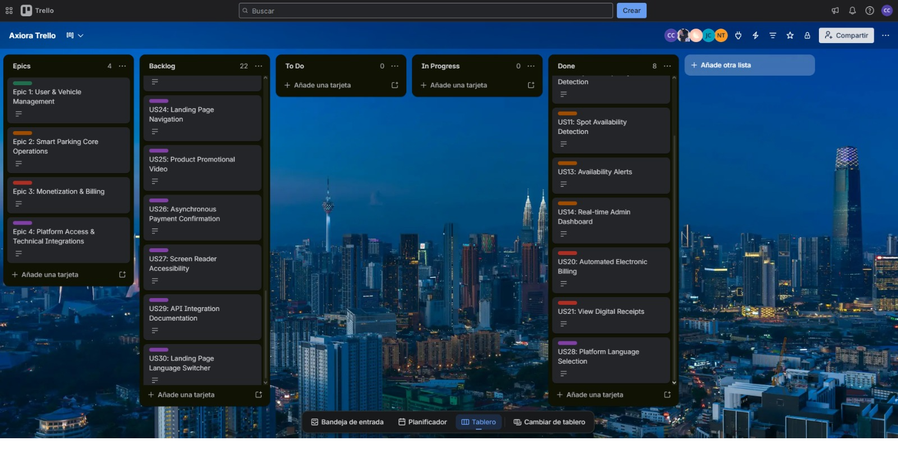
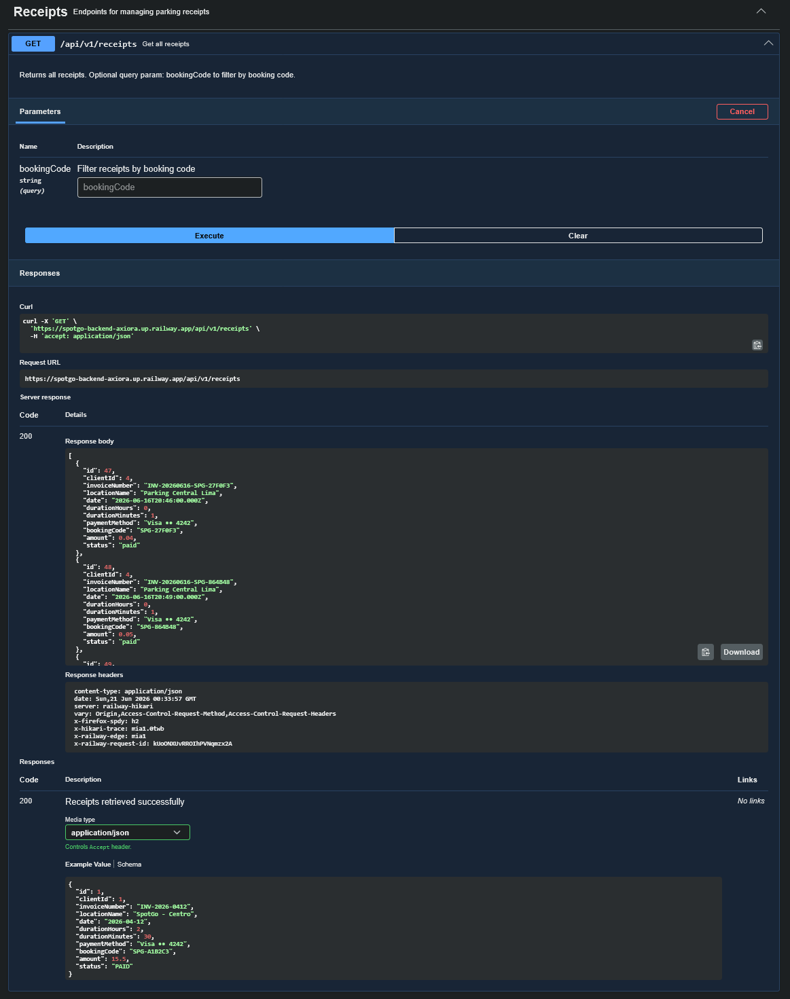
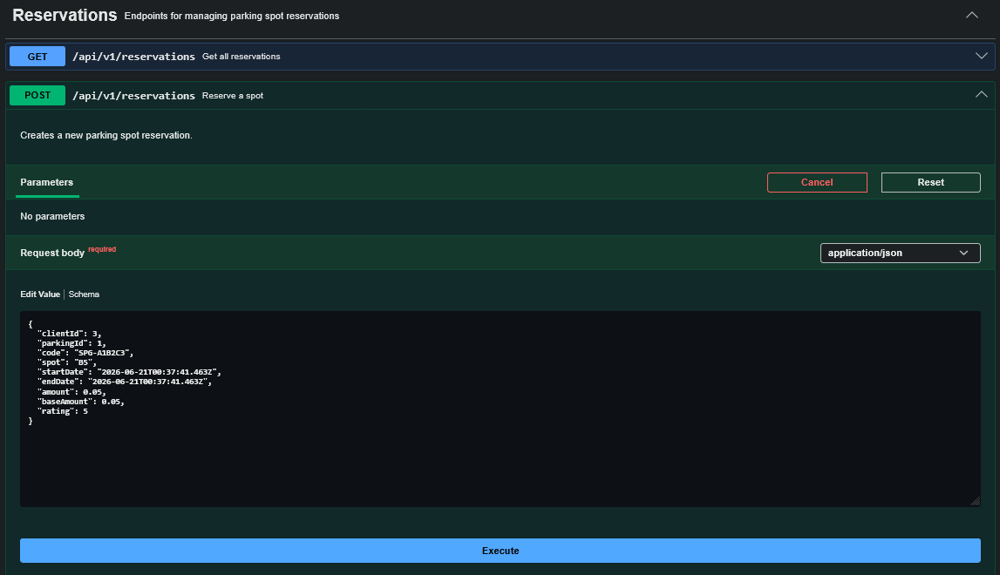
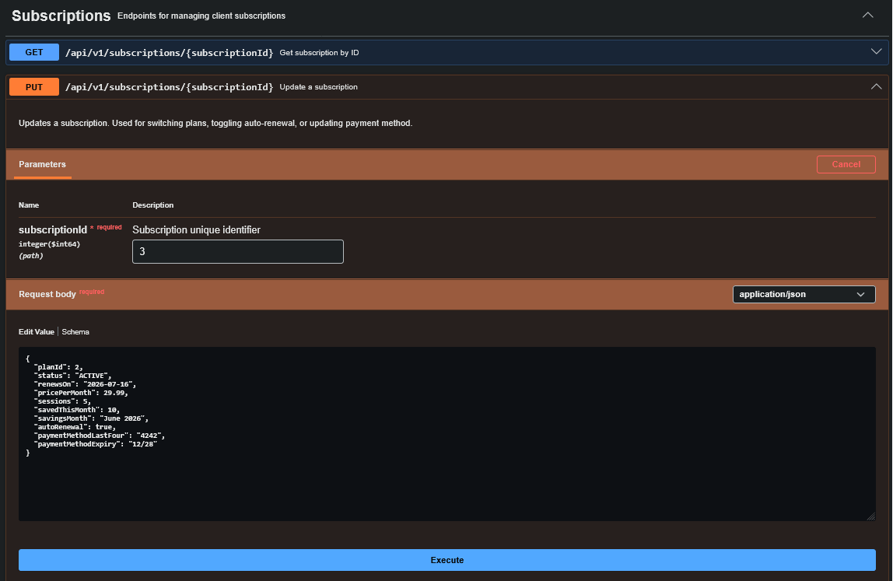
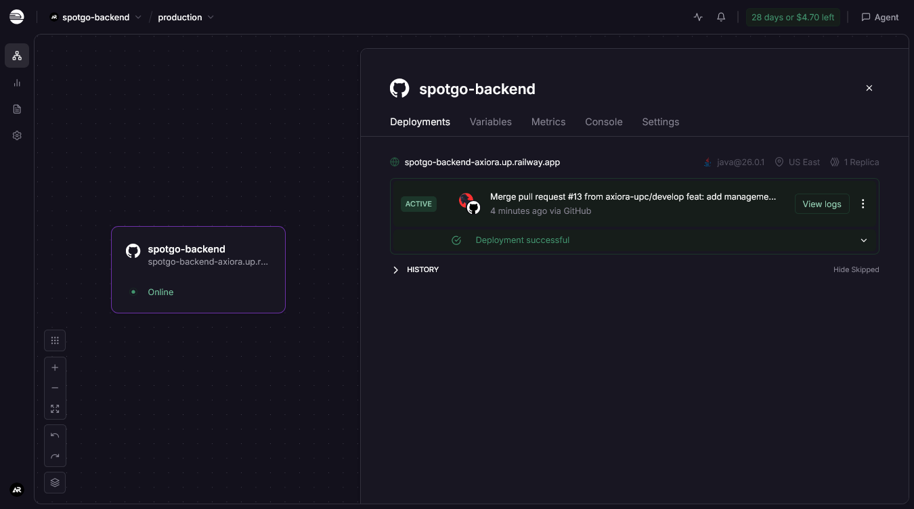
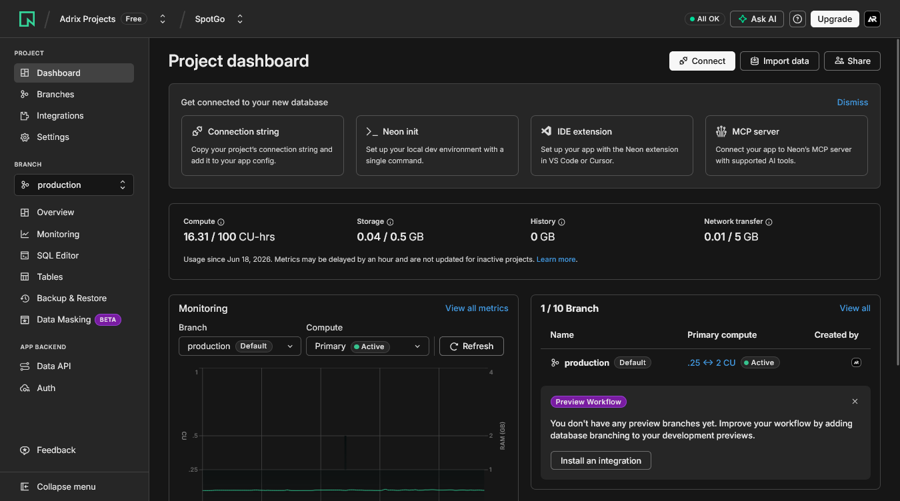
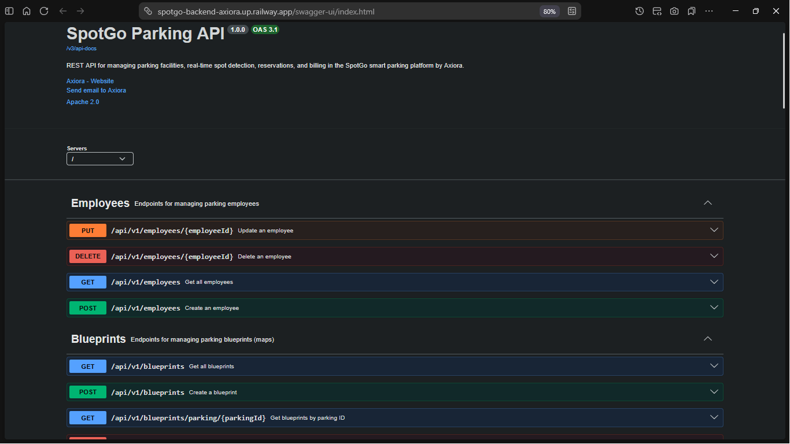
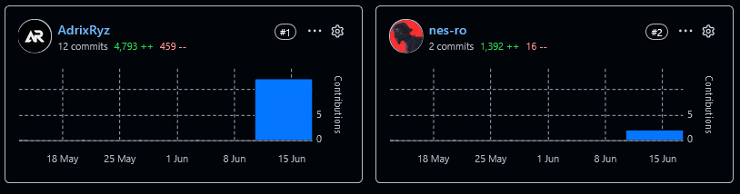

### 5.2.3. Sprint 3

#### *5.2.3.1. Sprint Planning 3*

Para el desarrollo del tercer sprint nos centramos en el elaboración del backend de nuestra aplicación, para ello lo dividimos de acuerdo a la cantidad de bounded context con cada integrante del grupo (fueron 5 bounded context, 1 por cada integrante). El back será elaborado teniendo en cuenta el flujo de datos del Diagrama de Base de datos.

| **Sprint #** | 3 |
| --- | --- |
| **Sprint Planning Background** | |
| **Date** | 2026-05-05 |
| **Time** | 6:00 PM |
| **Location** | Reunión virtual |
| **Prepared By** | Adrian Ruiz Mideyros |
| **Attendees** | Adrian Ruiz Mideyros, Nestor Alonso Rojas Tello, Paul Alexandro Espinoza Lopez, Cesar Jair Contreras Rojas, Johan Alexis Contreras Granados |
| **Sprint 2 Review Summary** | Durante el Sprint 2, el equipo logró implementar exitosamente la primera versión funcional de la aplicación web de SpotGo, completando un total de 15 User Stories que representan 52 Story Points. Se desarrollaron los principales módulos frontend del sistema, incluyendo: monitoreo en tiempo real con visualización dinámica de ocupación (US15), gestión de zonas de estacionamiento (US07), detección de ocupación y disponibilidad de espacios mediante sensores IoT (US11, US12), detección de estacionamiento no autorizado (US13), sistema de alertas en tiempo real (US14), generación de tickets virtuales (US10), integración de pagos digitales con Stripe (US17), gestión de suscripciones mensuales (US18), pagos SaaS para administradores B2B (US19), facturación electrónica automatizada compatible con SUNAT (US21), visualización y descarga de comprobantes electrónicos (US22), asignación de perfiles Staff (US04), carga de croquis de estacionamiento (US05), generación automática de mapas digitales (US06), y soporte multilenguaje (US30, US32). Además, se implementó una Landing Page estática con HTML, CSS y JavaScript puro (US25, US26, US27, US32) que presenta la propuesta de valor del sistema, permitiendo a los visitantes comprender rápidamente el modelo de negocio de SpotGo. La aplicación web fue desplegada exitosamente en Vercel, garantizando disponibilidad continua y accesibilidad para pruebas iterativas. |
| **Sprint 2 Retrospective Summary** | Durante la retrospectiva, el equipo identificó como fortalezas principales la efectiva distribución de tareas según los Bounded Contexts y la integración temprana de componentes mediante GitFlow, lo que permitió una entrega consistente sin bloqueos críticos. Como oportunidades de mejora, el equipo acordó refinar la estimación de Story Points para equilibrar mejor la carga de trabajo, ya que se completaron 52 SP frente a los 42 estimados inicialmente. También se identificó la necesidad de mejorar la trazabilidad entre User Stories y tareas técnicas (Work-Items) para garantizar que cada criterio de aceptación tenga una implementación claramente vinculada en el código. El equipo reforzó el compromiso de mantener actualizados los estados de las tareas en el Sprint Backlog, mejorar la documentación de los servicios API con ejemplos más detallados en Swagger, y fortalecer las pruebas de accesibilidad (ARIA) y soporte multilenguaje en futuros sprints. Finalmente, se acordó priorizar la integración completa con los servicios backend en el Sprint 3 para habilitar el flujo end-to-end de la plataforma. |
| **Sprint Goal & User Stories** | |
| **Sprint 3 Goal** | El objetivo de este tercer sprint es elaborar el backend de nuestro aplicativo. Se han implementado las API's Restful para nuestro aplicativo y se ha realizado la documentación de los EndPoint en swagger. |
| **Sprint 1 Velocity** | 10 Story Points (Velocidad estimada para el primer ciclo del equipo). |
| **Sprint 2 Velocity** | 34 Story Points (Velocidad estimada para el segundo ciclo del equipo). |
| **Sum of Story Points** | 44 |

#### *5.2.3.2. Aspect Leaders and Collaborators*

A continuación se detalla la matriz de liderazgo y colaboración (LACX) para brindar claridad en la comunicación del equipo durante el desarrollo de las tareas de este Sprint.

| Team Member (Last Name, First Name) | GitHub Username | Parking | Monitoring | RESTful Config | Frontend Interceptor | Billing |
| --- | --- | --- | --- | --- | --- | --- |
| Ruiz Mideyros, Adrian | @AdrixRyz | L | C | C | C | C |
| Rojas Tello, Nestor Alonso | @nes-ro | C | L | C | C | C |
| Espinoza Lopez, Paul Alexandro | @R3memo | C | C | C | L | C |
| Contreras Rojas, Cesar Jair | @CesarJrCR | C | C | L | C | C |
| Contreras Granados, Johan Alexis | @johancg04 | C | C | C | C | L |

#### *5.2.3.3. Sprint Backlog 3*

El backlog del Sprint 3 se orienta a consolidar la arquitectura backend y reemplazar progresivamente los servicios simulados por APIs reales. Las tareas cubren documentación Swagger, persistencia por contexto, endpoints para recibos, planes de clientes, suscripciones, reservas, parking, además de la integración del frontend con datos provenientes del servidor.

**Trello link:** [https://trello.com/invite/b/6a3044b58529d68c1f19afee/ATTIa322332a59d2dc5bf472752e3591fc3f5CBEB433/axiora-trello](https://trello.com/invite/b/6a3044b58529d68c1f19afee/ATTIa322332a59d2dc5bf472752e3591fc3f5CBEB433/axiora-trello )

| User Story Id | User Story Title | Work-Item / Task Id | Work-Item / Task Title | Description | Estimation (Hours) | Assigned To | Status |
| --- | --- | --- | --- | --- | --- | --- | --- |
| US05 | Upload Parking Croquis | TS05.1 | Develop Croquis Upload Module | Implementar el módulo de carga de croquis permitiendo subir imágenes PNG/JPG y validar formatos soportados. | 4 | @nes-ro | Done |
| US06 | Automatic Digital Map Generation | TS06.1 | Develop Automatic Map Generator | Aplicar la lógica de procesamiento del croquis para generar automáticamente zonas y espacios del estacionamiento. | 3 | @johancg04 | Done |
| US08 | Virtual Receipt Generation | TS08.1 | Develop Virtual Receipt Module | Llevar a cabo la generación y visualización de recibos virtuales con información del espacio asignado. | 3 | @nes-ro | Done |
| US09 | Spot Occupancy Detection | TS09.1 | Develop Occupancy Detection Logic | Aplicar la lógica de actualización automática del estado de ocupación mediante sensores IoT. | 3 | @johancg04 | Done |
| US10 | Spot Availability Detection | TS10.1 | Develop Spot Availability Tracker | Poner en marcha la actualización automática de disponibilidad de espacios mediante sensores IoT. | 4 | @CesarJrCR | Done |
| US21 | Product Promotional Video | TS21.1 | Embed Promotional Video | Integrar video promocional de YouTube con fallback a imagen estática. | 2 | @nes-ro | Done |
| US23 | Screen Reader Accessibility | TS23.1 | Implement Accessibility Enhancements | Configurar atributos ARIA y navegación accesible mediante teclado en la Web App. | 4 | @R3memo | Done |
| US25 | API Integration Documentation | TS25.1 | Generate Swagger API Documentation | Generar documentación OpenAPI mediante Swagger para todos los endpoints RESTful. | 3 | @johancg04 | Done |

#### *5.2.3.4. Development Evidence for Sprint Review*

| Repository | Branch | Commit Id | Commit Message | Committed By | Commit Date |
| --- | --- | --- | --- | --- | --- |
| spotgo-backend | main | 90a34f8 | chore: initial project setup | AdrixRyz | 2026-06-15 |
| spotgo-backend | feature/parking | 6c33093 | feat: implement parking module | AdrixRyz | 2026-06-18 |
| spotgo-backend | feature/parking | 27c8fee | feat: configure production profile and endpoints for spring boot | AdrixRyz | 2026-06-18 |
| spotgo-backend | feature/parking | 525852a | feat: add support for detected spots creation | AdrixRyz | 2026-06-18 |
| spotgo-backend | feature/billing | 66ecdb9 | feat(billing): add billing bounded context | johancg04 | 2026-06-18 |
| spotgo-backend | feature/parking | 5c9ba8e | feat: update database backend connections | AdrixRyz | 2026-06-20 |
| spotgo-backend | develop | eb91983 | feat: backend first version | AdrixRyz | 2026-06-20 |
| spotgo-backend | develop | 48a986c | feat: align backend API with frontend format | AdrixRyz | 2026-06-20 |
| spotgo-backend | feature/monitoring | 7e641de | feat: add base of monitoring | nes-ro | 2026-06-20 |
| spotgo-backend | feature/monitoring | bfdf832 | feat: add endpoints configurationsof employees, occupancy, and weekly trends | nes-ro | 2026-06-20 |

#### *5.2.3.5. Execution Evidence for Sprint Review*

Durante el Sprint 3 se logró avanzar en la integración funcional entre el frontend y los servicios backend desarrollados para los principales flujos de SpotGo. Se implementaron y validaron vistas relacionadas, las reservas, suscripciones, recibos, parking favoritos, historial de parkings en lo que respecta a la vista de usuario y mapa en tiempo real, reportes, lista de empleados, sección de analytics y configuración para administrador. Reemplazando progresivamente el uso de datos simulados por peticiones reales a la API. Las evidencias de ejecución presentadas en esta sección muestran las principales vistas implementadas y permiten comprobar que los usuarios pueden interactuar con funcionalidades clave del sistema dentro del alcance definido para el Sprint.

**Principales entregables funcionales:**

- Endpoints REST para gestión de recibos, planes para clientes, suscripciones, reservaciones, parkings, detección de parking spots y croquis.
- Integración de la capa de consumo del frontend con los servicios backend reales.
- Validación de flujos de usuario tanto para conductor como para administrador.
- Despliegue del backend en un entorno de producción para su integración continua con el frontend.
- Documentación de los servicios REST implementados mediante OpenAPI/Swagger para su consulta y validación por parte del equipo y stakeholders.

#### *5.2.3.6. Services Documentation Evidence for Sprint Review*

Durante el Sprint 3 se documentaron los endpoints REST correspondientes a los contextos de Parking, Reservations, Billing y Subscriptions mediante OpenAPI/Swagger. Esta documentación permite evidenciar los servicios implementados dentro del alcance del Sprint, incluyendo las rutas base y las acciones disponibles para la gestión de estacionamientos, croquis, spots detectados, reservas, recibos, planes y suscripciones de clientes. Además del uso de una base de datos PostgreSQL para la persistencia de la información. A continuación se presenta un resumen de los endpoints documentados y las acciones implementadas para cada recurso:

| Recurso | Endpoint Base | Acciones Implementadas |
| --- | --- | --- |
| Employees | `/api/v1/employees` | GET, POST, PUT por ID, DELETE por ID |
| Blueprints | `/api/v1/blueprints` | GET, POST, DELETE por ID, GET por parking |
| Client Reports | `/api/v1/clientReports` | GET, POST, PATCH por ID |
| Occupancy By Hour | `/api/v1/occupancyByHour` | GET |
| Weekly Trends | `/api/v1/weeklyTrends` | GET |
| Detected Spots | `/api/v1/detectedSpots` | GET, POST, PATCH status por ID, GET por blueprint |
| Parkings | `/api/v1/parkings` | GET, POST, PATCH por ID |
| Receipts | `/api/v1/receipts` | GET, POST, GET por ID, DELETE |
| Reservations | `/api/v1/reservations` | GET, POST |
| Client Plans | `/api/v1/clientPlans` | GET, GET por ID |
| Subscriptions | `/api/v1/subscriptions` | GET, POST, GET por ID, PUT, PATCH |

**Evidencia de ejecución**

Para mostrar la interacción, ejecutamos algunos endpoints.

1. GET /api/v1/receipts el cual nos permite buscar todos los recibos y/o buscar recibos por bookingCode.

2. POST /api/v1/reservations el cual nos permite añadir una reserva a la base de datos.

3. PUT /api/v1/subscriptions/{subscriptionId} el cual nos permite actualizar la información de una suscripción.

#### *5.2.3.7. Software Deployment Evidence for Sprint Review*

Durante el Sprint 3 se realizó el despliegue del backend de SpotGo en un entorno de producción utilizando Railway como plataforma de hosting. Este despliegue permitió validar la correcta configuración del entorno, la conexión a la base de datos PostgreSQL y la disponibilidad de los servicios REST implementados para su consumo desde el frontend. La evidencia presentada en esta sección muestra capturas del proceso de despliegue en Railway, confirmando que el backend está operativo y accesible para su integración con el frontend.

**Backend Swagger Documentation Link:** [https://spotgo-backend-axiora.up.railway.app/swagger-ui/index.html](https://spotgo-backend-axiora.up.railway.app/swagger-ui/index.html)

#### *5.2.3.8. Team Collaboration Insights during Sprint*

Para la organización técnica del desarrollo del Backend, el equipo adoptó un flujo de trabajo basado en GitFlow con ramas de características (feature/) bien definidas (como feature/parking, feature/billing, etc.), garantizando una integración ordenada hacia la rama develop.

A continuación se presenta la evidencia de las interacciones y control de colaboración registrados durante el transcurso de este Sprint:

