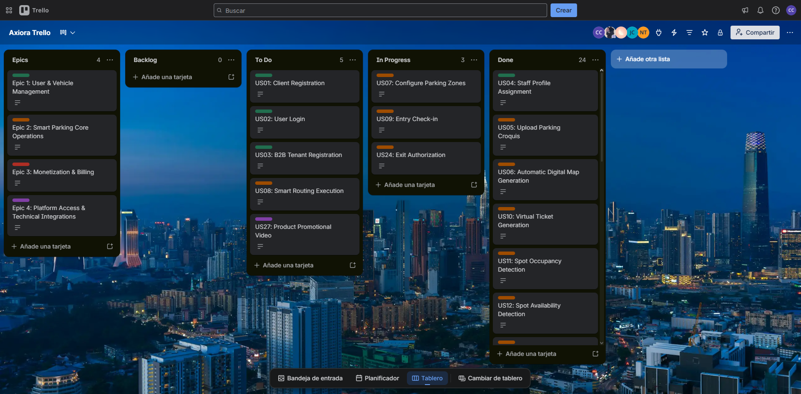
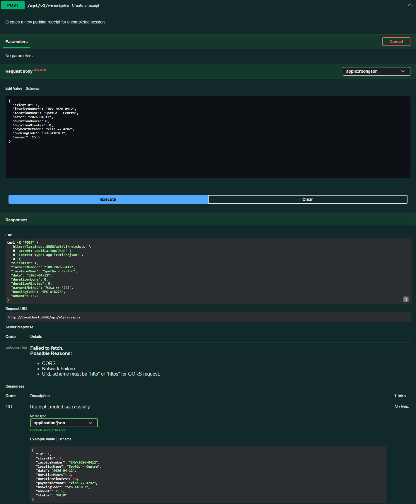
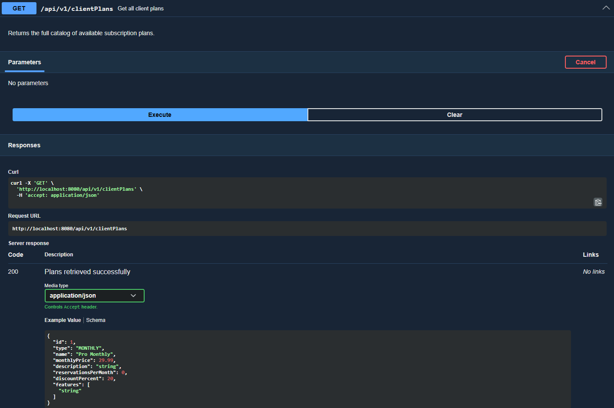

### 5.2.3. Sprint 3

#### *5.2.3.1. Sprint Planning 3*

Para el desarrollo del tercer sprint nos centramos en el elaboracion del backend de nuetra aplicación, para ello lo dividimos de acuerdo a la cantidad de bounded context con cada integrante del grupo (fueron 5 bounded context, 1 por cada integrante). El back sera elaborado teniendo en cuenta el flujo de datos del Diagrama de Base de datos.

| **Sprint #** | 3 |
| --- | --- |
| **Sprint Planning Background** | |
| **Date** | 2026-05-05 |
| **Time** | 6:00 PM |
| **Location** | Reunión virtual |
| **Prepared By** | Adrian Ruiz Mideyros |
| **Attendees** | Adrian Ruiz Mideyros, Nestor Alonso Rojas Tello, Paul Alexandro Espinoza Lopez, Cesar Jair Contreras Rojas, Johan Alexis Contreras Granados |
| **Sprint 2 Review Summary** | Durante el Sprint 2, el equipo logró implementar exitosamente la primera versión funcional de la aplicación web de SpotGo, completando un total de 15 User Stories que representan 52 Story Points. Se desarrollaron los principales módulos frontend del sistema, incluyendo: monitoreo en tiempo real con visualización dinámica de ocupación (US15), gestión de zonas de estacionamiento (US07), detección de ocupación y disponibilidad de espacios mediante sensores IoT (US11, US12), detección de estacionamiento no autorizado (US13), sistema de alertas en tiempo real (US14), generación de tickets virtuales (US10), integración de pagos digitales con Stripe (US17), gestión de suscripciones mensuales (US18), pagos SaaS para administradores B2B (US19), facturación electrónica automatizada compatible con SUNAT (US21), visualización y descarga de comprobantes electrónicos (US22), asignación de perfiles Staff (US04), carga de croquis de estacionamiento (US05), generación automática de mapas digitales (US06), y soporte multilenguaje (US30, US32). Además, se implementó una Landing Page estática con HTML, CSS y JavaScript puro (US25, US26, US27, US32) que presenta la propuesta de valor del sistema, permitiendo a los visitantes comprender rápidamente el modelo de negocio de SpotGo. La aplicación web fue desplegada exitosamente en Vercel, garantizando disponibilidad continua y accesibilidad para pruebas iterativas. |
| **Sprint 2 Retrospective Summary** | Durante la retrospectiva, el equipo identificó como fortalezas principales la efectiva distribución de tareas según los Bounded Contexts y la integración temprana de componentes mediante GitFlow, lo que permitió una entrega consistente sin bloqueos críticos. Como oportunidades de mejora, el equipo acordó refinar la estimación de Story Points para equilibrar mejor la carga de trabajo, ya que se completaron 52 SP frente a los 42 estimados inicialmente. También se identificó la necesidad de mejorar la trazabilidad entre User Stories y tareas técnicas (Work-Items) para garantizar que cada criterio de aceptación tenga una implementación claramente vinculada en el código. El equipo reforzó el compromiso de mantener actualizados los estados de las tareas en el Sprint Backlog, mejorar la documentación de los servicios API con ejemplos más detallados en Swagger, y fortalecer las pruebas de accesibilidad (ARIA) y soporte multilenguaje en futuros sprints. Finalmente, se acordó priorizar la integración completa con los servicios backend en el Sprint 3 para habilitar el flujo end-to-end de la plataforma. |
| **Sprint Goal & User Stories** | |
| **Sprint 3 Goal** | El objetivo de este tercer sprint es elaborar el backend de nuestro aplicativo. Se han implementado las API's Restful para nuestro aplicativo y se ha realizado la documentación de los EndPoint en swagger. |
| **Sprint 1 Velocity** | 10 Story Points (Velocidad estimada para el primer ciclo del equipo). |
| **Sprint 2 Velocity** | 42 Story Points (Velocidad estimada para el segundo ciclo del equipo). |
| **Sum of Story Points** | 52 |

#### *5.2.3.2. Aspect Leaders and Collaborators*

A continuación se detalla la matriz de liderazgo y colaboración (LACX) para brindar claridad en la comunicación del equipo durante el desarrollo de las tareas de este Sprint.

| Team Member (Last Name, First Name) | GitHub Username | Develop | Billing-Module | Parking | Profiles | Monitoring |
| --- | --- | --- | --- | --- | --- | --- |
| Ruiz Mideyros, Adrian | @AdrixRyz | L | C | C | C | C |
| Rojas Tello, Nestor Alonso | @nes-ro | C | L | C | C | C |
| Espinoza Lopez, Paul Alexandro | @R3memo | C | C | C | L | C |
| Contreras Rojas, Cesar Jair | @CesarJrCR | C | C | L | C | C |
| Contreras Granados, Johan Alexis | @johancg04 | C | C | C | C | L |

#### *5.2.3.3. Sprint Backlog 3*

El backlog del Sprint 3 se orienta a consolidar la arquitectura backend y reemplazar progresivamente los servicios simulados por APIs reales. Las tareas cubren documentación Swagger, persistencia por contexto, endpoints para recivos, planes de clientes, suscripciones, reservas, parking, además de la integración del frontend con datos provenientes del servidor.

**Trello link:** https://trello.com/invite/b/6a3044b58529d68c1f19afee/ATTIa322332a59d2dc5bf472752e3591fc3f5CBEB433/axiora-trello 

| User Story Id | User Story Title | Work-Item / Task Id | Work-Item / Task Title | Description | Estimation (Hours) | Assigned To | Status |
| --- | --- | --- | --- | --- | --- | --- | --- |
| US01 | Client Registration | TS01.1 | Develop User Registration Module | Ejecutar formulario de registro de usuarios con validación de credenciales y persistencia de datos. | 4 | @AdrixRyz | To Do |
| US02 | User Login | TS02.1 | Develop Authentication Module | Poner en marcha el inicio de sesión seguro con validación de credenciales y generación de tokens. | 4 | @CesarJrCR | To Do |
| US03 | B2B Tenant Registration | TS03.1 | Develop Tenant Registration Module | Aplicar el registro de nuevos tenants y generación de credenciales administrativas. | 4 | @AdrixRyz | To Do |
| US04 | Staff Profile Assignment | TS04.1 | Develop Staff Profile Assignment Module | Poner en marcha asignación y revocación de perfiles Staff para vehículos autorizados. | 3 | @AdrixRyz | Done |
| US05 | Upload Parking Croquis | TS05.1 | Develop Croquis Upload Module | Implementar el módulo de carga de croquis permitiendo subir imágenes PNG/JPG y validar formatos soportados. | 4 | @nes-ro | Done |
| US06 | Automatic Digital Map Generation | TS06.1 | Develop Automatic Map Generator | Aplicar la lógica de procesamiento del croquis para generar automáticamente zonas y espacios del estacionamiento. | 3 | @johancg04 | Done |
| US07 | Configure Parking Zones | TS07.1 | Develop Parking Zone Manager | Poner en practica la configuración y asignación de zonas de estacionamiento para visitantes, taxis y personal. | 3 | @AdrixRyz | In Progress |
| US08 | Smart Routing Execution | TS08.1 | Develop Smart Routing Engine | Implementar el motor de enrutamiento inteligente para asignar espacios según el perfil del vehículo detectado. | 4 | @CesarJrCR | To Do |
| US09 | Entry Barrier Check-in | TS09.1 | Implement Entry Barrier Automation | Aplicar la automatización de apertura de barrera basada en validación de acceso y asignación de espacio. | 2 | @AdrixRyz | In Progress |
| US10 | Virtual Ticket Generation | TS10.1 | Develop Virtual Ticket Module | Llevar a cabo la generación y visualización de tickets virtuales con información del espacio asignado. | 3 | @nes-ro | Done |
| US11 | Spot Occupancy Detection | TS11.1 | Develop Occupancy Detection Logic | Aplicar la lógica de actualización automática del estado de ocupación mediante sensores IoT. | 3 | @johancg04 | Done |
| US12 | Spot Availability Detection | TS12.1 | Develop Spot Availability Tracker | Poner en marcha la actualización automática de disponibilidad de espacios mediante sensores IoT. | 4 | @CesarJrCR | Done |
| US13 | Unauthorized Parking Detection | TS13.1 | Develop Parking Infraction Detection | Implementar la detección de estacionamiento no autorizado según reglas de zonas y perfiles. | 2 | @CesarJrCR | Done |
| US14 | Availability Alerts | TS14.1 | Develop Alert Notification System | Poner en marcha sistema de alertas en tiempo real para ocupación alta e infracciones. | 4 | @nes-ro | Done |
| US15 | Real-time Admin Dashboard | TS15.1 | Develop Real-time Monitoring Dashboard | Poner en marcha dashboard en tiempo real con visualización dinámica de ocupación y filtros por zonas. | 4 | @CesarJrCR | Done |
| US16 | Client Occupancy View | TS16.1 | Develop Client Parking Map View | Implementar vista interactiva para clientes mostrando espacios disponibles y rutas asignadas. | 3 | @CesarJrCR | Done |
| US17 | B2C Digital Payment | TS17.1 | Integrate Digital Payment Gateway | Integrar pagos digitales mediante Stripe API para autorización de checkout. | 3 | @johancg04 | Done |
| US18 | B2C Monthly Subscription | TS18.1 | Develop Subscription Management Module | Poner en marcha la gestión de suscripciones mensuales y renovación automática de planes. | 2 | @johancg04 | Done |
| US19 | B2B SaaS Subscription Payment | TS19.1 | Develop SaaS Billing Module | Poner en practica pagos recurrentes y actualización de planes SaaS para administradores B2B. | 2 | @johancg04 | Done |
| US20 | Service Suspension Warning | TS20.1 | Develop Payment Failure Alert System | Aplicar alertas automáticas de suspensión por fallos en pagos recurrentes. | 4 | @R3memo | Done |
| US21 | Automated Electronic Billing | TS21.1 | Develop Electronic Billing Integration | Llevar a cabo generación automática de comprobantes electrónicos compatibles con SUNAT. | 3 | @CesarJrCR | Done |
| US22 | View Digital Receipts | TS22.1 | Develop Digital Receipt Viewer | Implementar módulo para visualizar y descargar comprobantes electrónicos en PDF. | 3 | @CesarJrCR | Done |
| US23 | Admin B2B Billing Panel | TS23.1 | Develop Billing Administration Panel | Ejecutar el panel administrativo para visualización de facturas y datos tributarios. | 4 | @R3memo | Done |
| US24 | Exit Barrier Authorization | TS24.1 | Implement Exit Authorization Module | Poner en practica validación automática de pago y apertura de barrera de salida. | 2 | @AdrixRyz | In Progress |
| US25 | Landing Page Value Proposition | TS25.1 | Develop Static Landing Page | Crear landing page estática con HTML/CSS/JS puro mostrando las funcionalidades del sistema. | 3 | @nes-ro | Done |
| US26 | Landing Page Navigation | TS26.1 | Implement Landing Page Navigation | Configurar navegación por anclas y redirección a la Web App mediante enlaces estáticos. | 2 | @nes-ro | Done |
| US27 | Product Promotional Video | TS27.1 | Embed Promotional Video | Integrar video promocional de YouTube con fallback a imagen estática. | 2 | @nes-ro | To Do |
| US28 | Asynchronous Payment Confirmation | TS28.1 | Develop Stripe Webhook Integration | Ejecutar los endpoint webhook para procesar confirmaciones asíncronas de Stripe. | 2 | @CesarJrCR | Done |
| US29 | Screen Reader Accessibility | TS29.1 | Implement Accessibility Enhancements | Configurar atributos ARIA y navegación accesible mediante teclado en la Web App. | 4 | @R3memo | Done |
| US30 | Platform Language Selection | TS30.1 | Implement Internationalization Support | Configurar soporte i18n para Inglés y Español en la aplicación Angular. | 3 | @johancg04 | Done |
| US31 | API Integration Documentation | TS31.1 | Generate Swagger API Documentation | Generar documentación OpenAPI mediante Swagger para todos los endpoints RESTful. | 3 | @johancg04 | Done |
| US32 | Landing Page Language Switcher | TS32.1 | Implement JS Dictionary | Crear el script Vanilla JS para alternar los nodos de texto entre Español e Inglés del DOM. | 4 | @nes-ro | Done |

#### *5.2.3.4. Development Evidence for Sprint Review*

| Repository | Branch | Commit Id | Commit Message | Committed By | Commit Date |
|---|---|---|---|---|---|
| spotgo-backend | main | 22fb0c5 | Merge pull request #6 from axiora-upc/develop | CesarJrCR | 2026-06-20 |
| spotgo-backend | develop | eb91983 | feat: backend first version | AdrixRyz | 2026-06-20 |
| spotgo-backend | develop | 7c20334 | docs: add README.md | AdrixRyz | 2026-06-20 |
| spotgo-backend | develop | 69bc668 | fix: swagger documentation | AdrixRyz | 2026-06-20 |
| spotgo-backend | develop | 48a986c | feat: align backend API with frontend format | AdrixRyz | 2026-06-20 |
| spotgo-backend | develop | 3da7505 | fix: naming mistake | AdrixRyz | 2026-06-20 |
| spotgo-backend | main | ef0cb5e | Merge pull request #5 from axiora-upc/feature/parking | AdrixRyz | 2026-06-20 |
| spotgo-backend | feature/parking | 5c9ba8e | feat: update database backend connections | AdrixRyz | 2026-06-20 |
| spotgo-backend | main | 193a3bf | fix: enable JPA auditing | AdrixRyz | 2026-06-18 |
| spotgo-backend | main | 5a7db6a | Merge pull request #4 from axiora-upc/feature/billing-module | johancg04 | 2026-06-18 |
| spotgo-backend | feature/billing-module | 66ecdb9 | feat(billing): add billing bounded context | Jobi | 2026-06-18 |
| spotgo-backend | main | 15ec769 | Merge pull request #3 from axiora-upc/feature/parking | AdrixRyz | 2026-06-18 |
| spotgo-backend | feature/parking | 525852a | feat: add support for detected spots creation | AdrixRyz | 2026-06-18 |
| spotgo-backend | main | af1923d | Merge pull request #2 from axiora-upc/feature/parking | AdrixRyz | 2026-06-18 |
| spotgo-backend | feature/parking | 27c8fee | feat: configure production profile and endpoints for spring boot | AdrixRyz | 2026-06-18 |
| spotgo-backend | main | 642874c | Merge pull request #1 from axiora-upc/feature/parking | AdrixRyz | 2026-06-18 |
| spotgo-backend | feature/parking | 6c33093 | feat(parking): implement parking module | AdrixRyz | 2026-06-18 |
| spotgo-backend | main | 90a34f8 | chore: initial project setup | AdrixRyz | 2026-06-15 |
| spotgo-backend | main | b5693f5 | Initial commit | AdrixRyz | 2026-04-08 |

#### *5.2.3.5. Execution Evidence for Sprint Review*

Durante el Sprint 3 se logró avanzar en la integración funcional entre el frontend y los servicios backend desarrollados para los principales flujos de SpotGo. Se implementaron y validaron vistas relacionadas, las reservas, suscripciones, recivos, parking favoritos, historial de parkings en lo que respecta a la vista de usuario y mapa en tiempo real, reportes, lista de empleados, sección de analytics y configuración para adiministrador. Reemplazando progresivamente el uso de datos simulados por peticiones reales a la API. Las evidencias de ejecución presentadas en esta sección muestran las principales vistas implementadas y permiten comprobar que los usuarios pueden interactuar con funcionalidades clave del sistema dentro del alcance definido para el Sprint.

**Principales entregables funcionales:**

- Endpoints REST para gestión de recivos, planes para clientes, suscripciones, reservaciones, parkings, detección de parking spots y croquis.
- Integración de la capa de consumo del frontend con los servicios backend reales.
- Validación de flujos de usuario tanto para conductor como para administrador.
- Despliegue del backend en un entorno de producción para su integración continua con el frontend.
- Documentación de los servicios REST implementados mediante OpenAPI/Swagger para su consulta y validación por parte del equipo y stakeholders.

#### *5.2.3.6. Services Documentation Evidence for Sprint Review*

Durante el Sprint 3 se documentaron los endpoints REST correspondientes a los contextos de Parking, Reservations, Billing y Subscriptions mediante OpenAPI/Swagger. Esta documentación permite evidenciar los servicios implementados dentro del alcance del Sprint, incluyendo las rutas base y las acciones disponibles para la gestión de estacionamientos, croquis, spots detectados, reservas, recibos, planes y suscripciones de clientes. Además del uso de una base de datos PostgreSQL para la persistencia de la información. A continuación se presenta un resumen de los endpoints documentados y las acciones implementadas para cada recurso:

| Recurso | Endpoint Base | Acciones Implementadas |
| --- | --- | --- |
| Parkings | `/api/v1/parkings` | GET, POST, PATCH por ID |
| Blueprints | `/api/v1/blueprints` | GET, POST, DELETE por ID, GET por parking |
| Detected Spots | `/api/v1/detectedSpots` | GET, POST, PATCH status por ID, GET por blueprint |
| Reservations | `/api/v1/reservations` | GET, POST |
| Receipts | `/api/v1/receipts` | GET, POST, GET por ID, DELETE |
| Client Plans | `/api/v1/clientPlans` | GET, GET por ID |
| Subscriptions | `/api/v1/subscriptions` | GET, POST, GET por ID, PUT, PATCH |

**Evidencia de ejecución**

Para mostrar la interacción, ejecutamos algunos endpoints.

1. GET /api/v1/receipts el cual permite buscar recibos a traves de su codigo de reserva.

2. POST /api/v1/receipts el cual añade un recibo a la base de datos.

3. GET /api/v1/clientPlans el caul nos permite buscar los diversos planes que se lo ofrecen a los clientes

#### *5.2.3.7. Software Deployment Evidence for Sprint Review*

#### *5.2.3.8. Team Collaboration Insights during Sprint*

Para la organización técnica del desarrollo del Backend, el equipo adoptó un flujo de trabajo basado en GitFlow con ramas de características (feature/) bien definidas (como feature/parking, feature/billing-module, etc.), garantizando una integración ordenada hacia la rama develop.

A continuación se presenta la evidencia de las interacciones y control de colaboración registrados durante el transcurso de este Sprint:

