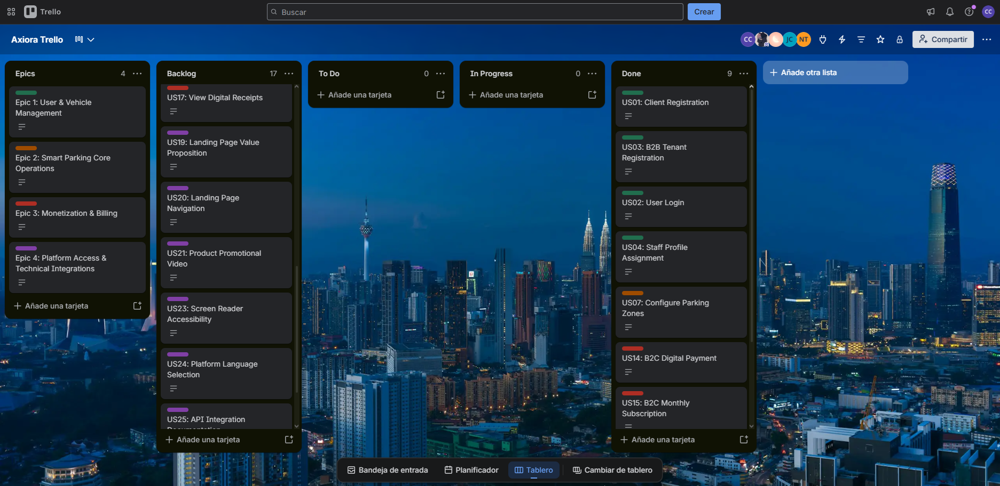
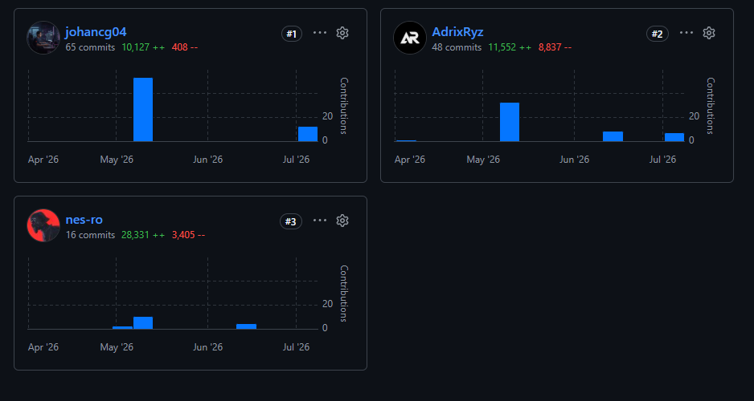
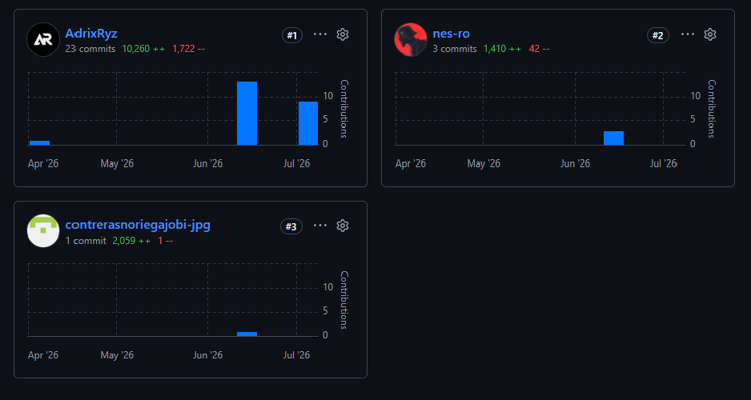

#### *5.2.4.1. Sprint Planning 4*

Para el desarrollo del cuarto sprint nos centramos completar las caracteristicas faltantes de nuestro proyecto así como implementar el componente IAM de este, Para ello hemos dividido la carga de trabajo en 5 segmentos.

| **Sprint #** | 4 |
| --- | --- |
| **Sprint Planning Background** | |
| **Date** | 2026-07-05 |
| **Time** | 6:00 PM |
| **Location** | Reunión virtual |
| **Prepared By** | Adrian Ruiz Mideyros |
| **Attendees** | Adrian Ruiz Mideyros, Nestor Alonso Rojas Tello, Paul Alexandro Espinoza Lopez, Cesar Jair Contreras Rojas, Johan Alexis Contreras Granados |
| **Sprint 3 Review Summary** | Durante el Sprint 3, el equipo logró implementar exitosamente el equipo logro desarrollar y desplegar el Backend (API's Restful) de nuestra aplicación. Se desarrollaron los principales módulos backend del sistema, incluyendo: Upload Parking Croquis (US05), Spot Occupancy Detection (US10), Spot Availability Detection (US11), Availability Alerts (US13), Real-time Admin Dashboard (US14), Automated Electronic Billing (US20), View Digital Receipts (US21), Product Promotional Video (US25). |
| **Sprint 3 Retrospective Summary** | Durante el Sprint 3, el equipo logró desarrollar e integrar exitosamente el backend de SpotGo, implementando APIs REST para los bounded contexts de Parking, Billing, Reservations y Subscriptions, documentadas mediante OpenAPI/Swagger y desplegadas en Railway con PostgreSQL como base de datos en producción. Como fortalezas, se destacó la efectiva distribución de tareas por bounded context y el uso de GitFlow con ramas feature/ bien definidas, lo que garantizó una integración ordenada hacia develop. Como oportunidades de mejora, el equipo identificó la necesidad de fortalecer la cobertura de pruebas, mejorar el manejo de errores en los endpoints y completar los módulos de autenticación y registro de usuarios que quedaron pendientes. Se acordó priorizar en el Sprint 4 la integración end-to-end completa, la validación de flujos con datos reales y el refinamiento de la experiencia de usuario en los módulos conectados al backend. |
| **Sprint Goal & User Stories** | |
| **Sprint 4 Goal** | El objetivo de este cuarto sprint es elaborar el IAM de nuestro aplicativo así como acabar con los bounded context que hayan incompleto o parcialmente completos. |
| **Sprint 1 Velocity** | 10 Story Points (Velocidad estimada para el primer ciclo del equipo). |
| **Sprint 2 Velocity** | 26 Story Points (Velocidad estimada para el segundo ciclo del equipo). |
| **Sprint 3 Velocity** | 27 Story Points (Velocidad estimada para el segundo ciclo del equipo). |
| **Sum of Story Points** | 63 |

#### *5.2.4.2. Aspect Leaders and Collaborators*

A continuación se detalla la matriz de liderazgo y colaboración (LACX) para brindar claridad en la comunicación del equipo durante el desarrollo de las tareas de este Sprint.

| Team Member (Last Name, First Name) | GitHub Username | IAM | Backend | Connections | Frontend Improves | New features |
| --- | --- | --- | --- | --- | --- | --- |
| Ruiz Mideyros, Adrian | @AdrixRyz | L | C | C | C | C |
| Rojas Tello, Nestor Alonso | @nes-ro | C | L | C | C | C |
| Espinoza Lopez, Paul Alexandro | @R3memo | C | C | C | L | C |
| Contreras Rojas, Cesar Jair | @CesarJrCR | C | C | L | C | C |
| Contreras Granados, Johan Alexis | @johancg04 | C | C | C | C | L |

#### *5.2.4.3. Sprint Backlog 4*

El backlog del Sprint 4 se orienta a desarrollar el componente IAM de nuestro aplicativo y completar los bounded context que hayan quedado parcialmente completos.

**Trello link:** [https://trello.com/invite/b/6a3044b58529d68c1f19afee/ATTIa322332a59d2dc5bf472752e3591fc3f5CBEB433/axiora-trello](https://trello.com/invite/b/6a3044b58529d68c1f19afee/ATTIa322332a59d2dc5bf472752e3591fc3f5CBEB433/axiora-trello )

| User Story Id | User Story Title | Work-Item / Task Id | Work-Item / Task Title | Description | Estimation (Hours) | Assigned To | Status |
| --- | --- | --- | --- | --- | --- | --- | --- |
| US01 | Client Registration | TS01.1 | Implement Client Registration Endpoint | Desarrollar el endpoint REST para el registro de clientes con validación de credenciales y persistencia en base de datos. | 4 | @AdrixRyz | Done |
| US02 | User Login | TS02.1 | Implement Authentication Endpoint | Desarrollar el endpoint de autenticación con validación de credenciales y generación de tokens JWT. | 4 | @AdrixRyz | Done |
| US03 | B2B Tenant Registration | TS03.1 | Implement Tenant Registration Endpoint | Desarrollar el endpoint para registro de nuevos tenants y generación de credenciales administrativas. | 4 | @CesarJrCR | Done |
| US04 | Staff Profile Assignment | TS04.1 | Implement Staff Profile Assignment Endpoint | Desarrollar el endpoint para asignación y revocación de perfiles Staff a vehículos registrados. | 3 | @johancg04 | Done |
| US07 | Configure Parking Zones | TS07.1 | Implement Parking Zone Configuration Endpoint | Desarrollar el endpoint para creación y asignación de zonas de estacionamiento por perfil de vehículo. | 3 | @johancg04 | Done |
| US14 | B2C Digital Payment | TS14.1 | Implement Digital Payment Integration | Integrar pagos digitales mediante Stripe API para autorización de checkout y confirmación de pago. | 4 | @nes-ro | Done |
| US15 | B2C Monthly Subscription | TS15.1 | Implement Subscription Management Endpoint | Desarrollar el endpoint para gestión de suscripciones mensuales y renovación automática de planes. | 3 | @nes-ro | Done |
| US18 | Admin B2B Billing Panel | TS18.1 | Implement B2B Billing Panel Endpoint | Desarrollar el endpoint para visualización de facturas y gestión de datos tributarios del administrador. | 4 | @R3memo | Done |
| US22 | Asynchronous Payment Confirmation | TS22.1 | Implement Stripe Webhook Endpoint | Desarrollar el endpoint webhook para recepción y procesamiento de eventos de pago asíncronos desde Stripe. | 4 | @R3memo | Done |

#### *5.2.4.4. Development Evidence for Sprint Review*

| Repository | Branch | Commit Id | Commit Message | Committed By | Commit Date |
| --- | --- | --- | --- | --- | --- |
| spotgo-frontend | feature/iam | 0493802 | feat(iam): add User domain entity and Role type | Johan Contreras | 2026-07-05 |
| spotgo-frontend | feature/iam | ee77d7b | feat(iam): add IAM infrastructure layer (users/roles API, assembler, IamApi) | Johan Contreras | 2026-07-05 |
| spotgo-frontend | feature/iam | 75b0f60 | feat(iam): add AuthStore and auth/guest route guards | Johan Contreras | 2026-07-05 |
| spotgo-frontend | feature/iam | 6936c76 | feat(iam): add IAM routes and role-based redirect view | Johan Contreras | 2026-07-05 |
| spotgo-frontend | feature/iam | a32f7df | feat(iam): add shared styles for auth views (login/register layout) | Johan Contreras | 2026-07-05 |
| spotgo-frontend | feature/iam | 35dc179 | feat(iam): add Login view with driver/operator selector and password toggle | Johan Contreras | 2026-07-05 |
| spotgo-frontend | feature/iam | 4f37515 | feat(iam): add Register view with driver/operator selector and password toggle | Johan Contreras | 2026-07-05 |
| spotgo-frontend | feature/iam | 854ccce | feat(app): make login/register the landing experience, gate app routes behind auth | Johan Contreras | 2026-07-05 |
| spotgo-frontend | feature/iam | d3f1f46 | feat(toolbar): remove manual user/admin view switcher, add logout and change-password menu | Johan Contreras | 2026-07-05 |
| spotgo-frontend | feature/iam | e8659ff | feat(iam): add change-password dialog and forgot-password flow | Johan Contreras | 2026-07-05 |
| spotgo-frontend | feature/iam | 08f105e | feat(iam): add i18n keys for auth flows, seed test accounts, fix null parkingId crashing json-server DELETE cascade | Johan Contreras | 2026-07-05 |
| spotgo-backend | develop | 08ca217 | feat: add spring security config | AdrixRyz | 2026-07-06 |
| spotgo-backend | develop | b068ebd | feat: add iam module, add missing endpoints, improve structure and fix a lot of bugs | AdrixRyz | 2026-07-06 |
| spotgo-frontend | develop | 6623d43 | feat: add routes security | AdrixRyz | 2026-07-06 |
| spotgo-frontend | develop | ce6b0be | feat: add final connection to backend, refactor entitys structure and fix a lot of bugs | AdrixRyz | 2026-07-06 |
| spotgo-backend | develop | b2d99e5 | feat: add MIT License to the project | AdrixRyz | 2026-07-07 |
| spotgo-backend | develop | d795358 | feat: add more security and fix a lot of bugs | AdrixRyz | 2026-07-07 |
| spotgo-frontend | develop | ff0225c | feat: add MIT License to the project | AdrixRyz | 2026-07-07 |
| spotgo-frontend | develop | b0af3f0 | feat: improve some details, like screens, modals, backend connections, and fix a lot of bugs | AdrixRyz | 2026-07-07 |
| spotgo-frontend | develop | ade31d7 | feat: improve analytics view | AdrixRyz | 2026-07-08 |

#### *5.2.4.5. Execution Evidence for Sprint Review*

Durante el Sprint 4 se logró consolidar la integración completa de la plataforma SpotGo, habilitando los flujos end-to-end pendientes e implementando los módulos críticos que complementan la arquitectura full-stack del sistema. Las principales áreas de avance fueron:

**Principales entregables funcionales:**
- Implementación del módulo IAM (Identity and Access Management), incluyendo los endpoints de registro de clientes (US01), login con generación de tokens JWT (US02) y registro de tenants B2B (US03), habilitando flujos de autenticación reales en la plataforma.
- Desarrollo de los endpoints REST pendientes, incluyendo asignación de perfiles Staff (US04) y configuración de zonas de estacionamiento (US07).
- Integración completa del módulo de pagos digitales mediante Stripe API (US14), incluyendo el endpoint webhook para confirmación asíncrona de pagos (US22).
- Implementación de los módulos de suscripciones B2C (US15) y el panel de facturación administrativo B2B (US18).
- Validación de flujos de usuario completos tanto para el rol de conductor como para el administrador, con datos reales provenientes del backend desplegado en Railway.
- Actualización de la documentación de los EndPoints en Swagger.

#### *5.2.4.6. Services Documentation Evidence for Sprint Review*

Durante el Sprint 4 se documentaron los endpoints REST correspondientes a el contexto de IAM mediante OpenAPI/Swagger. Esta documentación permite evidenciar los servicios implementados dentro del alcance del Sprint, incluyendo las rutas base y las acciones disponibles de este contexto. Además del uso de una base de datos PostgreSQL para la persistencia de la información. A continuación se presenta un resumen de los endpoints documentados y las acciones implementadas para cada recurso:

| Recurso | Endpoint Base | Acciones Implementadas |
| --- | --- | --- |
| Authentication | `/api/v1/authentication` | POST sign-up , POST sign-in,  POST password-reset/request, POST password-reset/confirm |
| Users | `/api/v1/users` | GET, GET by id, PATCH update user, PATCH update password |
| Vehicles | `/api/v1/vehicles` | GET, POST, DELETE by id, PATCH update by id |
| Analytics | `/api/v1/analytics` | GET |
| Favorites | `/api/v1/favorites` | GET, POST, DELETE by id |

**Evidencia de ejecución**

Para mostrar la interacción, ejecutamos algunos endpoints.

#### *5.2.4.7. Software Deployment Evidence for Sprint Review*

N/A. No sé ha agregado ninguna nueva configuración de despliegue, es la misma configuración del sprint 3.

#### *5.2.4.8. Team Collaboration Insights during Sprint* 

Para la organización técnica del desarrollo del Sprint 4, el equipo mantuvo el flujo de trabajo basado en GitFlow establecido en sprints anteriores, con ramas de características (feature/) bien definidas para cada módulo implementado, garantizando una integración ordenada hacia la rama develop y posteriormente hacia main mediante Pull Requests revisados por el equipo.

Las tareas fueron distribuidas equitativamente entre los cinco integrantes según los bounded contexts de cada módulo: IAM y autenticación, pagos y suscripciones, detección y enrutamiento, accesibilidad y documentación. Esta distribución permitió un avance paralelo sin bloqueos críticos, manteniendo la coherencia arquitectónica del sistema.

La comunicación del equipo se sostuvo mediante reuniones virtuales periódicas y coordinación continua a través de los canales establecidos, lo que facilitó la resolución oportuna de dependencias entre módulos, especialmente en la integración del módulo IAM con los demás servicios del backend y la conexión con el frontend desplegado en Vercel.

A continuación se presenta la evidencia de las interacciones y control de colaboración registrados durante el transcurso de este Sprint:

