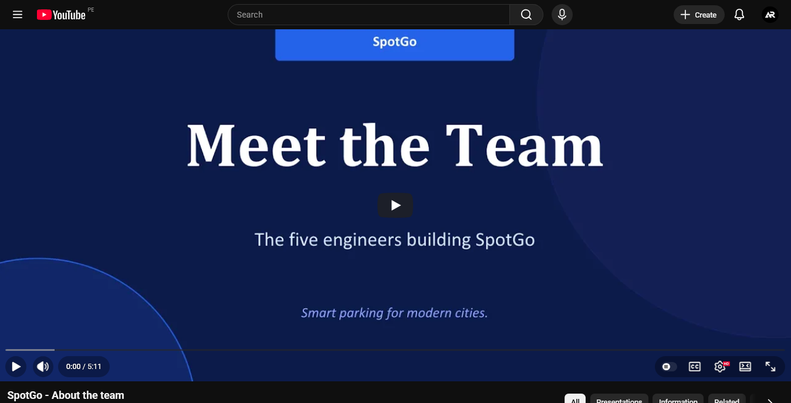

# Video About-The-Team

En esta sección se presenta el video About-the-Team de Axiora, equipo responsable del desarrollo de SpotGo. El video permite conocer a los integrantes del grupo, sus perfiles, responsabilidades y la forma en que colaboraron durante el proyecto para construir una solución orientada a mejorar la gestión de estacionamientos mediante tecnología inteligente.

Asimismo, se muestra cómo el equipo organizó el trabajo durante las distintas etapas del proyecto, desde la investigación inicial y el diseño de la propuesta, hasta la implementación del frontend, backend, despliegue y validación de SpotGo.

**Video About-the-Team Link:** [https://youtu.be/IRr8sYOzKZo?si=5Ha_syyuT4NtNw-o](https://youtu.be/IRr8sYOzKZo?si=5Ha_syyuT4NtNw-o)

